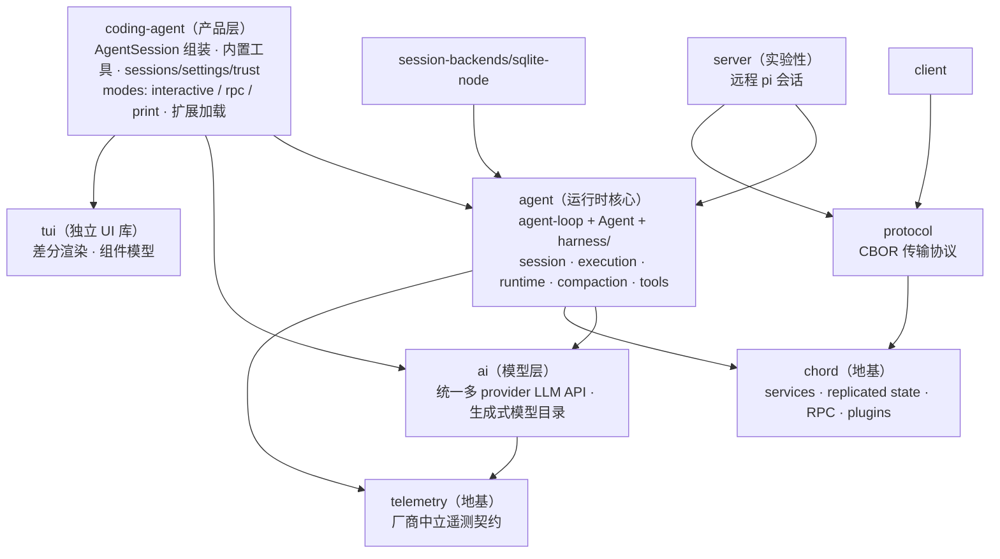

# pi 学习路径（七阶段）

**文档性质：本文是一份「索引/排序」文档，不拥有任何事实。** 它只回答两个问题：先读什么、后读什么，以及每一阶段怎样算过关。所有工程事实的唯一归属（one home per fact）是其原文档：根 [README.md](../README.md)、[AGENTS.md](../AGENTS.md)、[CONTRIBUTING.md](../CONTRIBUTING.md)、[packages/coding-agent/docs/](../packages/coding-agent/docs/index.md)、各包 package.json 与源码。本文对事实只给指针，不复制、不复述；任何一处本文与原文档冲突，以原文档为准，并应当修正本文。

**基准与诚实性声明**：初始落笔于 pi-coding-agent 0.85.1（commit 9767ba275，2026-09-07）。与「先学后写」的成熟学习路径不同，本文是**学习开始前**基于一次仓库勘察（目录结构 + package.json + 关键文件抽样）制定的计划；阶段 1 的「架构总览」一节是勘察级鸟瞰，标注为待各阶段精读验证。pi 迭代快，本文可信度以链接目标为准。

**记录方式**见 [method.zh.md](method.zh.md)；进度登记见 [index.zh.md](index.zh.md)。

## 读者与前置

面向首次接触本仓库的学习者。前置条件：Node 可用（建议 22+，Windows 下有 `pi-test.ps1`/`pi-test.bat`）；不强制持有 provider API key——无 key 时锚点实验可改用测试套件（faux provider）生成的会话，但真实交互体验（阶段 1 起的动手任务）有 key 最佳。

七阶段为推荐顺序而非硬性串行：可以在阶段间来回。建议阶段 3 过关之前不要动手改 agent 运行时行为，阶段 5 过关之前不要动手写正式 extension。

## 总览

| 阶段 | 主题 | 核心产出 |
|---|---|---|
| 1 | 仓库结构与工具链 | 包依赖拓扑一页纸；check/test 工具链跑通；五个核心术语 |
| 2 | ai 包：统一 LLM API | 能复述一次模型调用的统一数据流 |
| 3 | agent 包：运行时核心 | 能追踪一次 turn 的完整生命周期 |
| 4 | coding-agent：产品装配 | 能画出 AgentSession 组装图 |
| 5 | 扩展体系 | 能说出 extension / skill / prompt / package 的分工 |
| 6 | 扩展实践 | 亲手写的 extension + skill + prompt template 跑通 |
| 7 | 专项深入（按需） | 在所选领域独立定位事实的 home |

## 入门第一步：会话锚点实验

建议先于阶段 1 执行：跑一次真实（或 faux）会话，找到落盘的 session JSONL 文件，对照 [session-format.md](../packages/coding-agent/docs/session-format.md) 逐行精读，建立「一次对话 = 一棵 JSONL 事件树」的实物锚点。执行拆解见 [plan/stage-1.zh.md](plan/stage-1.zh.md) 第 0 步；完成后记录为 `experiments/001-session-anchor.zh.md`。

为什么先做这个：pi 的所有持久状态（分支、resume、compaction、导出、分享）都作用在这棵树上，它是后续每个阶段的对照物——读 agent loop 时问「这些事件落在 JSONL 哪一行」，读 extension 时问「它改了树的哪部分」。

## 阶段 1 — 仓库结构与工具链

目标：建立 monorepo 地图与分层认知，跑通工具链，掌握贯穿全程的五个核心术语。

### 架构总览：一页纸建立整体认知

本节是既有事实的勘察级鸟瞰重组（不新增事实），供「先整体、后细节」的认知框架；每条的权威定义在其事实源，冲突时修本节。

**pi 是什么**：Pi Agent Harness——自扩展（self-extensible）编码 agent 的 monorepo。信条「最小核心 + 通过扩展长大」（[CONTRIBUTING.md](../CONTRIBUTING.md)）：核心只保留 runtime 与少量内置工具，一切增值能力（工具、命令、事件钩子、UI、技能、提示词、主题）通过 TypeScript extension / skill / prompt template / pi package 外挂。抓三条主线：

1. **静态视角**：11 个 npm workspace 包，依赖拓扑分层（谁建在谁之上）。
2. **运行视角**：coding-agent 把 agent 运行时 + 内置工具 + 会话管理装配成产品；agent 包驱动回合循环——组装请求 → 调模型 → 执行工具 → 结果落会话 JSONL → 判断是否继续（阶段 3 深入）。
3. **扩展视角**：所有增值能力是外挂资源，不打补丁不改核心；`.pi/` 目录就是本仓库用 pi 开发 pi 的实例（阶段 5 深入）。

**分层鸟瞰**（依据各包 package.json 的 workspace 依赖边；精确依赖图见 [map.zh.md](map.zh.md)）：

**每层职责一句话**：

- **chord / telemetry（地基）**：chord 是应用组合运行时（服务、复制状态、RPC、插件），几乎被所有上层包依赖；telemetry 定义厂商中立的遥测契约。
- **ai（模型层）**：把 OpenAI / Anthropic / Google 等多 provider 抹平成一个 API——统一的消息与流式词汇、工具 schema、自动模型发现（`models.generated.ts` 由脚本生成，AGENTS.md 红线：不可手改）。
- **agent（运行时核心）**：通用 agent runtime——`agent-loop.ts` 回合驱动、`agent.ts` 有状态包装、`harness/` 大子系统（会话存储、执行、运行时驱动、压缩、工具管线）。
- **coding-agent（产品层）**：面向终端用户的编码 agent——`AgentSession` 组装中枢、内置工具（read / bash / powershell / edit / write / grep / find / ls）、会话管理与分支、设置与信任、扩展/技能/提示词加载、三种运行模式。
- **tui（独立 UI 库）**：差分渲染的终端 UI 库，被 coding-agent 的 interactive 模式消费。
- **protocol / client / server（远程会话轴，实验性）**：CBOR 协议 + 客户端 + 服务器，服务远程 pi 会话；与 coding-agent 的 rpc 模式同属「出进程集成」一族。
- **session-backends/sqlite-node**：会话的 SQLite 后端（默认实现是 JSONL 文件，见 [session-format.md](../packages/coding-agent/docs/session-format.md)）。
- **evals**：评测框架（独立，无 workspace 依赖）。

**一条消息如何穿过各层**（初始假设，阶段 3/4 精读验证）：

1. 用户经 interactive（tui）或 rpc / print 模式输入消息。
2. coding-agent 的 `AgentSession` 接收，消息 append 进会话 JSONL（会话文件是事实源）。
3. agent 运行时组装请求（系统提示词 + 历史 + 工具 schema），经 ai 统一 API 调 provider，流式响应回来。
4. 工具调用分批执行（内置工具或 extension 注册的工具），结果 append 进会话；若仍有未完成的工具请求则进入下一 step，否则 turn 结束。
5. 全程 JSONL 只增不改（append + `parentId` 分支）；resume、compaction、导出都是在这棵树上做投影或改写。

**五个核心术语**（贯穿全程，精读材料 5 有权威定义）：

| 术语 | 一句话定位 | 权威定义 |
|---|---|---|
| AgentSession | coding-agent 的组装中枢：把 agent 运行时、工具、会话、设置、扩展装配成一个产品级会话 | [agent-session.ts](../packages/coding-agent/src/core/agent-session.ts) |
| agent loop | agent 包的回合驱动：消息进 → 模型调 → 工具执行 → 落日志 → 判断继续 | [agent-loop.ts](../packages/agent/src/agent-loop.ts) |
| harness | agent 包内围绕 loop 的大子系统（会话、执行、运行时、压缩、工具） | [packages/agent/src/harness/](../packages/agent/src/harness/) |
| extension | 运行时加载的 TS/JS 模块，注册工具、命令、事件钩子、自定义 UI | [extensions.md](../packages/coding-agent/docs/extensions.md) |
| skill | 按需加载的能力包（`SKILL.md`），模型用时才读 | [skills.md](../packages/coding-agent/docs/skills.md) |

### 精读材料（按序）

1. [README.md](../README.md) — 产品一句话定位、包清单、开发命令、供应链加固。
2. 根 [AGENTS.md](../AGENTS.md) — 精读 Commands、Code Quality、Git 三节：这是每个会话都要在场的常备规则；Testing pi Interactive Mode with tmux 一节后面动手要用。
3. [CONTRIBUTING.md](../CONTRIBUTING.md) — 贡献哲学（最小核心、扩展优先、新贡献者 auto-close 政策、`npm run check` + `./test.sh` 门禁）。
4. [packages/coding-agent/docs/index.md](../packages/coding-agent/docs/index.md) — 官方文档地图：Start here / Customization / Programmatic usage / Reference / Platform setup / Development 六区（2026-09-10 修正，原漏 Platform setup），本路径各阶段会反复进入。
5. [packages/coding-agent/docs/development.md](../packages/coding-agent/docs/development.md) — 本地开发、项目结构、调试。
6. [packages/coding-agent/docs/quickstart.md](../packages/coding-agent/docs/quickstart.md) 与 [usage.md](../packages/coding-agent/docs/usage.md) — 产品使用面：交互模式、slash 命令、CLI 参考。

### 动手任务

1. `npm install --ignore-scripts`，然后 `npm run check` 与 `./test.sh`（test.sh 自建隔离环境，无 key 跳过 LLM 相关测试）。
2. 锚点实验（见 plan/stage-1.zh.md 第 0 步）。
3. 对照根 [package.json](../package.json) 的 `build` 脚本顺序（chord → tui → telemetry → ai → agent → session-backends/sqlite-node → protocol → client → server → coding-agent）与各包 package.json 的 workspace 依赖，亲手画出依赖拓扑，与本文分层鸟瞰互相印证。

### 过关检验

见完成标志表「阶段 1」行。

## 阶段 2 — ai 包：统一 LLM API

目标：理解 pi 如何把多 provider 抹平成一个 API——统一词汇、provider 适配层、模型目录的生成与保鲜。

精读材料（按序）：

1. [packages/ai](../packages/ai) 源码布局：`src/providers/`（provider 适配）、`src/models.generated.ts`（生成物）、流式与类型定义。
2. [models.md](../packages/coding-agent/docs/models.md) — 自定义模型条目。
3. [providers.md](../packages/coding-agent/docs/providers.md) — 内置 provider 与认证。
4. [custom-provider.md](../packages/coding-agent/docs/custom-provider.md) — 自定义 provider 与 OAuth 流程。
5. [packages/ai/scripts/generate-models.ts](../packages/ai/scripts/generate-models.ts) — 模型目录的生成链路（对照 AGENTS.md 红线：永不手改 `models.generated.ts`）。

动手任务：

1. `./pi-test.sh --list-models`（Windows：`pi-test.ps1`）观察模型目录输出。
2. 在 `models.generated.ts` 里任选一个 provider 的段落，回溯 `generate-models.ts` 的数据源，说清「这一段是怎么生成的」。
3. 用 `./pi-test.sh -p "Say exactly: ok"` 跑一次最小真实调用（需 key）；无 key 则读 `packages/agent/test/agent-loop.test.ts` 看 faux provider 怎么替身。

过关检验：见完成标志表「阶段 2」行。

## 阶段 3 — agent 包：运行时核心

目标：读通 pi 的心脏——agent loop 与 harness 子系统，并通过「模型可见面」三项前置检查。

精读材料（按序）：

1. [agent-loop.ts](../packages/agent/src/agent-loop.ts) — 主循环：事件序列（`agent_start` / `turn_start` / … / `agent_end`）、工具批执行、停止条件、follow-up 消息。
2. [agent.ts](../packages/agent/src/agent.ts) — 有状态 `Agent` 包装：消息队列、tool hooks、session id、transport。
3. `types.ts`、`stream-fn.ts`、`node.ts`、`proxy.ts` — 词汇与出口。
4. [harness/](../packages/agent/src/harness/) 子系统，按「顶层文件 → 子目录」顺序：
   - 顶层：`agent-harness.ts`、`context.ts`、`events.ts`、`hooks.ts`、`messages.ts`、`system-prompt.ts`、`skills.ts`、`prompt-templates.ts`；
   - 子目录：`session/`（JSONL 存储与 conformance 测试）、`execution/`、`runtime/`（含 `drive/`）、`compaction/`、`tools/`、`env/`；
   - 读法优先级（2026-09-12 Q1 裁决后）：`compaction/` 必读——生产路径经 `coding-agent/src/core/compaction` 复用这层纯函数，阶段 3/4 绕不开；其余子目录（`runtime/`、`session/`、`execution/` 等）属 durable 栈，主线学完或触碰 server 时再读。详见 [notes/mechanisms/dual-runtime-semantics.zh.md](notes/mechanisms/dual-runtime-semantics.zh.md)「学习优先级裁决」。
5. `search/` — 搜索原语。

**本阶段的核心开放问题（已裁决，2026-09-12）**：`agent-loop.ts` 与 `harness/`（AgentHarness）不是分层协作，是两条并行的执行栈——经典内存栈为生产路径，AgentHarness 为已发布的 durable 第二栈（按场景分工，无替换承诺）。裁决证据见 [notes/architecture/pi-architecture-overview.zh.md](notes/architecture/pi-architecture-overview.zh.md) §3，双栈语义与学习优先级见 [notes/mechanisms/dual-runtime-semantics.zh.md](notes/mechanisms/dual-runtime-semantics.zh.md)；[questions.zh.md](questions.zh.md) Q1 状态待流转。

**三项前置检查（会话日志是事实源）**——三项全部通过前，不要改动任何 agent 运行时行为：

1. **事实源**：能凭自己的话说出「会话 JSONL 文件是对话状态的唯一事实源；模型历史、UI 展示、resume 都从它投影」。
2. **append-only + 分支**：能解释「日志只增不改；分支靠 `parentId`，树形导航是在树上走」并能在自己锚点实验的会话文件里指出分支点。
3. **改动落点**：新增一个模型可见的输入或工具结果形态时，能说出它必须先成为 JSONL 里的一种 entry（对照 [session-format.md](../packages/coding-agent/docs/session-format.md)）。

动手任务：

1. 对照锚点实验的会话 JSONL，在 `agent-loop.ts` 里标出每类事件由哪段代码发出。
2. 从包根跑 agent 单测：`node "$(git rev-parse --show-toplevel)/node_modules/vitest/dist/cli.js" --run test/agent-loop.test.ts`（AGENTS.md 规定的包内单测方式）。

过关检验：见完成标志表「阶段 3」行。

## 阶段 4 — coding-agent：产品装配

目标：理解 `AgentSession` 如何把运行时组装成产品——工具、系统提示词、会话管理、设置与信任、三种模式。

精读材料（按序）：

1. [agent-session.ts](../packages/coding-agent/src/core/agent-session.ts)（连带 `agent-session-runtime.ts`、`agent-session-services.ts`）— 组装中枢。
2. [tools/](../packages/coding-agent/src/core/tools/) — 内置工具族：`read` / `bash` / `powershell` / `edit` / `write` / `grep` / `find` / `ls` 与 renderers；重点读 `edit.ts` 与 `edit-diff.ts`（编辑的安全设计）。
3. [system-prompt.ts](../packages/coding-agent/src/core/system-prompt.ts) — 系统提示词装配。
4. [session-manager.ts](../packages/coding-agent/src/core/session-manager.ts) + [session-format.md](../packages/coding-agent/docs/session-format.md) + [sessions.md](../packages/coding-agent/docs/sessions.md) — 会话管理与分支、树导航。
5. [settings-manager.ts](../packages/coding-agent/src/core/settings-manager.ts) + [settings.md](../packages/coding-agent/docs/settings.md)；[trust-manager.ts](../packages/coding-agent/src/core/trust-manager.ts) + [security.md](../packages/coding-agent/docs/security.md)。
6. `slash-commands.ts`、`skills.ts`；[compaction.md](../packages/coding-agent/docs/compaction.md) 与 `core/compaction/`。
7. [modes/](../packages/coding-agent/src/modes/) — interactive / rpc / print 三种运行模式与入口。

动手任务：

1. 按 AGENTS.md「Testing pi Interactive Mode with tmux」流程在 tmux 里跑 `./pi-test.sh`，提交一个 prompt，等回复，capture 验证。
2. 在会话里做一次分支（tree navigation），然后在会话 JSONL 里找到新分支的 `parentId`，把「UI 操作 → 日志落点」对上。

过关检验：见完成标志表「阶段 4」行。

## 阶段 5 — 扩展体系

目标：掌握 pi 的核心理念——自扩展。能分清四种扩展资源的分工与加载机制。

精读材料（按序）：

1. [extensions.md](../packages/coding-agent/docs/extensions.md) — extension API 全景：工具、命令、事件、自定义 UI。
2. [extensions/](../packages/coding-agent/src/core/extensions/) 源码 — 加载与发现机制（发现顺序、inline extension）。
3. [skills.md](../packages/coding-agent/docs/skills.md)、[prompt-templates.md](../packages/coding-agent/docs/prompt-templates.md)、[themes.md](../packages/coding-agent/docs/themes.md)。
4. [packages.md](../packages/coding-agent/docs/packages.md) — pi package：npm / git / local 三种来源、`pi` manifest、过滤与去重。
5. 本仓库 `.pi/` 目录的 dogfooding 实例：[extensions/](../.pi/extensions/)（`tps.ts`、`prompt-url-widget.ts`、`redraws.ts`、`import-repro.ts`）、[skills/](../.pi/skills/)（`add-llm-provider.md`）、[prompts/](../.pi/prompts/)（`cl.md`、`wr.md` 等）。
6. [packages/coding-agent/src/extensions/llama/](../packages/coding-agent/src/extensions/llama/) — 随包发布的内置 extension 实例。

动手任务：

1. 精读 `.pi/extensions/tps.ts`（或任选一个），在 tmux 会话里看它生效。
2. 用 `/cl` 或 `/wr` 调用一个 `.pi/prompts/` 里的 prompt template，对照文件原文看展开。

过关检验：见完成标志表「阶段 5」行。

## 阶段 6 — 扩展实践

目标：把前五阶段的读变成一次端到端的小改动——亲手写扩展，遵守「挂在扩展点上，不改核心」。

动手任务（三件套，全部在 `.pi/` 或临时目录完成，不动 packages/）：

1. 写一个最小 extension：注册一个自定义工具或 slash 命令（参考 [extensions.md](../packages/coding-agent/docs/extensions.md) 的示例与 `.pi/extensions/` 现有实例）。
2. 写一个 `SKILL.md` skill，验证模型按需加载它（参考 [skills.md](../packages/coding-agent/docs/skills.md)）。
3. 写一个 prompt template，经 slash 命令展开（参考 [prompt-templates.md](../packages/coding-agent/docs/prompt-templates.md)）。
4. （可选）把三件套打成一个 pi package，`pi install <本地路径>` 安装再卸载，走完 [packages.md](../packages/coding-agent/docs/packages.md) 的安装落点。

过关检验：见完成标志表「阶段 6」行。

## 阶段 7 — 专项深入（按需）

目标：按工作需要自选领域深入。不设统一过关线，唯一要求是能在所选领域独立定位「事实的 home 在哪个文档/源码」。

可选方向（均为指针）：

- **tui 深入**：差分渲染、组件模型、自定义 TUI（[tui.md](../packages/coding-agent/docs/tui.md)、[packages/tui](../packages/tui)）。
- **远程与嵌入**：RPC 模式（[rpc.md](../packages/coding-agent/docs/rpc.md)）、JSON 事件流（[json.md](../packages/coding-agent/docs/json.md)）、SDK（[sdk.md](../packages/coding-agent/docs/sdk.md)）、`packages/protocol`（CBOR）、`packages/client`、`packages/server`。
- **chord**：应用组合运行时（services、replicated state、RPC、plugins），及其在 agent harness `context.ts` 中的实际用法。
- **telemetry**：契约、参考适配器、conformance 测试。
- **evals**：评测框架与数据集。
- **测试策略**：`test.sh` 隔离环境、`packages/coding-agent/test/suite/` + `harness.ts` + faux provider、vitest 分层、tui 的 `node:test`。
- **compaction 深入**：`agent/src/harness/compaction/` + `coding-agent/src/core/compaction/` + branch summarization。
- **session-backends/sqlite-node**：SQLite 后端与默认 JSONL 的关系。
- **安全与容器化**：[containerization.md](../packages/coding-agent/docs/containerization.md)（Gondolin / Docker / OpenShell 三模式）。
- **实验性子系统**：[experimental/](../packages/coding-agent/src/experimental/)（mini、plugins、services、radius、coordinator、session worker）。

## 完成标志表

| 阶段 | 完成标志（可逐条勾选） |
|---|---|
| 1 | ① `npm install --ignore-scripts` / `npm run check` / `./test.sh` 在本机通过；② 能不看资料画出 11 包依赖拓扑（至少 chord / telemetry / tui / ai / agent / coding-agent 六个关键包的位置与依赖边）；③ 锚点实验完成：能找到自己的会话文件并说出 SessionHeader / 消息 entry / toolResult entry 三类基本结构；④ 能用自己的话复述五个核心术语（AgentSession / agent loop / harness / extension / skill）；⑤ 能凭记忆复述一条消息穿过各层的路径 |
| 2 | ① 能复述一次模型调用的统一数据流（request → 流式事件 → 聚合 message）；② 能解释 `models.generated.ts` 的生成链路与「不可手改」规则，说出改模型目录的正确入口（`generate-models.ts`）；③ 能指出新增自定义模型 / 自定义 provider 的文档入口 |
| 3 | ① 通过三项前置检查（事实源 / append-only + 分支 / 改动落点，见阶段 3 原文）；② 能对照源码复述一次 turn 的完整生命周期与继续条件；③ 能说出 `harness/` 各子目录职责一句话；④ 能对「agent-loop 与 AgentHarness 的关系」给出源码级裁决（并回填 questions.zh.md） |
| 4 | ① 能画出 AgentSession 组装图（哪些服务被注入、谁拥有谁的生命周期）；② 能列出全部内置工具并说出 edit 的安全设计；③ 能说出 interactive / rpc / print 三种模式的差异与入口文件；④ 能复述会话分支与树导航模型，并做过一次「UI 分支操作 → JSONL 落点」对照 |
| 5 | ① 能说出 extension 的挂载点全集与加载/发现机制；② 能分清 extension / skill / prompt template / theme / pi package 五种资源的分工与适用场景；③ 能指出 `.pi/` 目录里每个文件的角色；④ 能说出 pi package 三种来源的安装落点（npm→`~/.pi/agent/npm/`、git→`~/.pi/agent/git/`、local 原地引用） |
| 6 | ① extension 在 `./pi-test.sh` 会话中生效（工具可调或命令可见）；② skill 被模型按需加载（日志可见）；③ prompt template 经 slash 命令正确展开；④ （可选）本地 pi package 安装、卸载全程跑通 |
| 7 | 在自选领域能：(a) 说出该领域事实的 home 文档/源码；(b) 解释该领域当前行为而不需要本文 |

## 风险提示

- **索引会漂移，事实不会**：pi 迭代快（lockstep 版本、patch 频繁）。本文所有内容以链接目标的当前内容为准；发现不一致时修正本文，绝不反向修改原文档来迁就本文。
- **`models.generated.ts` 是红线**：永不手改；更新走 [generate-models.ts](../packages/ai/scripts/generate-models.ts) 再生成（AGENTS.md 明文）。
- **不跑全量测试与构建**：`npm run build` 与 `npm test` 仅在用户要求时执行（AGENTS.md）；非 e2e 测试一律 `./test.sh`，包内单测按 AGENTS.md 的 vitest / node:test 指定方式跑。
- **check 是门禁**：改代码后 `npm run check` 必须全绿（error/warning/info 全清）才能提交；但本学习区只有 markdown，不在 check 范围。
- **贡献政策**：新贡献者的 issue/PR 默认自动关闭（[CONTRIBUTING.md](../CONTRIBUTING.md)）；学习区的产出不等于可提交的 PR，蒸馏出口见 [method.zh.md](method.zh.md)。
- **无 key 的能力边界**：无 key 环境验证不了真实模型行为，只能引用 faux provider 测试与 CI 结果；本地「全绿」不覆盖真实 provider 面。
- **并行会话纪律**：多个 pi 会话可能同时在改本仓库；git 操作只碰自己改的文件，禁用 `git add -A`、`git reset --hard` 等破坏性命令（AGENTS.md Git 节）。

## 本文档的维护

发现指针失效、层序变化或完成标志与原文档冲突时：以原文档为准，修本文对应行；包结构大改（重命名、重分组）时逐链接核对一遍。本文不新增事实——任何想在本文展开的工程细节，都应写进它的 home，再由本文加一行指针；阶段 1「架构总览」一节的鸟瞰重组是文档性质声明中的例外，它只重组既有事实，不改变此规则。
