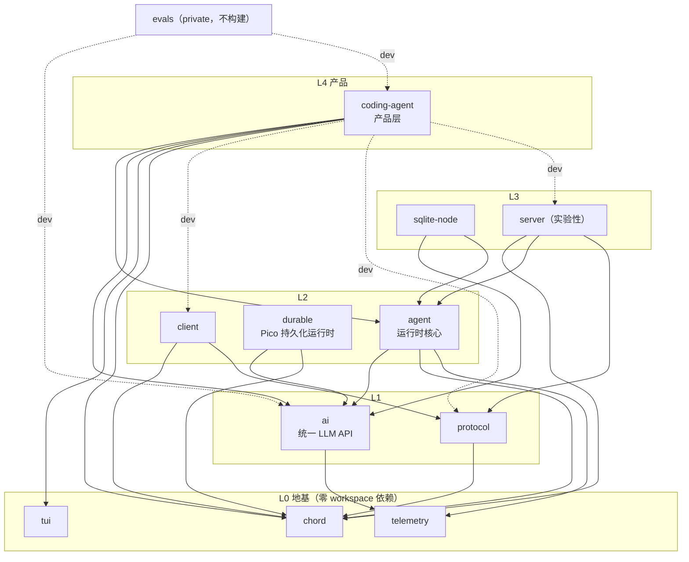
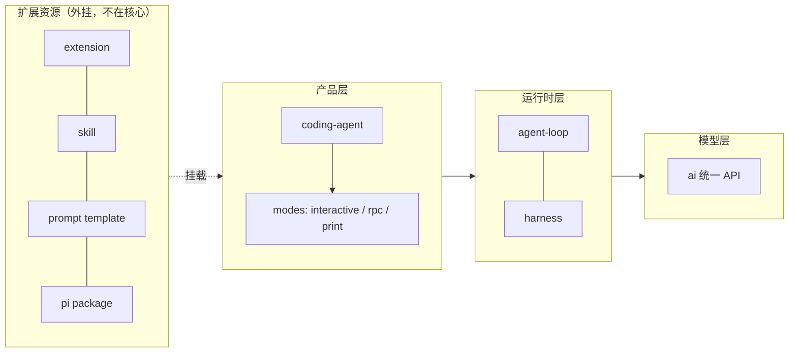

# 认知地图

状态：初稿（2026-09-07，建立学习区时基于一次仓库勘察落笔：目录结构 + 各包 package.json 依赖边 + 关键文件抽样，**未经逐包精读验证**；「已知」均为勘察级事实，待各阶段对照源码验证后升级或推翻）。基准：pi-coding-agent 0.85.1（commit 9767ba275）。版本对齐（2026-09-19，合并 main commit 99d9144）：新增 `packages/durable` 包 → 12 包、构建顺序插入 durable、agent 包新增 `harness/pico3/` 实验性子系统；拓扑与「11 包」口径已同步修正。

## 提纲（已知 / 未知 / 猜测）

- **总体定性**：已知产品是 agent（pi-coding-agent）、仓库是 harness——agent loop 仅占全仓 src 约 0.5%，harness = 构成等式（LLM + 工具 + loop）的生产级实现 + 等式之外的一切支撑设施；README 双词并用，各说各的层面。详见 [notes/architecture/agent-vs-harness.zh.md](notes/architecture/agent-vs-harness.zh.md)。
- **依赖拓扑**：已知 12 个 workspace 包的依赖边（见下图，全部读自各包 package.json；2026-09-10 第 4 步逐包复核，修正两处漏边 client/server → chord 与 evals 的 dev 边；2026-09-19 复核补入 durable 包）；已验证根 build 脚本顺序是本拓扑的合法线性化，机制原因见详解（包内 tsconfig.build.json 的 paths 解析上游 dist）；已知 README 包清单只列 7/12 个目录（2026-09-19 起含 durable），画拓扑不能依赖 README。未知 chord 内部结构（services / replicated state / RPC / plugins 具体指什么）。猜测 chord 的角色类似 dsh 的 Cordis（插件框架地基），但 pi 的扩展系统看起来不建在 chord 上（extension 是独立加载机制）——待验证。
- **agent 运行时**：已知 `agent-loop.ts` 是回合主循环（`agent_start` / `turn_start` / 工具批 / 停止条件 / `agent_end`）、`agent.ts` 是有状态包装（消息队列、tool hooks、session id、transport）、`harness/` 是大子系统（顶层 12 文件 + compaction/env/execution/pico3/runtime/session/tools/utils 八个子目录，pico3 为 2026-09-19 合并新增的实验性子系统）。**未知 `agent-loop.ts` 与 `harness/`（AgentHarness）的关系**——本地图当前最大的洞，见 questions.zh.md Q1。
- **会话模型**：已知 JSONL 落盘于 `~/.pi/agent/sessions/--<path>--/<timestamp>_<uuid>.jsonl`；已知 entry 有 SessionHeader / 消息（text / image / thinking / tool call）/ toolResult，带 `id` 与 `parentId`（分支成树）；2026-09-19 起 system 消息（承载提示词与工具声明）也作为消息 entry 落盘，见 [session-message-flow.zh.md](notes/mechanisms/session-message-flow.zh.md)「system 消息落盘」；权威定义在 [session-format.md](../packages/coding-agent/docs/session-format.md)。compaction 的触发/摘要/阻塞时序已知，见 [context-compaction.zh.md](notes/mechanisms/context-compaction.zh.md)；其如何改写树的 `parentId` 分支、以及 branch summarization 的树操作仍待验证。
- **coding-agent 产品层**：已知 `src/core/` 约 40 文件，`agent-session.ts` 是组装中枢；已知内置工具 `read / bash / powershell / edit / write / grep / find / ls`（含 renderers）；已知三种模式 interactive / rpc / print（`src/modes/`）。未知 AgentSession 的注入清单与生命周期归属。
- **扩展体系**：已知五种资源（extension / skill / prompt template / theme / pi package）；已知 `.pi/` 是 dogfooding 实例（4 个 extension、1 个 skill、6 个 prompt template）；已知 pi package 三种来源与安装落点（[packages.md](../packages/coding-agent/docs/packages.md)）。未知 extension API 全集与加载发现顺序。
- **交互与远程**：已知 tui 是差分渲染库、被 interactive 模式消费；已知 protocol（CBOR）+ client + server 是远程会话轴（server 标注 experimental）；已知 rpc 模式走 stdin/stdout JSONL、sdk.ts 提供程序化嵌入。未知三者的边界与重叠。
- **横切**：已知 telemetry 是契约包（无 workspace 依赖）、evals 是 private 包但**有 dev 依赖边**（devDependencies 依赖 ai + coding-agent，无 build 脚本、不在 build 链上——2026-09-10 第 4 步复核修正，原记「独立无 workspace 依赖」有误）、session-backends 实为目录组而非包（无根 package.json，内含 sqlite-node 子包，其依赖 agent + ai；包总数口径已核：根 workspaces = packages/*（11 包，2026-09-19 起含 durable）+ session-backends/*（1 子包）= 12 包，另有示例 workspace coding-agent/examples/extensions/with-deps，2026-09-10 第 2 步顺带完成）。未知 SQLite 后端与默认 JSONL 的取舍关系。
- **文档布局**：已知 docs/（约 30 篇产品文档）只在 coding-agent 包下——文档跟着交付单元走，写给「装 pi 的人」；ai / agent / tui 的 README 即库 API 文档（ai 1339 行、agent 393 行、tui 704 行），写给嵌入者与维护者。dsh 对照：框架型仓库的 docs/ 在仓库根（首要读者是插件开发者），产品型仓库的文档跟着产品包走。

## 详解

### 依赖拓扑（已验证边）

读自各包 package.json 的 workspace 依赖（`@earendil-works/*`，实线 = dependencies 运行时边，虚线 = devDependencies 开发期边）。2026-09-10 第 4 步逐包复核并修正三处：补 client → chord、server → chord 两条漏边；evals 实有 dev 边（原记「独立无 workspace 依赖」有误）：

读法要点：地基三包（chord / telemetry / tui）无 workspace 依赖；ai 只叠 telemetry；durable 叠 chord + ai（Pico 持久化运行时，当前无包依赖它，属独立发布的新一代 durable 落地）；agent 叠三者；client / server 都同时依赖 chord 与 protocol 族（远程会话轴以 chord 为公共地基）；coding-agent 是唯一直接依赖 tui 的包（交互面归属 coding-agent），其 dev 边（client / protocol / server）即 remote harness 开发期轴；evals 是 private 消费者（dev 依赖 ai + coding-agent），无 build 脚本、不在 build 链上。

构建顺序（根 package.json `build` 脚本）是本 DAG 的手工线性化：chord → tui → telemetry → ai → durable → agent → sqlite-node → protocol → client → server → coding-agent。机制原因：包内 `tsconfig.build.json` 的 paths 把 workspace 依赖解析到**上游 dist 产物**（如 agent 的 paths 指向 `../ai/dist/index.d.ts`），下游构建前上游产物必须在场；而根 tsconfig 的 paths 指向各包 src（check 的源码面）——build 走产物面、check 走源码面，两套解析面分离。

### agent 运行时（当前最大的洞）

勘察所见：`packages/agent/src/` 顶层 7 文件（`agent-loop.ts` / `agent.ts` / `index.ts` / `node.ts` / `proxy.ts` / `stream-fn.ts` / `types.ts`）+ `harness/`（顶层 12 文件 + 6 子目录）+ `search/`。`harness/` 顶层文件里同时出现了 `agent-harness.ts`、`hooks.ts`、`events.ts`、`messages.ts`、`system-prompt.ts`、`skills.ts`、`prompt-templates.ts`——后几个名字与 coding-agent 产品层职责高度重叠，说明 agent 包的 harness 可能是一个「自带全套装配」的更高级抽象，而 `agent-loop.ts` 是更底层的循环原语。

当前理解（猜测，阶段 3 裁决）：存在两个使用层次——低层 API（`agent-loop.ts` + `agent.ts`，coding-agent 经 AgentSession 消费）与高层 harness（`AgentHarness`，把会话、压缩、技能、提示词模板整体打包，可能服务于 SDK / server 场景）。chord 的 `Context` / `ContextKey` 类型出现在 `harness/context.ts`，说明 harness 的装配模型有 chord 参与。

### 会话模型（锚点实验的对照物）

一次会话 = 一个 JSONL 文件 = 一棵树：每个 entry 带 `id` 与 `parentId`，正常流转时 `parentId` 链成主线，分支时新 entry 指向旧 entry 形成树杈。文件首行是 SessionHeader。所有上层能力（resume、tree navigation、compaction、导出 JSONL/HTML、分享）都是这棵树上的操作。权威定义：[session-format.md](../packages/coding-agent/docs/session-format.md)。

### 分层心智模型（初始版）

与 dsh 的本质差异（帮助迁移已有心智模型的对照）：dsh 是「一切皆插件」，框架（Cordis）在运行时装配一切；pi 是「最小核心 + 外挂资源」，核心是一个普通 npm 包的分层依赖，扩展是核心之外的资源加载。pi 没有配置式组合层（profile / bundle / patch），产品形态由入口模式（interactive / rpc / print / sdk）与已启用扩展决定。
