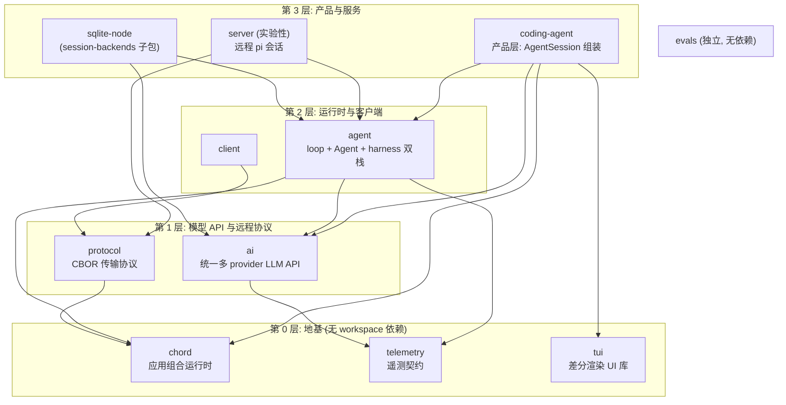

# Pi 架构级认知总览（大图）

状态：初稿（2026-09-12。基于两组源码勘察验证：packages/agent 与 packages/coding-agent 的完整探索（code-explorer 子代理，只读）+ 本学习区既有已验证事实。文中行号为勘察时参考，版本迭代后会漂移，以当前源码为准）。基准：pi-coding-agent 0.85.1（commit 9767ba275）附近。

文档性质：架构级鸟瞰与认知加工（重组既有事实 + 源码勘察结论），不新增事实源；与 [map.zh.md](../../map.zh.md) 互补——map 是「我知道什么/不知道什么」的快照，本文是「整体怎么理解」的展开。冲突时以源码与官方文档为准。

## 0. 一句话定位

pi 是一个自扩展编码 agent 的 monorepo：产品 `pi`（coding-agent 包）= 用 agent 运行时（agent 包）+ 统一 LLM API（ai 包）+ 终端 UI（tui 包）装配出来的 CLI；仓库主体是 harness——让「LLM + 工具 + loop」这个构成等式能在生产环境跑起来的全部支撑设施。

## 1. 设计理念（五条信条）

1. **最小核心 + 自扩展**：核心只保留运行时与少量内置工具（read / bash / powershell / edit / write / grep / find / ls 共 8 个），一切增值能力（工具、命令、事件钩子、UI、技能、提示词、主题）通过五种外挂资源（extension / skill / prompt template / theme / pi package）加载，不打补丁不改核心。`.pi/` 目录就是本仓库用 pi 开发 pi 的 dogfooding 实例。
2. **agent 是行为，harness 是实体**：构成等式（LLM + 工具 + loop）只占全仓 src 约 0.5%（agent-loop.ts 单文件）到 17%（含 pi-ai 与工具设施）；其余约 83% 是 harness——会话管理、扩展系统、TUI、设置、信任、供应链。详见 [agent-vs-harness.zh.md](agent-vs-harness.zh.md)。
3. **会话 JSONL 是唯一事实源**：一次会话 = 一个 JSONL 文件 = 一棵树（append-only + `parentId` 分支）。模型历史、UI 展示、resume、compaction、导出全部是这棵树上的投影或追加，不另外维护状态。
4. **信任而非权限**：pi 不内置权限系统，以启动用户的权限运行；需要边界时容器化/沙箱化（Gondolin / Docker / OpenShell 三模式，见 [containerization.md](../../../packages/coding-agent/docs/containerization.md)）。项目级信任门控决定扩展是否加载（未信任先只加载 pre-trust 集）。
5. **依赖即审查代码**：直接依赖钉死精确版本、lockfile 是 ground truth、`--ignore-scripts`、锁步版本发布。工程哲学：agent 会改你的代码，所以供应链必须可审计。

## 2. 总体架构：11 包分层

依赖方向：箭头 = 「依赖」（建在谁之上）。读自各包 package.json 的 workspace 依赖边，与 [map.zh.md](../../map.zh.md) 已验证拓扑一致。图中每个包恰好出现一次，主链 9 条边全部画出。

主链（产品如何自上而下叠起来）：

```
+----------------------------------------------------------------------+
|                          coding-agent (产品层)                        |
|     AgentSession 组装 | 内置工具 x8 | 会话/设置/信任 | 扩展加载         |
|     出口: interactive(TUI) / rpc / print / sdk                        |
+-----+---------------+-----------------+----------------+-------------+
      |               |                 |                |
      v               v                 v                v
+----------+  +-------------+  +-------------+  +------------+
|  chord   |  |    agent    |  |     ai      |  |    tui     |
| 应用组合  |  |  运行时核心  |  |  统一 LLM   |  |  差分渲染  |
| 运行时    |<--| loop+Agent |-->| 多provider  |  |   UI 库   |
| (无依赖) |  |  (双栈)     |  |    API      |  |  (无依赖)  |
+----------+  +------+------+  +------+------+  +------------+
                     |                 |
                     | 依赖            | 依赖
                     v                 v
                  +--------------------------+
                  |         telemetry        |
                  |      (无依赖, 地基)        |
                  +--------------------------+
```

mermaid 总图（11 包 + 全部 11 条已验证边；层次依据 = 依赖深度，即最长依赖路径——所有边都只向下指，无环。ASCII 图与本图等价，看层次用本图，纯文本场景用 ASCII 图，核对用下方邻接表）：



分层依据表（层次划分 = 依赖深度，即最长依赖路径；所有边只向下指，无环。可机器验证：把邻接表喂给拓扑排序即可复验）：

| 层 | 包 | 深度推导 |
|---|---|---|
| L0 | chord, telemetry, tui | 无依赖 |
| L1 | ai, protocol | ai→telemetry；protocol→chord |
| L2 | agent, client | agent→ai→telemetry；client→protocol |
| L3 | coding-agent, server, sqlite-node | 三者最深路径都到 agent（如 coding-agent→agent→ai→telemetry） |

跨层直达边（coding-agent 直达 tui/chord、agent 直达 chord/telemetry）是真实的依赖边，没有为图面整齐而合并或省略。

侧链（独立于主链，同样只画已验证边）：

```
  +----------------+       +----------------+       +----------+
  |     server     |------>|    protocol    |<------|  client  |
  | (experimental) |       |    (CBOR)      |       +----------+
  +-------+--------+       +--------+-------+
          |                         |
          v 依赖                     v 依赖
     +----------+              +----------+
     |  agent   |              |  chord   |
     +----------+              +----------+

  存储扩展: session-backends/sqlite-node --> agent + ai   (SQLite 会话后端, 独立子包)
  独立:     evals (评测框架, 无 workspace 依赖)
```

依赖边全集核对表（读自各包 package.json 的 workspace 依赖；图与表冲突时以表为准）：

| 包 | workspace 依赖 |
|---|---|
| coding-agent | agent, ai, tui, chord |
| agent | ai, chord, telemetry |
| ai | telemetry |
| tui | —（无） |
| chord | —（无） |
| telemetry | —（无） |
| server（实验性） | agent, protocol |
| client | protocol |
| protocol | chord |
| session-backends/sqlite-node | agent, ai |
| evals | —（无） |

读法要点：第二层四框是 coding-agent 的全部直接依赖（agent / ai / tui / chord）；agent 的三条边（→ai、→chord 为水平箭头，→telemetry 为下行箭头）与 ai 的一条下行边（→telemetry）补全运行时层与模型层的依赖。chord / telemetry / tui 无 workspace 依赖（地基），其中 tui 仅被 coding-agent 依赖（交互面归属产品层）。远程轴 protocol→chord 与 agent 通过 server 汇合，独立于产品主链。

### 图之外：依赖图未体现的四个维度

依赖图只回答「谁依赖谁」。以下四个维度同样真实，但图上不可见：

**1. 被依赖广度（fan-in）：同层不等分量。** 直接被依赖数：chord ← coding-agent / agent / protocol；ai ← coding-agent / agent / sqlite-node；agent ← coding-agent / server / sqlite-node（各 3）；telemetry ← agent / ai；protocol ← server / client（各 2）；tui ← coding-agent（1，全仓唯一消费方）。算传递闭包差距更大：chord 被 6 个包直接或间接依赖（coding-agent、agent、protocol、server、client、sqlite-node），telemetry 被 5 个（coding-agent、agent、ai、server、sqlite-node），tui 只有 1 个。同样位于 L0 的三个地基包，chord 是全仓被依赖最广的地基，tui 实际上是产品层的专用 UI 库——拓扑位置相同，分量完全不同。

**2. 节点分量：框一样大，包不一样大。** 图上等大的框掩盖了体量差异（行数统计见 [agent-vs-harness.zh.md](agent-vs-harness.zh.md)，2026-09-08）：全仓 src 约 134,700 行中，coding-agent 62,923 行（47%）是体量最大的包；pi-ai 约 22.1k 行；agent-loop 本体仅约 800 行，但 agent 包 harness 子系统的 lane.ts 一个文件约 2,000 行。产品层吞掉近半代码，这个事实从任何依赖图上都看不出来。

**3. 依赖强度：边一样画，用法不一样重。** package.json 的依赖边是声明级，不区分调用强度。已知的强度差异：agent → ai 是运行时主路径（每次 LLM 调用都经它）；agent → chord 目前已知至少是类型复用（harness/context.ts 的 Context / ContextKey，运行时参与度是 Q3 待验证）；coding-agent → agent 的实际使用集中在 Agent 类与 harness 子树的 compaction 纯函数，而非全量 API——特别是「coding-agent 复用 harness 纯函数」这一点，从依赖图上完全不可见（图上只有一条边，看不出复用的是哪个子树）。

**4. 版本与状态：图不携带元数据。** 全部包 lockstep 同版本号（当前基准 0.85.1）；server 标注 experimental；sqlite-node 是可选会话后端（默认实现是 JSONL 文件，SQLite 只在显式选择时启用）；evals 独立发布，但服务于整个仓库的评测。

## 3. 运行时双栈：最重要的架构事实（Q1 的源码裁决）

**结论：`agent-loop.ts`（+ `agent.ts`）与 `harness/`（AgentHarness）不是分层协作，是两条并行的执行栈——经典内存栈（当前生产路径）与 durable 持久化栈（已发布的第二条栈，设计意图指向下一代但仓库未承诺替换主路径）。** 两条栈的语义详解（内存即真相 vs 先记账再执行、崩溃行为对照、状态澄清）见 [dual-runtime-semantics.zh.md](../mechanisms/dual-runtime-semantics.zh.md)。证据：`harness/` 全目录不 import `agent-loop.ts`（已验证 0 命中）；`AgentHarness` 在 coding-agent 的 core / modes / main.ts 主路径 0 命中，只出现在 experimental 目录、packages/server、evals、sqlite-node 一致性测试。

```
                     共享底座 (两栈都建在其上, 这也是它们「看起来分层」的原因)
     +----------------------------------------------------------------------+
     |  types.ts: AgentMessage / AgentTool / QueueMode / ThinkingLevel        |
     |  pi-ai: streamSimple / Model / EventStream                            |
     |  chord: Context / ContextKey (cancellation / telemetry 载体)           |
     +---------------------------+------------------------------------------+
                                 |
            +--------------------+---------------------+
            v                                          v
 [路径 A: 经典内存栈]                       [路径 B: durable 持久化栈]
 (当前生产路径, 单进程交互式使用)             (已发布: 崩溃可恢复 / 多 lane / 远程驱动)

   AgentSession (coding-agent/core)         AgentHarness (纯接口, agent-harness.ts)
       |                                       |  .create()
       v                                       v
   Agent (agent.ts, 有状态包装)               Harness (runtime/harness.ts)
       |  runAgentLoop                         |  lanesByName: Map<name, Lane>
       v                                       v
   agent-loop.ts runLoop                      Lane (runtime/lane.ts, 操作状态机)
   (双层 while 循环)                            |  accept  持久化准入, 不启动效果
       |                                       |  drive   分阶段推进
       v                                       v
   pi-ai streamFn --> provider                runtime/drive/* (response / tools /
                                              checkpoint / retry / recovery / ...)
                                                  |
                                                  v
                                              session/ 三存储 (JSONL / SQLite)
   [内存即真相: 进程崩溃即丢失]                [每步原子提交: 任意两次提交之间崩溃可恢复]

 消费方: coding-agent core 生产代码            消费方: coding-agent experimental/
 (sdk.ts L306 new Agent;                        (session-worker / mini / services),
 agent-session.ts)                            packages/server, evals, sqlite-node
```

两栈的概念映射（代码不复用，概念对齐）：`runLoop` 内层 while ↔ `Lane.drive`；steering/followUp 队列 ↔ lane inbox；`beforeToolCall/afterToolCall` ↔ `before_tool/after_tool` 钩子；`prepareNextTurn` ↔ run 的 boundary 阶段。

补充：coding-agent 生产路径还**复用了 harness 子树的纯函数部分**（compaction / branch-summarization，经 `coding-agent/src/core/compaction/` 落地），但不用 Harness 类本身。

### 生产路径的静态结构（精简）

只含经典内存栈（当前生产路径）的静态组装关系——箭头 = 创建 / 持有 / 调用，不是运行时数据流（数据流见 §4）：

```
+---------------------------------------------------------------+
| coding-agent (产品包)                                         |
|                                                              |
|  modes (入口): interactive / rpc / print                     |
|    |  interactive 模式经 tui 包渲染 (差分渲染 UI 库)          |
|    v                                                         |
|  AgentSession (组装中枢, agent-session.ts)                   |
|    组装: [工具注册表] [SessionManager] [ExtensionRunner]      |
|          [ModelRuntime] [SettingsManager] [ResourceLoader]   |
|    工具来源: 内置 x8 + 扩展注册                               |
+--------------+-----------------------------------------------+
               | 创建并持有
               v
+---------------------------------------------------------------+
| agent (运行时包) -- 经典栈本体                                 |
|                                                              |
|  Agent (有状态包装, agent.ts)                                 |
|    持有: _state.messages (内存 transcript, 即真相)            |
|          steering / followUp 队列                             |
|          beforeToolCall / afterToolCall 钩子                   |
|    调用: agentLoop (无状态 turn 循环原语, agent-loop.ts)      |
+--------------+-----------------------------------------------+
               | 每次 LLM 调用经 streamFn
               v
+---------------------------------------------------------------+
| ai (模型包)                                                  |
|                                                              |
|   streamSimple (统一流式 API) | 模型目录 (生成式, 不可手改)   |
+--------------+-----------------------------------------------+
               v
      provider (OpenAI / Anthropic / Google / ...)

外部落点 (静态关系, 不在调用链上):
  SessionManager ----> 会话 JSONL 文件 (append-only 树)
  ExtensionRunner <---- 扩展 (.pi/ 发现: 注册工具/命令/事件钩子)
```

读法：AgentSession 是组装中枢（coding-agent 包内），它创建并持有 Agent（agent 包）与其他服务；Agent 调用 agentLoop 循环原语；每次 LLM 调用经 ai 包的 streamSimple 到 provider。tui 只被 interactive 模式使用（独立包）。会话 JSONL 与扩展是两个外部落点：前者由 SessionManager 追加，后者经 ExtensionRunner 注入。本图回答「系统由哪些组件、谁组装谁」；§4 回答「一条消息怎么穿过去」——两图正交。

## 4. 一次对话的生命周期（生产路径一条消息）

精简数据流总览（箭头 = 调用 / 数据流；静态组装关系见 §3 末尾「生产路径的静态结构」；详细事件流见下图）：

```
  用户
   |  interactive(TUI) / rpc / print
   v
+--+------------------------------------------------------------+
| coding-agent (产品层)                                          |
|                                                               |
|   AgentSession [组装中枢]                                     |
|   装配: 工具注册表(内置 x8 + 扩展注册) | SessionManager        |
|         | ExtensionRunner | SettingsManager                   |
|   入口职责: 校验模型与鉴权; 展开 slash 命令 / skill /           |
|             prompt template                                   |
+---------------+-----------------------------------------------+
                | Agent.prompt()
                v
+---------------------------------------------------------------+
| agent (经典内存栈: 内存即真相)                                  |
|                                                               |
|   Agent (agent.ts, 有状态包装)                                 |
|     内存态: _state.messages | steering / followUp 队列         |
|         |                                                     |
|         | runAgentLoop                                        |
|         v                                                     |
|   runLoop (agent-loop.ts, turn 循环)                          |
|     组请求 -> 流式响应 -> 提取 toolCalls                      |
|     -> executeToolCalls (工具: 内置 x8 + 扩展注册)            |
|     -> toolResult 推回上下文 -> 有工具调用则下一 turn          |
+---------------+-----------------------------------------------+
                | streamFn (每次 LLM 调用)
                v
+---------------------------------------------------------------+
| ai (模型层): streamSimple 统一 API -> provider                 |
|               (OpenAI / Anthropic / Google / ...)              |
+---------------------------------------------------------------+

旁路 (不在主链上, 但每 turn 都发生):
  message_end 事件 --> SessionManager append --> 会话 JSONL (树)
  agent 事件 --> ExtensionRunner (30+ 事件钩子) / 模式层渲染
```

详细事件流（全量）：

```
用户
 |  输入 (interactive TUI / rpc stdin / print -p)
 v
AgentSession.prompt()                                 [coding-agent]
 |  1. 校验模型/鉴权 (ModelRuntime)
 |  2. 展开 slash 命令 / skill / prompt template
 v
Agent.prompt() -> 消息入队                              [agent]
 |
 v
runAgentLoop (agent-loop.ts, 双层 while)
 |
 |  agent_start
 |    |
 |    |  +---------- turn 循环 (while 有工具调用或排队消息) ----------+
 |    |  |                                                          |
 |    |  |  prepareNextTurn      <-- 压缩 (compaction) 的注入点       |
 |    |  |  turn_start                                               |
 |    |  |  [注入 steering 消息, 如有]                                |
 |    |  |       |                                                  |
 |    |  |       v                                                  |
 |    |  |  transformContext -> convertToLlm                         |
 |    |  |       |  (系统提示词 + 历史 + 工具 schema -> Message[])     |
 |    |  |       v                                                  |
 |    |  |  streamFn -----> pi-ai streamSimple -----> provider       |
 |    |  |       |             (统一 API, 词汇转换)     (OpenAI/      |
 |    |  |       |                                    Anthropic/...)  |
 |    |  |  message_start / update / end  (assistant 流式)           |
 |    |  |       |                                                  |
 |    |  |       v                                                  |
 |    |  |  提取 toolCalls; stopReason=error/aborted -> 直接终止      |
 |    |  |  stopReason=length -> 工具调用标记为截断错误 (不执行)       |
 |    |  |       |                                                  |
 |    |  |       v                                                  |
 |    |  |  executeToolCalls  (顺序 / 并行 批执行)                    |
 |    |  |  tool_execution_start / update / end                      |
 |    |  |       |     内置工具或扩展注册的工具                         |
 |    |  |       v                                                  |
 |    |  |  toolResult 消息以 message_start/end 推回上下文            |
 |    |  |       |                                                  |
 |    |  |  turn_end -> shouldStopAfterTurn? -> 可提前终止            |
 |    |  +----------------------------------------------------------+
 |    |
 |    |  (无 follow-up 排队消息 -> 退出外层循环)
 |  agent_end
 |
 v  事件流同时分三路:
 +---> SessionManager: message_end 时 append 进会话 JSONL (事实源)
 +---> ExtensionRunner: 30+ 事件钩子 (tool_call / context 改写 / ...)
 +---> 模式层监听者: TUI 渲染 / rpc stdout / print 输出
```

停止条件全集：error/aborted、`shouldStopAfterTurn`、工具批全部 `terminate === true`、无 follow-up 消息。

## 5. AgentSession：组装中枢

```
        createAgentSessionServices (cwd 绑定的基础设施)
        +------------------------------------------------------+
        | ModelRuntime     SettingsManager     ResourceLoader   |
        | (模型目录/鉴权)    (设置)    (extensions/skills/prompts|
        |                            /themes, 含项目信任门控)    |
        +-------------------------+----------------------------+
                                  |  createAgentSession (sdk.ts)
                                  v
        +------------------------------------------------------+
        |                     AgentSession                      |
        |                                                       |
        |  Agent (agent 包)  <--- prompt() / steer() / followUp() |
        |      beforeToolCall/afterToolCall --------------------+
        |      (经 _installAgentToolHooks 桥接到扩展的 tool 事件)  |
        |                                                       |
        |  工具注册表: createAllToolDefinitions (read/bash/edit/   |
        |    write/grep/find/ls/powershell) + 扩展注册工具        |
        |    + allowlist / denylist                              |
        |  SessionManager (JSONL 会话树, 见 §6)                  |
        |  ExtensionRunner (事件分发)                             |
        +---------------------^---------------------------------+
                              | 事件 / prompt
        AgentSessionRuntime 持有它, 负责 /new / resume /fork /import
        的整会话替换 (teardown -> 重建 -> session_start)
                              |
            +-----------------+-----------------+
            v                 v                 v
     interactive (TUI)    rpc (stdin/stdout   print (单发, -p;
     全功能界面/斜杠命令/    JSONL 无头协议;      --mode json 变体
     会话树导航/主题        扩展 UI 请求-响应桥)  输出事件流)
```

生命周期六步：建服务 → 建会话（`new Agent` + 恢复历史）→ 绑定扩展（`bindExtensions`，发 `session_start`）→ 运行回合（`prompt` → `_runAgentPrompt` → `_handlePostAgentRun`：自动重试/溢出压缩/排队消息 → `agent_settled`）→ 会话替换（switchSession/newSession/fork/import）→ 销毁（dispose）。

## 6. 会话树模型（已验证锚点，[experiments/001](../../experiments/001-session-anchor.zh.md)）

```
~/.pi/agent/sessions/--<cwd编码>--/<timestamp>_<uuid>.jsonl

SessionHeader (首行: id / cwd / parentSession / version)
   |
   v
 [e1 user] <-- [e2 assistant] <-- [e3 toolResult] <-- [e5 user] ...   主线
                  ^
                  | 分支: 新 entry 的 parentId 指向 e2
                  |
              [e6 user] <-- [e7 assistant] ...                      分支 B
```

不变量（全部上层能力的地基）：

- **append-only**：日志只增不改。
- **分支 = 改 leaf 指针**：`branch(id)` 把 leaf 指到历史条目，后续 append 从那里长出新枝，原路径仍在文件中。
- **resume = 路径投影**：从 leaf 沿 `parentId` 回溯到根，生成恢复上下文 `{messages, thinkingLevel, model}`。
- **compaction = 追加条目**：追加 `compaction` 条目 + `firstKeptEntryId`，旧条目不删除。
- **会话级 fork = 导出新文件**：只写 root→leaf 路径，新 header 的 `parentSession` 指回原文件，形成会话间父子链。

## 7. 扩展体系：自扩展信条的载体

```
五种外挂资源 (都不在核心内):
+----------------+--------------------+---------------------------------+
| 资源            | 形态               | 加载时机                         |
+----------------+--------------------+---------------------------------+
| extension      | TS/JS 模块 (jiti)  | 会话启动时全部加载               |
| skill          | SKILL.md           | 系统提示词列目录, 模型按需读      |
| prompt template| md 文件            | /slash 命令展开时                |
| theme          | 主题定义            | TUI 启动/切换时                 |
| pi package     | npm/git/local 包   | pi install 后由 manifest 过滤    |
+----------------+--------------------+---------------------------------+
```

extension 发现顺序（去重后串行加载）：`<cwd>/.pi/extensions/`（项目本地）→ `~/.pi/agent/extensions/`（全局）→ settings/CLI 显式路径。目录内规则：`*.ts|*.js` 直接文件、子目录 `index.ts`、子目录 `package.json` 带 `"pi"` manifest（npm 包形态扩展的接入点）。

extension 的挂载点全集：工具（`registerTool`）、斜杠命令（`registerCommand`）、事件钩子（`pi.on`，30+ 事件：会话生命周期 / turn / 消息流式 / `tool_call`/`tool_result` 可拦截改写 / `context` 改写发给 LLM 的消息 / provider 请求响应前后）、UI（setWidget / 对话框 / 选择器）、provider（`registerProvider`）、资源发现（`resources_discover` 动态贡献 skills/prompts/themes）、会话操作（newSession/switchSession/fork）。

加载细节：jiti 直接加载 TS（无需预编译），编译二进制场景经 virtualModules 注入宿主 API（扩展永远用宿主打包的 API 版本）；未信任项目先加载 pre-trust 扩展集。

## 8. 各包一览

| 包 | 一句话 | 与学习路径的映射 |
|---|---|---|
| coding-agent | 产品层：AgentSession 组装、内置工具、会话/设置/信任、扩展加载、三模式 | 阶段 4 |
| agent | 运行时核心：双栈（loop+Agent 经典栈 / AgentHarness durable 栈）+ 共享纯函数（compaction 等） | 阶段 3 |
| ai | 模型层：统一多 provider LLM API、流式词汇、生成式模型目录（`models.generated.ts` 红线：改走 `generate-models.ts`） | 阶段 2 |
| tui | 独立 UI 库：差分渲染、组件模型，仅被 coding-agent 消费 | 阶段 7 按需 |
| chord | 地基：应用组合运行时（services / replicated state / RPC / plugins），几乎被所有上层依赖 | 阶段 7 按需 |
| telemetry | 地基：厂商中立遥测契约（无 workspace 依赖） | 阶段 7 按需 |
| protocol / client / server | 远程会话轴：CBOR 协议 + 客户端 + 服务器（server 实验性） | 阶段 7 按需 |
| session-backends/sqlite-node | 会话 SQLite 后端（默认实现是 JSONL 文件） | 阶段 7 按需 |
| evals | 评测框架（独立，无 workspace 依赖） | 按需 |

agent 包内部结构速查：

```
packages/agent/src/
  types.ts / stream-fn.ts / proxy.ts / search/     共享底座 (AgentMessage/AgentTool)
  agent-loop.ts       路径 A: 无状态主循环 (事件序列, 工具批, 停止条件)
  agent.ts            路径 A: Agent 有状态包装 (transcript/队列/hooks/abort)
  harness/            路径 B + 共享纯函数
    agent-harness.ts   接口层: HarnessEventPayload(40+ 事件) / HookMap(12 钩子)
                       / AgentLane / AgentHarness (纯类型声明)
    context.ts         chord Context 复用
    events.ts          HarnessEventBus (被动事件总线)
    hooks.ts           HookRegistry (有序聚合执行)
    messages.ts        自定义消息角色 (declaration merging)
    skills.ts / prompt-templates.ts / system-prompt.ts
    runtime/           实现层: Harness -> Lane(操作状态机) -> drive/*(推进阶段)
    session/           持久化: Session / JSONL 后端 / fork / commit / values(pi.op.state)
    compaction/        压缩 + 分支摘要 (纯函数, 生产路径也复用)
    env/               Node 执行环境 (FileSystem / Shell 抽象)
    execution/         assistant 流 / 工具执行 / effect-gate
    tools/             内置编码工具 (read/write/edit/bash/...)
```

## 9. 对既有认知地图的修正

- **Q1 裁决（源码级）**：双代并存，非分层协作。生产路径 = `AgentSession → Agent → runAgentLoop`；`AgentHarness` 不在主路径，服务 experimental / server / evals / sqlite-node。map.zh.md「agent 运行时」一节的猜测「高低层 / 分层协作」应修正为「双栈」；CHANGELOG 称之为 "inherited v2 session and AgentHarness API"，方向是下一代运行时。
- **Q2 部分解答**：drive = 分阶段推进一个已被 accept 的操作（response / tools / checkpoint / retry / recovery 等 12 个阶段模块），对应经典栈的循环体，但每阶段原子提交。
- **Q3 部分解答**：`harness/context.ts` 复用 chord 的 `Context` / `ContextKey` 类型并注入 telemetry parent；运行时参与度待验证。
- **Q4 基本可确认**：coding-agent 通过 `_installAgentToolHooks` 把 Agent 的 `beforeToolCall/afterToolCall` 桥接到扩展的 `tool_call`/`tool_result` 事件——extension API 是对 agent 钩子的封装桥接，不是独立机制；待精读 runner.ts 定案。

## 10. 遗留问题

- 双栈未来：AgentHarness 是否/何时替换经典栈（观察 experimental 目录与 server 的演进）。
- chord 的运行时参与度（Q3 后半）。
- print / json / rpc / sdk 四个出口的边界与重叠（Q6，仍 open）。
- harness 的 intent → effect → settlement 两阶段提交细节（阶段 3 深入时读 `docs/harness.md` 规格）。

## 验证方式

- 依赖拓扑：各包 package.json 的 workspace 依赖（与 map.zh.md 已验证边一致）。
- 双栈关系：`packages/agent/src/harness/` 全目录搜索对 `agent-loop` 的引用（0 命中）；`packages/coding-agent/src/core/`、`src/modes/`、`main.ts` 搜索 `AgentHarness|harness`（0 命中）；`sdk.ts` L306 `new Agent({...})`。
- 消息生命周期：`agent-loop.ts` 的 `runLoop`（事件序列）+ `agent-session.ts` 的 `_handleAgentEvent`（持久化分路）。
- 本文档行号基于 2026-09-12 勘察（子代理只读探索），版本迭代后以当前源码为准。
