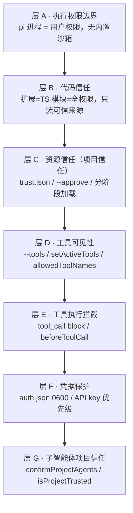

# pi 安全模型：七层输入守卫 + 零内置沙箱

状态：草稿（2026-09-18 对照 [docs/security.md](../../../packages/coding-agent/docs/security.md) 全文、[docs/containerization.md](../../../packages/coding-agent/docs/containerization.md) 四种隔离模式、[core/trust-manager.ts](../../../packages/coding-agent/src/core/trust-manager.ts) 项目信任实现、[docs/extensions.md](../../../packages/coding-agent/docs/extensions.md) L111 扩展信任、[docs/providers.md](../../../packages/coding-agent/docs/providers.md) L139 凭据权限、[docs/skills.md](../../../packages/coding-agent/docs/skills.md) L149 allowed-tools、[examples/extensions/subagent/index.ts](../../../packages/coding-agent/examples/extensions/subagent/index.ts) 子智能体信任；七层分类、项目信任机制、容器化模式均逐点对照源码）

本文是 [extension-human-approval.zh.md](../modules/extension-human-approval.zh.md) 里「三层安全模型」背景的**完整展开**——从三层扩成七层，并补全「无内置沙箱」的设计哲学与容器化隔离选项。放 architecture 目录因为它是跨多层的架构级认知，而非单个模块。

## 事实源（链接，不复述）

- [docs/security.md](../../../packages/coding-agent/docs/security.md)（官方安全文档全文，59 行）
- [docs/containerization.md](../../../packages/coding-agent/docs/containerization.md)（四种隔离模式）
- [core/trust-manager.ts](../../../packages/coding-agent/src/core/trust-manager.ts)（项目信任存储实现）
- [docs/extensions.md](../../../packages/coding-agent/docs/extensions.md) L111（扩展 = 全权限）
- [docs/providers.md](../../../packages/coding-agent/docs/providers.md) L139（auth.json 0600）
- [docs/skills.md](../../../packages/coding-agent/docs/skills.md) L149（allowed-tools）
- [examples/extensions/subagent/index.ts](../../../packages/coding-agent/examples/extensions/subagent/index.ts)（confirmProjectAgents）
- [extension-human-approval.zh.md](../modules/extension-human-approval.zh.md)（层 E 详述）

## 总纲：pi 的信任哲学

[docs/security.md](../../../packages/coding-agent/docs/security.md) 三句话定了基调：

1. **L3**：*Pi runs with the permissions of the user account that starts it, and it treats files writable by that user as inside the same local trust boundary.*（以用户权限运行，用户可写文件 = 同一信任边界）
2. **L7**：*Project trust ... is not a sandbox and it does not restrict what the model can ask tools to do.*（项目信任不是沙箱）
3. **L31-37**：无内置沙箱是**故意的**——部分进程内沙箱「容易被误解为安全边界，但实际仍依赖 host shell/fs/凭据/扩展代码」；真正隔离必须来自 OS 或容器/虚拟化边界。

核心理念：**pi 不假装提供安全边界，而是把"信任"明确成几层输入守卫，把"隔离"明确甩给 OS/容器。**

## 安全模型的七层

### 层 A：执行权限边界（无内置沙箱）

[docs/security.md](../../../packages/coding-agent/docs/security.md) L33：内置工具能读写文件、跑 shell，**以 pi 进程权限**；扩展是 TS 模块，**同样权限**。

四种外部隔离模式（[docs/containerization.md](../../../packages/coding-agent/docs/containerization.md)）：

| 模式 | 隔离什么 | 凭据位置 |
|---|---|---|
| **Gondolin** 扩展 | 内置工具 + `!` 命令路由进 micro-VM | 留 host |
| **Plain Docker** | 整个 pi 进程 | 进容器 |
| **OpenShell** | 整个 pi 进程，策略沙箱 | 可经 inference routing 留网关 |
| **Docker Sandboxes (sbx)** | 整个 pi 进程，托管沙箱 | sentinel 值，proxy 出口替换，**不进容器** |

### 层 B：代码信任（扩展来源）

[docs/extensions.md](../../../packages/coding-agent/docs/extensions.md) L111：*Extensions run with your full system permissions and can execute arbitrary code. Only install from sources you trust.*

- 扩展 = TS 模块 = 与 pi 同权限，能执行任意代码；
- 自动发现**只从可信位置**（user/global `~/.pi/agent/extensions` + CLI `-e` + 项目信任后的 `.pi/extensions`）；
- 项目本地扩展**只在项目信任后**才加载（与层 C 联动）。

### 层 C：资源信任（项目信任）—— 最复杂的一层

**触发条件**（[core/trust-manager.ts](../../../packages/coding-agent/src/core/trust-manager.ts) `TRUST_REQUIRING_PROJECT_CONFIG_RESOURCES` + `hasTrustRequiringProjectResources`）：cwd 下 `.pi/` 含 `settings.json` / `extensions` / `skills` / `prompts` / `themes` / `SYSTEM.md` / `APPEND_SYSTEM.md`，或 cwd 及祖先有 `.agents/skills`（**排除** user 全局 `~/.agents/skills`，那是可信用户资源）。

> 注意：**裸 `.pi` 目录不算**需要信任的资源（[docs/security.md](../../../packages/coding-agent/docs/security.md) L16）。

**决策存储**（`ProjectTrustStore`，`trust.json`）：

- 按**规范路径**（`canonicalizePath`）存 `true`/`false`/`null`；
- `findNearestTrustEntry` 从 cwd 逐级向上找**最近祖先**决策——父目录信任则子目录继承；
- `proper-lockfile` 锁防止并发写。

**决策来源优先级**（[docs/security.md](../../../packages/coding-agent/docs/security.md) L18-29）：

| 来源 | 时机 |
|---|---|
| `trust.json` 最近祖先 | 静态，启动时读 |
| `project_trust` 事件（user/global/CLI 扩展） | 第一个返回 yes/no 的拥有决策 |
| `defaultProjectTrust` 全局设置 | 兜底，`ask`(默认)/`always`/`never` |
| `--approve`/`-a` / `--no-approve`/`-na` | 单次覆盖 |
| `/trust` 交互命令 | 保存到 `trust.json` |

**分阶段加载**（[docs/security.md](../../../packages/coding-agent/docs/security.md) L27，关键）：

- **信任前**：只加载 context files（`AGENTS.md` 等）+ user/global 扩展 + CLI `-e` 扩展；
- **信任后**：才加载 `.pi/settings.json`、`.pi/{extensions,skills,prompts,themes}`、项目包管理扩展、项目本地扩展。

**模式差异**（[docs/security.md](../../../packages/coding-agent/docs/security.md) L29）：

- 交互模式：`ask` 弹信任提示；
- 非交互（`-p`/`json`/`rpc`）：不弹窗，`ask`/`never` 忽略资源，`always` 信任，可用 `--approve` 覆盖。

**项目信任不是安全边界**（[docs/security.md](../../../packages/coding-agent/docs/security.md) L37，最重要的一句话）：

> *Project trust is only an input-loading guard. It prevents a repository from silently changing pi's settings or extensions before you approve it. It does not make untrusted code, untrusted prompts, or untrusted model output safe.*

它只防"仓库偷偷改 pi 配置/扩展"，**不防** prompt injection（来自仓库文件/注释/文档/构建输出）——那是预期的本地 agent 风险。

### 层 D：工具可见性（工具白名单）

| API | 作用 |
|---|---|
| `--tools` CLI flag | 启动时限定工具集 |
| `setActiveTools(names)` | 运行时增删 |
| `allowedToolNames` / `excludedToolNames`（sdk.ts） | AgentSession 注入时的允许/排除名单 |
| skill 的 `allowed-tools`（[docs/skills.md](../../../packages/coding-agent/docs/skills.md) L149） | skill 预批准工具（实验性） |

控制的是「**模型能调到哪些工具**」——未启用的工具模型根本看不到。这是"可见性"限制，不是"执行时审批"。

### 层 E：工具执行拦截（扩展自建审批）

详见 [extension-human-approval.zh.md](../modules/extension-human-approval.zh.md)。机制是 `tool_call` 事件 + `beforeToolCall` 可 `block` + `ctx.ui.confirm` 暂停等待。**pi 提供机制，审批逻辑靠扩展写**（`permission-gate.ts` / `protected-paths.ts` 是官方示例）。

### 层 F：凭据保护

- `auth.json` 创建时 `0600` 权限（[docs/providers.md](../../../packages/coding-agent/docs/providers.md) L139）；
- 凭据优先级：auth.json > 环境变量；
- 短期 token（OAuth）经 `getApiKey` 钩子动态刷新；
- 容器模式下推荐「最小 key / 短期凭据 / sentinel + proxy 出口替换」（Docker Sandboxes）。

### 层 G：子智能体的项目信任确认

subagent 示例（[examples/extensions/subagent/index.ts](../../../packages/coding-agent/examples/extensions/subagent/index.ts)）：项目本地 agents（`.pi/agents/*.md`）是 repo 控制的提示，能指示模型读文件/跑 bash。扩展用 `ctx.ui.confirm` + `ctx.isProjectTrusted()` 在运行项目 agents 前确认——把"项目信任"延伸到子进程边界。

## 「无内置沙箱」的设计哲学

[docs/security.md](../../../packages/coding-agent/docs/security.md) L35-37 三句话最值得记住：

1. pi 设计目标是操作本地源码树、调用项目工具链、集成用户开发环境；
2. 进程内部分沙箱「容易被误解为安全边界，但实际仍依赖 host shell/fs/凭据/扩展」——**假边界比没边界更危险**；
3. 真正隔离必须来自 OS 或容器/虚拟化边界。

所以 pi 的立场是：**不提供假边界，把隔离责任明确交给 OS/容器**（[docs/containerization.md](../../../packages/coding-agent/docs/containerization.md) 给四种现成模式），自己只做"输入加载守卫"（项目信任）。

## 容器化最佳实践（[docs/security.md](../../../packages/coding-agent/docs/security.md) L41-53）

- 只挂载必要工作路径；
- 不挂 host `~/.pi/agent`（除非容器要访问 host 会话/凭据）；
- 最小 API key / 短期凭据；
- 任务不需要网络时限制网络；
- review diff 后再拷回可信系统；
- bind-mount 读写时容器内写入仍改 host 文件——需更强保护用只读挂载或拷入拷出。

## 安全边界之外（[docs/security.md](../../../packages/coding-agent/docs/security.md) L59）

这些**不在**安全边界内，除非报告证明真实的权限边界绕过：

- 预期的本地 agent 行为；
- 无内置沙箱；
- 来自不可信内容的 prompt injection；
- 用户安装的扩展/skill 行为。

## 一句话总结

pi 的安全模型是**七层输入守卫 + 零内置沙箱**：执行权限（用户权限/无沙箱）→ 代码信任（扩展=全权限/可信来源）→ 资源信任（项目信任，`trust.json`+分阶段加载，**只是输入守卫不是沙箱**）→ 工具可见性（白名单）→ 工具执行拦截（扩展自建审批）→ 凭据保护 → 子智能体信任延伸。核心理念是**不假装提供安全边界**：进程内沙箱是"假边界比没边界更危险"，真正隔离甩给 OS/容器（四种现成模式），自己只做"防止仓库偷偷改 pi 配置"的输入加载守卫。

## 验证方式

- `read_file` 读 `docs/security.md` 全文（59 行，官方立场）
- `read_file` 读 `docs/containerization.md` 全文（四种隔离模式）
- `read_file` 读 `core/trust-manager.ts` 全文（`ProjectTrustStore` / `hasTrustRequiringProjectResources` / `findNearestTrustEntry`）
- `read_file` 读 `docs/extensions.md` L111 附近（扩展权限声明）
- `search_content` 搜 `allowedToolNames` / `excludedToolNames` 定位工具白名单接线

## 遗留问题

- `project_trust` 事件的完整处理流程（哪个扩展第一个返回 yes/no 拥有决策、与 `defaultProjectTrust` 的兜底关系）未逐行追踪，留待阶段 5。
- skill `allowed-tools`（实验性）的语义与 `--tools`/`setActiveTools` 的交互未展开。
- OpenShell / Docker Sandboxes 的具体配置协议（inference routing、sentinel/proxy）属外部工具，本文只概括，深入留待实际部署需求。
