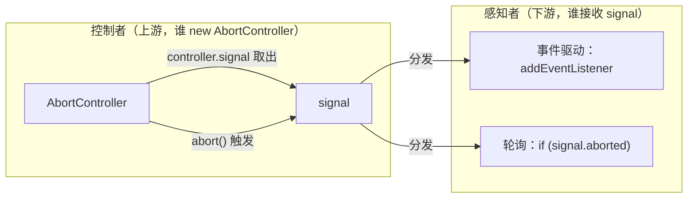
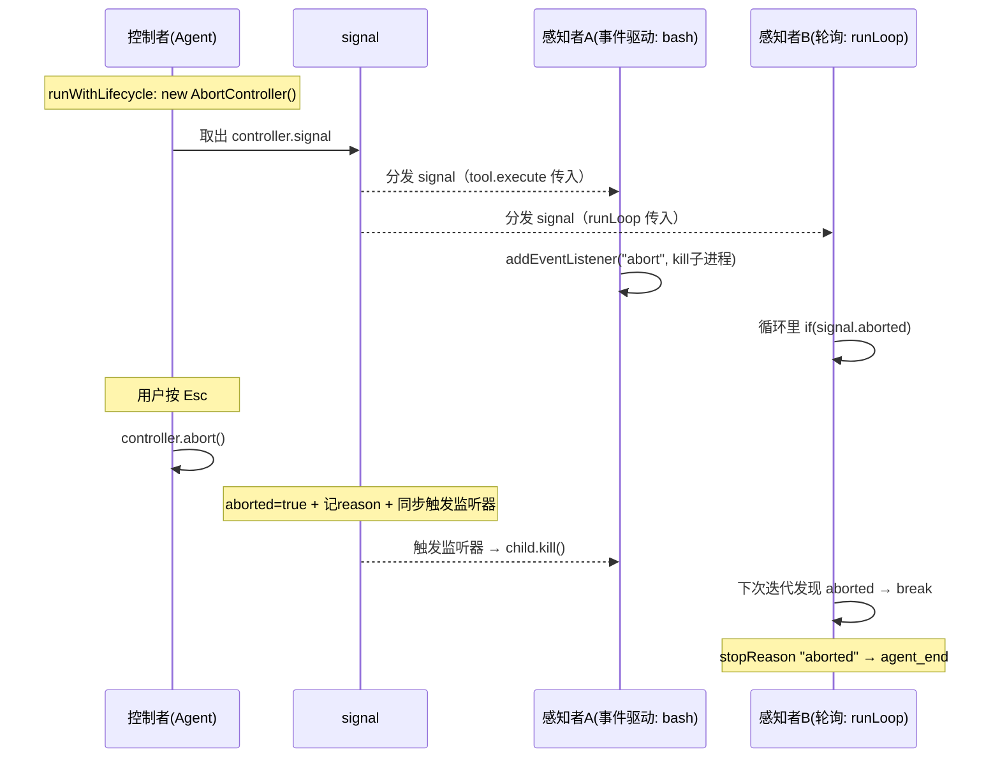
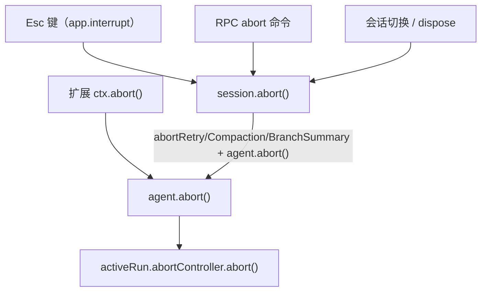

# AbortSignal 机制：控制者与感知者的单向信号链

状态：草稿（2026-09-18 对照 [agent.ts](../../../packages/agent/src/agent.ts) 的 `runWithLifecycle`/`abort`/`handleRunFailure`/`finishRun`、[agent-loop.ts](../../../packages/agent/src/agent-loop.ts) 的 signal 传递、[ai/utils/abort.ts](../../../packages/ai/src/utils/abort.ts) 的 `raceWithAbortSignal`、[coding-agent/src/utils/abort.ts](../../../packages/coding-agent/src/utils/abort.ts) 的副本、[ai/api/*](../../../packages/ai/src/api/) 各 provider 的 `signal.aborted ? "aborted" : "error"`、[ai/utils/retry.ts](../../../packages/ai/src/utils/retry.ts) 的 abort 永不重试、[agent-session.ts](../../../packages/coding-agent/src/core/agent-session.ts) 的 `abort` 复合操作、[keybindings.ts](../../../packages/coding-agent/src/core/keybindings.ts) 的 `app.interrupt`）

本文用「**控制者 / 感知者**」双视角，完整梳理 AbortSignal 在 pi 里的工作机制——两个核心对象、职责分工、底层实现、监听器注册范式、生命周期、触发入口，以及两个 `abort.ts` 重复的原因。

## 事实源（链接，不复述）

- [agent.ts](../../../packages/agent/src/agent.ts)（控制者：`runWithLifecycle` 486-509 创建 AbortController、`abort` 319-321 触发、`handleRunFailure` 511-527 兜底、`finishRun` 529-535 收尾）
- [agent-loop.ts](../../../packages/agent/src/agent-loop.ts)（感知者：signal 传递 + 各层 abort 检查）
- [ai/utils/abort.ts](../../../packages/ai/src/utils/abort.ts)（`raceWithAbortSignal` / `operationSignal` / `abortReason`，ai 包内部工具）
- [coding-agent/src/utils/abort.ts](../../../packages/coding-agent/src/utils/abort.ts)（副本，signal 改为可选）
- [ai/api/*](../../../packages/ai/src/api/)（provider 层统一 `signal.aborted ? "aborted" : "error"`）
- [ai/utils/retry.ts](../../../packages/ai/src/utils/retry.ts)（abort 永不重试）
- [agent-session.ts](../../../packages/coding-agent/src/core/agent-session.ts)（`abort` 复合操作 1640-1646、子操作 AbortController）
- [keybindings.ts](../../../packages/coding-agent/src/core/keybindings.ts)（`app.interrupt` = escape）

## 一句话定位

AbortSignal 是「**一个控制者、多个感知者、一条单向 signal 链**」：控制者（`AbortController`）持有唯一的「中止权」，通过 `abort()` 触发；信号（`AbortSignal`）被分发给所有感知者，它们只能「听/查」不能「喊」；真正的中止靠各层**合作式响应**——这是 JS `AbortSignal` 的标准语义。

## 一、两个核心对象：成员与方法

### AbortController —— 控制者（唯一能触发）

| 成员 / 方法 | 类型 | 说明 |
|---|---|---|
| `signal` | getter（只读） | 关联的 `AbortSignal`，是「取出分发给感知者」的句柄 |
| `abort(reason?)` | 方法 | **唯一的触发动作**，幂等 |

### AbortSignal —— 信号对象（分发给感知者）

| 成员 / 方法 | 类型 | 说明 |
|---|---|---|
| `aborted` | getter（只读） | 布尔标志，`abort()` 后为 true（轮询用的开关） |
| `reason` | getter（只读） | 中止原因，默认 `AbortError` |
| `addEventListener("abort", handler, {once})` | 方法 | 注册监听器（事件驱动方式） |
| `removeEventListener("abort", handler)` | 方法 | 移除监听器（防泄漏） |
| `throwIfAborted()` | 方法 | 若已 abort 则抛错（即时检查） |

> 核心不对称：**Controller 只有一个动作 `abort()`；Signal 只有一堆「被动感知」的入口**。

## 二、两个角色：职责分工



| 角色 | 谁扮演 | 职责 | 唯一动作 |
|---|---|---|---|
| 控制者 | 上游（发起操作、有「中止权」的一方） | 决定「何时中止」 | `abort()` |
| 感知者 | 下游（所有接收 signal 的方） | 决定「如何响应」 | 监听 or 轮询 |

**关键点**：signal 是两者之间的「单向桥梁」——控制者通过 `controller.signal` 取出分发下去；感知者拿到它只能「听/查」，不能反向触发。

## 三、感知者的两种响应方式

| | 事件驱动 | 轮询 |
|---|---|---|
| 用到的成员 | `addEventListener("abort", ...)` | `aborted` 标志 |
| 触发时机 | `abort()` 时**同步**唤醒 | 下一次迭代才察觉 |
| 典型场景 | 挂着等的操作（子进程/网络/Promise/对话框） | 循环推进的操作（agent loop） |
| 代表代码 | `signal.addEventListener("abort", () => child.kill())` | `if (signal.aborted) break` |

## 四、`abort()` 的底层实现（「然后呢」的答案）

```javascript
controller.abort(reason) {
    if (signal.aborted) return;        // ① 幂等
    signal.aborted = true;             // ② 置标志（内部维护，非手动赋值）
    signal.reason = reason;            // ③ 记原因

    for (const h of signal.listeners) {  // ④ 同步触发所有监听器
        h();
    }
    signal.listeners = [];             // ⑤ 清空监听器
}
```

**`abort()` 本身不杀任何东西**，它只做「置标志 + 记录 + 同步喊一嗓子」——谁注册了监听器谁就应声行动。`signal.aborted` 是只读 getter，不能手动赋值。

## 五、监听器的注册范式：`raceWithAbortSignal` + 三重竞态防护

监听器在「**开始可中止操作时、同步地**」注册，用 `raceWithAbortSignal`（[ai/utils/abort.ts](../../../packages/ai/src/utils/abort.ts)）最典型：

```typescript
export function raceWithAbortSignal<T>(operation: Promise<T>, signal: AbortSignal): Promise<T> {
    if (signal.aborted) {                        // ① 入口检查
        void operation.catch(() => {});
        return Promise.reject(abortReason(signal));
    }

    return new Promise<T>((resolve, reject) => {
        let settled = false;
        const cleanup = () => signal.removeEventListener("abort", onAbort);
        const onAbort = () => {
            if (settled) return;
            settled = true;
            cleanup();                            // 移除监听器（防泄漏）
            reject(abortReason(signal));
        };

        signal.addEventListener("abort", onAbort, { once: true });   // ② 注册
        void operation.then(
            (value) => { if (settled) return; settled = true; cleanup(); resolve(value); },
            (error) => { if (settled) return; settled = true; cleanup(); reject(error); },
        );
        if (signal.aborted) onAbort();            // ③ 末尾再查（竞态兜底）
    });
}
```

三个关键点：

1. **`{ once: true }`**：触发一次自动移除，防泄漏第一道防线；
2. **三重竞态防护**：入口查 → 注册 → 末尾再查，应对「注册前已 abort」和「注册后、检查前」的微秒竞态；
3. **`cleanup()`**：操作正常完成时 `removeEventListener` 移除监听器，配合 `settled` 标志防双重 settle。

## 六、pi 里的具体实例对照

### 控制者（上游）

| 实例 | 创建点 | 触发方式 |
|---|---|---|
| `Agent` | `runWithLifecycle`：`new AbortController()`，存入 `activeRun.abortController` | `Agent.abort()` → `controller.abort()` |
| 模型目录刷新 | `new AbortController()` + `setTimeout(() => controller.abort(), 15000)` | 15s 超时 |
| 登录对话框 | `new AbortController()` | 用户取消 |

### 感知者（下游）

| 实例 | 方式 | 响应动作 |
|---|---|---|
| `raceWithAbortSignal` | 事件驱动 | reject Promise |
| bash 工具 | 事件驱动 | `child.kill()` 杀子进程 |
| fetch / proxy | 事件驱动 | 转发 abort 到 HTTP 请求 |
| retry 的 sleep | 事件驱动 | 清 `setTimeout` |
| `ui.confirm` 对话框 | 事件驱动 | 关闭对话框 |
| `runLoop` / `executeToolCalls` | 轮询 | `if (signal.aborted) break` |
| `prepareToolCall` | 轮询 | `if (signal.aborted)` 返回 aborted 错误 |

## 七、完整生命周期（一次 abort 从控制者到感知者）



## 八、stopReason "aborted" 的统一产生（provider 层）

所有 provider 在 catch 里用**同一个模式**区分 abort 与 error：

```typescript
// anthropic-messages.ts L811-814，其余 provider 完全一致
output.stopReason = options?.signal?.aborted ? "aborted" : "error";
stream.push({ type: "error", reason: output.stopReason, error: output });
stream.end();
```

`error` 事件经 `AssistantMessageEventStream` 回流，`runLoop` 检测到 `stopReason "aborted"` 提前 `agent_end` 退出。**abort 是终态，永不重试**（[ai/utils/retry.ts](../../../packages/ai/src/utils/retry.ts) L187-190）。

## 九、异常兜底与收尾（控制者侧）

- **`handleRunFailure`**（`agent.ts` 511-527）：底层意外 throw 时，补发完整事件序列（message_start → message_end → turn_end → agent_end），`signal.aborted` 决定 stopReason 是 "aborted" 还是 "error"。
- **`finishRun`**（`agent.ts` 529-535）：清 streaming 状态、`activeRun = undefined`——此后 signal 失效，abort 对已结束的 run 无效。

## 十、触发 abort 的入口（都收敛到 `controller.abort()`）



- `session.abort()` 是「一拖四」复合操作：abort 三个子操作（retry/compaction/branchSummary，各自独立 AbortController）+ `agent.abort()`。
- 大量「局部 abort」（模型刷新超时、对话框取消）是与 agent 无关的独立 `AbortController`。

## 十一、两个 `abort.ts` 为什么几乎一样

[ai/utils/abort.ts](../../../packages/ai/src/utils/abort.ts) 是 ai 包**内部私有工具**（未在 `index.ts` 导出）；[coding-agent/src/utils/abort.ts](../../../packages/coding-agent/src/utils/abort.ts) 无法 import 它，于是**复制一份并本地适配**——唯一实质差异是把 `raceWithAbortSignal` 的 `signal` 从「必选」改成「可选」，加 `if (!signal) return operation;` 透传，以匹配 coding-agent 公共 API 里 `options?.signal` 的可选场景。代价是两处需同步维护。

## 一句话总结

AbortSignal 是「**一个控制者、多个感知者、一条单向 signal 链**」：

- **控制者（AbortController）**：唯一动作 `abort()`，做三件事——置 `aborted`、记 `reason`、同步触发监听器；
- **信号（AbortSignal）**：控制者经 `controller.signal` 取出、分发给所有感知者的单向「感知句柄」；
- **感知者**：拿到 signal 后必须主动配合——`addEventListener("abort", ...)` 被动等唤醒，或轮询 `signal.aborted` 主动查；
- **配合机制**：`raceWithAbortSignal` 是「事件驱动」的通用封装（三重竞态防护 + cleanup 防泄漏），provider 层统一 `signal.aborted ? "aborted" : "error"` 产出 stopReason，abort 永不重试，正常路径 `agent_end`、异常路径 `handleRunFailure` 补发事件序列。

「控制者喊、感知者听/查、signal 是广播线」——这就是 AbortSignal 完整工作机制的一图流。

## 验证方式

- `read_file` 读 `agent.ts` 486-535（`runWithLifecycle`/`abort`/`handleRunFailure`/`finishRun`）
- `read_file` 读 `ai/utils/abort.ts` 与 `coding-agent/src/utils/abort.ts`（对比副本差异）
- `read_file` 读 `ai/api/*` 任一 provider 的 catch 分支（统一 abort/error 区分）
- `read_file` 读 `ai/utils/retry.ts` 187-190（abort 永不重试）
- `read_file` 读 `agent-session.ts` 1640-1646（`abort` 复合操作）
- `read_file` 读 `keybindings.ts` 93（`app.interrupt` = escape）

## 遗留问题

- `abort(reason)` 的 `reason` 参数在 pi 里的使用面（OAuth 的 `controller.abort(signal.reason)`、`utils/abort.ts` 的 `abortReason`）未系统追踪。
- `waitForIdle()` 与 `finishRun` 的时序关系未展开，见 [agent-loop.zh.md](../modules/agent-loop.zh.md)。
- rpc 模式「远程客户端 abort」经协议传递到 `session.abort()` 的完整链路未深究。
