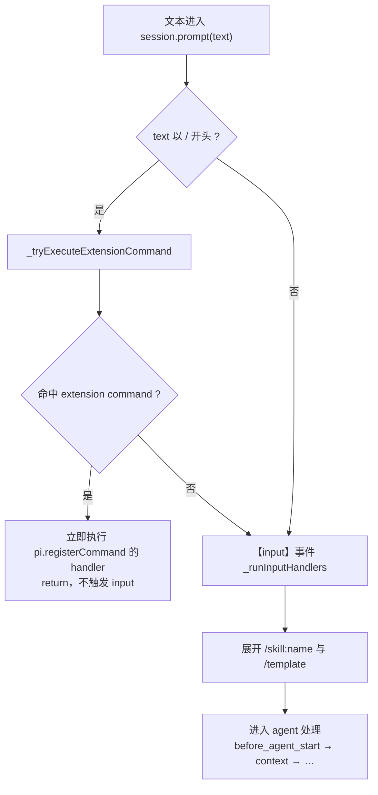

# 命令分派与 input 事件：两类 command、四种模式、谁汇入 input

状态：草稿（2026-09-22 对照 [rpc-types.ts](../../../packages/coding-agent/src/modes/rpc/rpc-types.ts) 的 `RpcCommand` union L20-74、[rpc-mode.ts](../../../packages/coding-agent/src/modes/rpc/rpc-mode.ts) 的 `handleCommand` L386-424、[slash-commands.ts](../../../packages/coding-agent/src/core/slash-commands.ts) 全文、[agent-session.ts](../../../packages/coding-agent/src/core/agent-session.ts) 的 `prompt` 分流 L1609-1752 与 `steer`/`followUp` L1852-1874、[interactive-mode.ts](../../../packages/coding-agent/src/modes/interactive/interactive-mode.ts) 的输入主循环 L1197-1206、[extensions/types.ts](../../../packages/coding-agent/src/core/extensions/types.ts) 的 Session/Model/UserBash 事件定义 L569-956）

本文回答一个问题：**pi 各工作方式下的"命令"分别是什么概念、它们如何分派——哪些汇入 `input` 事件，其余的用什么扩展事件 hook。** 它是 [provider-injection.zh.md](provider-injection.zh.md)（input 之后如何注入 provider 请求）的上游篇：该篇的链路以 `input` 为入口，本文回答"什么才会走到 `input`"；hook 点全景见 [extension-hooks.zh.md](../modules/extension-hooks.zh.md)，本文只补它没展开的"命令分类 × hook 矩阵"。

## 事实源（链接，不复述）

- [rpc-types.ts](../../../packages/coding-agent/src/modes/rpc/rpc-types.ts)（`RpcCommand` L20-74、`RpcSlashCommand` L81-90）
- [rpc-mode.ts](../../../packages/coding-agent/src/modes/rpc/rpc-mode.ts)（`handleCommand` 的 switch L386 起；`steer`/`follow_up` 传 `source:"rpc"` L416-424）
- [slash-commands.ts](../../../packages/coding-agent/src/core/slash-commands.ts)（`SlashCommandSource` L4、`BUILTIN_SLASH_COMMANDS` L19-44）
- [agent-session.ts](../../../packages/coding-agent/src/core/agent-session.ts)（`prompt` 分流 L1609-1752、`steer`/`followUp` L1852-1874、`_throwIfExtensionCommand` L1909-1919）
- [extensions/types.ts](../../../packages/coding-agent/src/core/extensions/types.ts)（`ExtensionMode` L317、`InputSource` L963、Session Events L569-691、Model Events L922-941、UserBash L943-956）
- [extensions.md](../../../packages/coding-agent/docs/extensions.md)（input 事件与处理顺序；2026-09-27 起该文档已大幅重写为 216 行，原 L914-963 章节不存在，input 概述见 L62/L99）

## 它是什么（≤5 句）

"command"在 pi 里是两层概念：协议级 command（RPC 模式专属的 `RpcCommand`，40 个 stdin JSON，逐个分派到 `AgentSession` 的方法）和 slash command（跨模式、文本里 `/` 开头，三来源 extension / prompt / skill，另有仅 TUI 的内置命令）。两者的汇聚点不同：文本输入类命令（prompt / steer / follow_up）走 `session.prompt/steer/followUp` 并触发 `input` 事件；其余协议级命令直接调 `AgentSession` 方法，各配专门扩展事件（多数可 cancel）或无事件。关键翻转：`RpcCommand` 映射到 `AgentSession` 方法而非 `pi.*`——`pi.*`（扩展 API）与 RPC 协议是两个平面，只有 slash 的 extension 子类落到 `pi.registerCommand`。

## 各模式的"command"对应物

| 模式 | 协议级 command | slash command | 输入入口 |
|---|---|---|---|
| RPC | `RpcCommand`（stdin JSON） | prompt message 里 `/` 开头 | `handleCommand` 分派到 `session.*` |
| interactive | 无；用户敲键盘 | `/cmd` 文本 + 内置 TUI 命令（`BUILTIN_SLASH_COMMANDS`） | `session.prompt(userInput)`（interactive-mode.ts L1201） |
| print / json | 无；只有 prompt 文本 | prompt 里可含 `/cmd`（extension 类会执行；内置 TUI 命令不执行） | `session.prompt(...)`（print-mode.ts L132/136） |
| SDK | `AgentSession` 公开方法即等价物 | `sendUserMessage` 文本可含 `/cmd` | 直接调方法 |

SDK 的方法清单（`prompt`/`steer`/`followUp`/`newSession`/`fork`/`compact`/`setModel`/`navigateTree`/`abort`/`clearQueue`/`sendUserMessage`/`exportHtml`…）与 RPC command 一一对应——`handleCommand` 本质是把 JSON 命令翻译成这些方法调用。

## prompt() 内部分流：谁触发 input

agent-session.ts L1618-1625 的固定顺序，extension command 检查在 input **之前**短路：

推论：

1. input handler 里看到的 `/` 开头文本一定是**未命中** extension command 的（命中的已短路，看不到）。
2. `/skill:name`、`/template` 在 input **之后**才展开——input 是展开前改写/拦截 skill 调用的唯一机会。
3. steer()/followUp() **不允许** extension command：`_throwIfExtensionCommand`（L1909-1919）直接抛错 "cannot be queued, use prompt()"；RPC 的 steer/follow_up command 同样拒绝（原 rpc.md L82/104；2026-09-27 起 rpc.md 已重写，命令详情移至 rpc-commands.md）。

## 命令分类 × hook 矩阵（核心增量）

| 命令类别 | 例（RPC） | 汇聚点 | hook 方式 | 能力 |
|---|---|---|---|---|
| 文本输入类 | prompt / steer / follow_up | `session.prompt/steer/followUp` → `input` | `pi.on("input")` | transform 改写 / handled 拦截 |
| 模型与思考层 | set_model / cycle_model / set_thinking_level / cycle_thinking_level | `session.setModel` / `setThinkingLevel` | `model_select`（带 `source:"set"\|"cycle"\|"restore"`）/ `thinking_level_select` | 观察 |
| 会话生命周期 | new_session / switch_session / fork / clone / compact | `session` 各方法 | `session_before_switch` / `session_before_fork` / `session_before_compact`（reason: manual/threshold/overflow）/ 切换成功后 `session_start`（reason: startup/reload/new/resume/fork） | **可 cancel**（compact 可 cancel/自定义） |
| tree 导航 | 导航类操作 | `session.navigateTree` | `session_before_tree` / `session_tree` | 拦截 / 观察 |
| bash | bash / abort_bash | `emitUserBash` | `user_bash` | **可接管**（返回 `operations` 或 `result`） |
| 会话信息 | set_session_name | sessionManager | `session_info_changed` | 观察 |
| 查询 / 配置开关 | get_* 全family / set_steering_mode / set_follow_up_mode / set_auto_compaction / set_auto_retry | 只读或纯设置 | **无扩展事件** | —（SDK 可在调用方包装） |
| slash extension 类 | prompt 里的 `/cmd` | `_tryExecuteExtensionCommand`（input 前短路） | `pi.registerCommand`（自身即 handler） | 全权 |

无 hook 的两类：纯查询类只读无副作用，pi 认为不需要拦截点；配置开关类没有专门事件。`abort` / `clear_queue` 也无直接事件，但后果可从 agent 事件流观察（`message_end` 带 `stopReason:"aborted"`）。

SDK 兜底：SDK 是进程内调用，`AgentSession` 方法是普通方法——无事件的命令在调用方包装即可（`const orig = session.setModel.bind(session); session.setModel = async (m, o) => { /* 前置 */ await orig(m, o); /* 后置 */ };`），不需要扩展事件。RPC / interactive 无此便利。

## input handler 的判别四维

`input` 是文本输入类的统一收集点（四种模式 + SDK 都汇入），handler 里可用的判别信息四个维度：

| 维度 | 取值 | 回答的问题 |
|---|---|---|
| `ctx.mode` | tui / rpc / json / print | 哪种工作方式 |
| `event.source` | interactive / rpc / extension | 输入从哪个通道来（print/json 默认 interactive，区分工作方式必须用 ctx.mode；SDK 可传 source 主动标记） |
| `event.streamingBehavior` | undefined / steer / followUp | 哪种投递类型：undefined=空闲 prompt、steer=流式中断、followUp=排队到完成 |
| `event.text` / `event.images` | 原始文本（skill/template 展开前） | 是否 slash 语法自行 `startsWith("/")` 判断 |

## 我曾经的误解（原以为 → 实际是 → 修正来源）

- 原以为：RPC 的 `RpcCommand` 会映射到 `pi.*`（扩展 API），extension 通过 `pi.*` 参与命令处理。
- 实际是：`RpcCommand` 映射到 `AgentSession` 的方法（rpc-mode.ts `handleCommand` 的 switch 逐个调 `session.*`）；`pi.*` 与 RPC 协议是两个平面，只有 slash 的 extension 子类（`/cmd`）经 `_tryExecuteExtensionCommand` 落到 `pi.registerCommand` 注册的 handler。
- 修正来源：rpc-mode.ts L386-424（switch 分派全貌）、agent-session.ts L1618-1625（extension command 检查点）。

## 与相邻单元的关系

- **下游篇** [provider-injection.zh.md](provider-injection.zh.md)：`input` 收集到的内容如何跨事件传递并注入 provider 请求（headers / payload）；该篇"陷阱 3"（compact 内部调用无前置 input）的机制根源在本文矩阵的"会话生命周期"行——compact 走 `session.compact` → `session_before_compact` → 摘要 LLM 调用，全程不经过 `prompt`/`input`。
- **全景篇** [extension-hooks.zh.md](../modules/extension-hooks.zh.md)：本文矩阵里各扩展事件在完整会话时间线上的位置与能力分类（观察/可修改/拦截）。
- **对照** [classic-stack-overview.zh.md](../architecture/classic-stack-overview.zh.md)：三模式（interactive / rpc / print）的静态结构。

## 验证方式

- `read_file` 读 [rpc-types.ts](../../../packages/coding-agent/src/modes/rpc/rpc-types.ts) L20-74（command 全清单）
- `read_file` 读 [rpc-mode.ts](../../../packages/coding-agent/src/modes/rpc/rpc-mode.ts) L386-424（分派到 session 方法、steer/follow_up 传 source:"rpc"）
- `read_file` 读 [agent-session.ts](../../../packages/coding-agent/src/core/agent-session.ts) L1609-1752（extension command 短路 → input → 展开）、L1909-1919（steer/followUp 拒绝 extension command）
- `search_content` 搜 `interface ModelSelectEvent|interface SessionBeforeCompactEvent|interface UserBashEvent` 定位各事件定义与 result 字段

## 遗留问题

- `steer()` 在 agent 空闲时的精确行为（直接入 steering 队列等待下次 run，还是立即触发 run）未逐行核对 `_queueUserInput` 与 `Agent.steer` 的交互——影响"streamingBehavior 在 idle steer 下是否仍为 steer"的判读，待阶段 3（agent 包）深入。
- 配置开关类（set_steering_mode / set_auto_*）无扩展事件是有意设计还是缺口，未见文档说明——留待阶段 5（扩展体系）对照 issue/RFC 核实。
