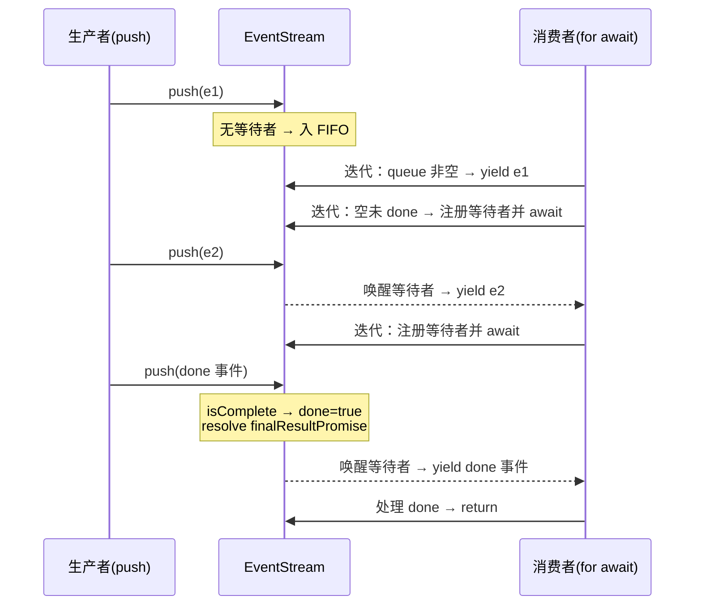

# EventStream 深度解析：异步流原语（推拉模型）

状态：草稿（2026-09-17 对照 [event-stream.ts](../../../packages/ai/src/utils/event-stream.ts) 全文 111 行；双栈 FIFO、push/消费/终结三态、result 提取、无背压取舍均逐行对照源码）

这是**重点学习篇**：`EventStream` 是 pi 异步流式输出的地基——`streamAssistantResponse` 靠它消费 LLM 流（见 [agent-loop-stream.zh.md](../modules/agent-loop-stream.zh.md)），`agentLoop` 靠它对外广播 agent 事件（见 [agent-loop-runloop.zh.md](../modules/agent-loop-runloop.zh.md)）。它是 ai 包提供、agent 包消费的跨包通用原语。

## 事实源（链接，不复述）

- [event-stream.ts](../../../packages/ai/src/utils/event-stream.ts)（111 行，全文即本笔记对象）
- [types.ts](../../../packages/ai/src/types.ts)（`AssistantMessageEvent` 协议 L546-562、`StreamFn` 返回 `AssistantMessageEventStream` 的契约 L326-337）
- [agent-loop.ts](../../../packages/agent/src/agent-loop.ts)（`createAgentStream` 146-151 行，`streamAssistantResponse` 275-370 行，两处消费/使用）

## 它是什么（≤5 句）

`EventStream<T, R>` 是一个同时具备「可推送」和「可迭代」的异步流原语：生产者 `push(event)` 塞事件，消费者 `for await (const e of stream)` 拉事件，中间用一个内存 FIFO 解耦。它用两个函数参数定义「终结语义」——`isComplete(event)` 判断哪个事件代表结束、`extractResult(event)` 从终结事件提取最终值 `R`。`result()` 返回该最终值的 Promise（幂等）。它**无背压**：`push` 永不阻塞，消费者慢时事件在内存 FIFO 里积压。

## 两个 FIFO 数据结构

### FifoQueue：双栈实现的队列（内部私有）

```typescript
class FifoQueue<T> {
	private incoming: T[] = [];
	private outgoing: T[] = [];

	enqueue(value: T): void {
		this.incoming.push(value);
	}

	dequeue(): T | undefined {
		if (this.outgoing.length === 0) {
			while (this.incoming.length > 0) {
				this.outgoing.push(this.incoming.pop()!);
			}
		}
		return this.outgoing.pop();
	}
}
```

经典「双栈实现队列」：`incoming` 是入队栈，`outgoing` 是出队栈。`dequeue` 时若 `outgoing` 空，把 `incoming` 全部**反转**倒入 `outgoing`，于是 `outgoing` 栈顶 = 最早入队元素。均摊 O(1)。

```
入队 1,2,3：incoming = [1,2,3]（栈底→栈顶）
第一次 dequeue：
  outgoing 空 → 反转：pop 3,2,1 → outgoing = [3,2,1]
  然后 outgoing.pop() = 1（最早）
之后：pop() = 2，再 pop() = 3
```

这个类**没有 `export`**，是 `EventStream` 的私有实现细节——外界只看到 `push`/`for await`/`result` 接口，看不到队列。

### waiting：等待者队列

第二个 FIFO 存的是「等待者」——即 `for await` 里挂起的 `Promise` 的 resolve 函数：

```typescript
private waiting = new FifoQueue<(value: IteratorResult<T>) => void>();
```

当队列空且未结束时，消费者把 resolve 函数塞进 `waiting` 并 `await`；生产者 `push` 时从 `waiting` 取出一个等待者，直接把事件「交付」给它。这是典型的**异步握手**。

## 核心机制：push / 消费 / 终结

### push：交付或入队 + 终结事件处理

```typescript
push(event: T): void {
	if (this.done) return;                       // 已结束，丢弃

	if (this.isComplete(event)) {                // 是终结事件（如 done/error）
		this.done = true;                         // 标记结束
		this.resolveFinalResult(this.extractResult(event));  // 先 resolve result()
	}

	const waiter = this.waiting.dequeue();       // 有等待者？
	if (waiter) {
		waiter({ value: event, done: false });    // 直接交付
	} else {
		this.queue.enqueue(event);                // 否则入队
	}
}
```

关键点：**终结事件本身仍会被交付/入队**（消费者能收到它），只是额外先触发了 `done = true` 和 `result()` 的 resolve。所以消费者在 `for await` 里能遇到 `done`/`error` 并据此 `return`。

### asyncIterator：消费三态

```typescript
async *[Symbol.asyncIterator](): AsyncIterator<T> {
	while (true) {
		if (this.queue.length > 0) {
			yield this.queue.dequeue()!;                       // ① 有缓存 → 立即出
		} else if (this.done) {
			return;                                            // ② 已结束 → 收尾
		} else {
			const result = await new Promise<IteratorResult<T>>(
				(resolve) => this.waiting.enqueue(resolve),
			);
			if (result.done) return;                           // 被 end() 唤醒
			yield result.value;                                // 被 push() 唤醒
		}
	}
}
```

三种状态循环：① 队列有货就 `yield`；② 无货但已结束就 `return`；③ 无货未结束就**注册等待者挂起**。第 ③ 步被唤醒有两种来源：

- `push` → `waiter({ value: event, done: false })` → `yield event`
- `end` → `waiter({ value: undefined, done: true })` → `return`

### end：强制收尾

```typescript
end(result?: R): void {
	this.done = true;
	if (result !== undefined) {
		this.resolveFinalResult(result);
	}
	while (this.waiting.length > 0) {
		const waiter = this.waiting.dequeue()!;
		waiter({ value: undefined as any, done: true });
	}
}
```

与 `push` 终结事件不同：`end` 不产生可消费的事件，只把所有挂起的等待者以 `done: true` 唤醒，让 `for await` 自然 `return`。它用于「异常提前关闭流」的场景，可选择性附带最终结果。

### result：终结值（幂等）

```typescript
result(): Promise<R> {
	return this.finalResultPromise;
}
```

`finalResultPromise` 在构造时创建、在 `push` 终结事件或 `end(result)` 时 resolve。可多次 `await`，返回同一个值——这正是 `streamAssistantResponse` 在 `done`/`error` 分支和循环后兜底里都能安全调用 `response.result()` 的原因。

## 推拉模型时序



一句话：**生产者永远不等待，消费者在有货时立刻拿、没货时挂起等 push 唤醒**。两端被 FIFO 解耦，谁也不阻塞谁（除非消费者处理慢导致 FIFO 积压）。

## 无背压：一个明确的取舍

代码里**没有队列上限、`push` 永不阻塞**，因此是**无背压（unbounded buffering）**的。消费者慢时，事件在内存 FIFO 里无限积压。对 LLM 流式输出场景这是可接受的：单次响应的事件总量有限、且消费端（UI 渲染 / 事件转发）通常足够快。代价是「慢消费者拖慢快生产者」这种背压需求被牺牲掉了。

## AssistantMessageEventStream：一个特化实例

```typescript
export class AssistantMessageEventStream extends EventStream<AssistantMessageEvent, AssistantMessage> {
	constructor() {
		super(
			(event) => event.type === "done" || event.type === "error",
			(event) => {
				if (event.type === "done") return event.message;
				else if (event.type === "error") return event.error;
				throw new Error("Unexpected event type for final result");
			},
		);
	}
}
```

把泛型的两个函数参数具体化：终结事件 = `done` 或 `error`；最终值 = `done.message` 或 `error.error`（都是 `AssistantMessage`）。`throw` 分支在 `isComplete` 的约束下不可达，是防御性代码。

## 与 agent-loop 的衔接（两处使用）

`EventStream` 在 agent 层有两个实例化点：

| 使用处 | 泛型 | isComplete | extractResult | 消费方式 |
|---|---|---|---|---|
| `streamAssistantResponse` | `AssistantMessageEventStream`（ai 包预定义） | `done`/`error` | `message`/`error` | `for await` 折叠成一条消息 |
| `createAgentStream`（agent-loop.ts 146-151） | `EventStream<AgentEvent, AgentMessage[]>` | `agent_end` | `event.messages` | `agentLoop` 对外广播 |

后者正是 [agent-loop.zh.md](agent-loop.zh.md) 里说的「`agentLoop` 把 `emit` 接到 `stream.push`」的底层——同一个原语，两个实例，各自用两个函数参数定义自己的终结语义。这是 `EventStream` 作为「通用原语」价值的直接体现。

## 验证方式

- `read_file` 读 `event-stream.ts` 全文，逐行对照 `FifoQueue` / `push` / `asyncIterator` / `end` / `result`
- 交叉验证两处实例化：`types.ts` 里 `AssistantMessageEventStream` 的 re-export、`agent-loop.ts` 里 `createAgentStream`

## 遗留问题

- 双栈 `FifoQueue` 的 `incoming`/`outgoing` 均为 `T[]`，`dequeue` 反转时用 `push(pop())`——与经典教科书实现一致，但未做 `null` 越界防护（依赖调用方保证「队列空时不 dequeue」或接受 `undefined`）。是否所有调用点都遵守此约定，留待后续对调用方的完整审计。
- 无背压是「观察 + 设计推断」，未在源码注释中看到显式声明——若有官方文档或测试佐证，可升级为「已验证」。
