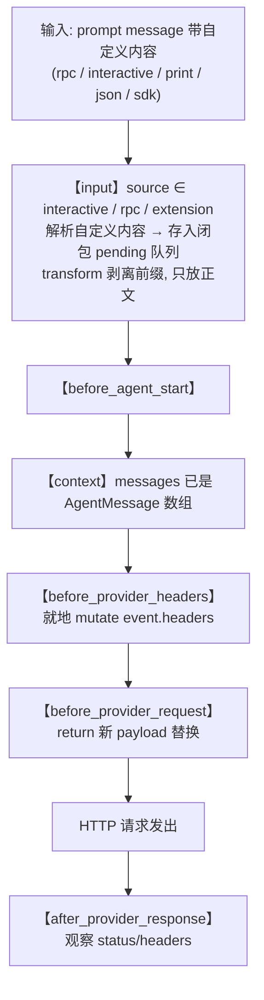

# 通过扩展把自定义内容注入发给大模型的请求

状态：草稿（2026-09-22 对照 [extensions/types.ts](../../../packages/coding-agent/src/core/extensions/types.ts) 的 `InputSource`/`InputEvent`/`InputEventResult`/`BeforeProviderRequestEvent`/`BeforeProviderHeadersEvent`、[runner.ts](../../../packages/coding-agent/src/core/extensions/runner.ts) 的 `emitInput`/`emitBeforeProviderRequest`/`emitBeforeProviderHeaders`、[agent-session.ts](../../../packages/coding-agent/src/core/agent-session.ts) 的 `prompt` source 默认值与 `sendUserMessage`、[sdk.ts](../../../packages/coding-agent/src/core/sdk.ts) 的 `onPayload`/`transformContext` 装配、[print-mode.ts](../../../packages/coding-agent/src/modes/print-mode.ts) 与 [rpc-mode.ts](../../../packages/coding-agent/src/modes/rpc/rpc-mode.ts) 与 [interactive-mode.ts](../../../packages/coding-agent/src/modes/interactive/interactive-mode.ts) 的 `bindExtensions` mode）

本文回答一个具体问题：**如何让一段自定义内容（控制信号 / header / provider 专属字段）随用户的一次输入进入 pi，最终落到发给大模型的 body 或 headers 上——且在 interactive / rpc / print / json / sdk 五种工作方式下都生效。** 它是 [extension-hooks.zh.md](../modules/extension-hooks.zh.md)（hook 点地图）与 [streamfn-production-path.zh.md](../modules/streamfn-production-path.zh.md)（provider 装配链）的应用篇：前者回答"能 hook 在哪"，后者回答"装配链怎么走"，本文回答"如何把这两端用一条跨事件的状态链串起来，并跨模式一致生效"。

## 事实源（链接，不复述）

- [extensions/types.ts](../../../packages/coding-agent/src/core/extensions/types.ts)（`InputSource` L864、`InputEvent` L866-877、`InputEventResult` L880-883、`BeforeProviderRequestEvent` L694-697、`BeforeProviderHeadersEvent` L704-707、`ExtensionMode` L307）
- [extensions/runner.ts](../../../packages/coding-agent/src/core/extensions/runner.ts)（`emitInput` L1246-1285、`emitBeforeProviderRequest` L1087-1116、`emitBeforeProviderHeaders` L1118-1143）
- [agent-session.ts](../../../packages/coding-agent/src/core/agent-session.ts)（`prompt` 的 `source` 默认 `"interactive"` L1277、`sendUserMessage` 用 `source:"extension"` L1672、`bindExtensions` L2541）
- [sdk.ts](../../../packages/coding-agent/src/core/sdk.ts)（`onPayload`→`emitBeforeProviderRequest` L343-349、`transformContext`→`emitContext` L362-366）
- [print-mode.ts](../../../packages/coding-agent/src/modes/print-mode.ts)（`bindExtensions({mode: print/json})` L76-77、`session.prompt` 不传 source L132/136）
- [rpc-mode.ts](../../../packages/coding-agent/src/modes/rpc/rpc-mode.ts)（`bindExtensions({mode:"rpc"})` L319-321）
- [interactive-mode.ts](../../../packages/coding-agent/src/modes/interactive/interactive-mode.ts)（`bindExtensions({mode:"tui"})` L1865-1867）
- [cli/args.ts](../../../packages/coding-agent/src/cli/args.ts)（`--extension`/`-e` flag L166）

## 它是什么（≤5 句）

一套"输入端收集 → 闭包暂存 → provider 端消费"的跨事件状态链：扩展在 `input` 事件里从用户输入文本中解析出自定义内容并 `transform` 剥离正文，把元数据存进模块级闭包；随后 pi 走 `before_agent_start` → `context` → `before_provider_headers`（就地 mutate headers）→ `before_provider_request`（返回新 payload 替换）时，扩展从闭包取出元数据注入。关键是这条链不绑死 RPC——`input` 事件对五种工作方式都触发，差别只在 `event.source` 的取值。因此方案的唯一硬性修正：source 过滤要用排除式（跳过 `"extension"` 避免循环），不能用"只认 rpc"的白名单，否则 print/json 会漏。

## 选型：先分类要注入的内容，再选事件

本文的跨事件链不是唯一注入方式。动手前先判断要注入的是哪一类：

| 要注入的是 | 例子 | 应选事件 | 理由 |
|---|---|---|---|
| **对话内容**（想让模型看到并回应） | 追加指令、注入上下文、改 system prompt | `context`（每次 LLM 调用前改 messages）或 `before_agent_start`（run 开始前注入消息 / 替换 systemPrompt） | AgentMessage 层，provider 无关；事件本身带 messages，无需跨事件传状态 |
| **控制信号**（不能当作对话发给模型） | 采样参数、网关 header、provider 专属字段、移除 pi 注入的内容 | `before_provider_headers` / `before_provider_request`（本文链路） | 只在 provider 协议层有意义，messages 层没有对应物 |

口诀：**`before_provider_request` 适合控制信号，`context` 适合对话内容。** 若目标只是"把额外文本塞给大模型"，用 `context` 返回追加后的 messages 即可，不必搭本文的状态链；且 provider 无关意味着陷阱 4（payload 随 provider 分支断言）的成本不存在。误用 `before_provider_request` 注入对话内容是双重浪费：付了跨事件传状态的复杂度，还要自行把文本塞进 provider 格式的 messages。反方向误用（用 `context` 改采样参数）则根本做不到——AgentMessage 层没有协议字段。

## 端到端链路



三处注入点的语义差异（来自源码，非臆断）：

| 注入点 | 改什么 | 语义 | 出处 |
|---|---|---|---|
| `input` | 输入文本/图片 | `transform` 链式改写，或 `handled` 短路 | runner.ts `emitInput` |
| `before_provider_headers` | headers | **就地 mutate**，返回值忽略，`null` 删该头 | types.ts L699-707 |
| `before_provider_request` | payload | 返回非 `undefined` 即**替换**；`undefined` 保持原样 | runner.ts `emitBeforeProviderRequest` |

## 跨模式适用性矩阵（核心增量）

| 模式 | `bindExtensions` mode | `input` 触发 | `input.source` | `before_provider_*` | `ctx.hasUI` |
|---|---|---|---|---|---|
| interactive | `"tui"` | ✓ | `"interactive"` | ✓ | true |
| rpc | `"rpc"` | ✓ | `"rpc"` | ✓ | true |
| print (`-p`) | `"print"` | ✓ | `"interactive"`（默认） | ✓ | false |
| json (`--mode json`) | `"json"` | ✓ | `"interactive"`（默认） | ✓ | false |
| sdk (`createAgentSession`) | 调用者设 | ✓ | 调用者控，默认 `"interactive"` | ✓ | 视 mode |

依据：`prompt()` 的 `source` 默认 `"interactive"`（agent-session.ts L1277 `options?.source ?? "interactive"`），print/json 的 `runPrintMode` 调 `session.prompt()` 时不传 source（print-mode.ts L132/136），所以是默认值；扩展自己 `sendUserMessage` 注入的消息是 `"extension"`（agent-session.ts L1672）。`InputSource` 三个值穷尽（types.ts L864），无第四种。`ctx.hasUI` 在 print/json 为 false（extensions.md L977-979），故 `input` handler 内不可调 `ctx.ui.confirm/select` 等。

结论：这套方案是**扩展机制本身，与传输层无关**——各模式只要加载了扩展、走了 `AgentSession.prompt()`，链路就一致。唯一要改的是 source 过滤逻辑。

## 四个陷阱

1. **必须 `transform` 剥离，否则控制信号作为对话内容发给模型。** 若不剥离，自定义内容会原样成为 user message 进入 `payload.messages`，模型会看到。剥离后正文照常进入 agent。反例：如果你其实就想让模型看到这段内容，那根本不必走 `before_provider_request`——`payload.messages` 里已经有了，此时该用 `context` 追加消息或改 system prompt（选型见上文「选型」；两层的完整论述见姊妹篇 [extension-hooks.zh.md](../modules/extension-hooks.zh.md)「context 与 before_provider_* 的层次差异」）。

2. **steer/followUp 时序对齐。** steer 在"当前 turn 结束、下次 LLM 调用前"送达（rpc.md L62），所以闭包里的 `pending` 要按 LLM 调用顺序 FIFO 消费。但一次 prompt 可能触发多轮 tool→LLM 循环，每轮都触发一次 `before_provider_request`——需决定注入是"仅首条"还是"每次"。用 `pending.shift()` 是仅首条，用 `pending[0]` 不弹出是每次。

3. **compaction/summary 等内部 LLM 调用也触发 `before_provider_request`，但前面没有对应的 `input`。** 此时闭包 `pending` 为空、自然跳过——这恰好是安全的默认。但若你想区分"用户发起的调用 vs 内部调用"，coding-agent 的 `before_provider_request` 事件本身**不带 step 信息**（harness 层有 `step:"assistant"|"deferred"|"compaction"|"branch_summary"`，但生产运行时没暴露给扩展），只能靠 pending 是否为空间接判断。

4. **payload 格式随 provider 变化。** `event.payload` 是 `unknown`，OpenAI 是 `ChatCompletionCreateParams`、Anthropic 是 `MessagesCreateParams`、Google 是 `GenerateContentParameters`。`temperature`/`max_tokens` 这类通用字段可盲打；provider 专属字段要按 `model.provider`/`model.api` 分支并断言到对应类型。

## 我曾经的误解（原以为 → 实际是 → 修正来源）

- 原以为：这套方案只对 RPC 适用，因为"自定义内容是从 RPC prompt 命令传进来的"。
- 实际是：`input` 事件对五种模式都触发，print/json 的 source 是默认的 `"interactive"` 而非 `"rpc"`。原示例用 `if (event.source !== "rpc") return continue` 做白名单，会把 interactive/print/json/sdk 的输入全跳过。
- 修正来源：agent-session.ts L1277（`source` 默认值）、print-mode.ts L132/136（不传 source）、types.ts L864（`InputSource` 穷尽三值）。修正为排除式：`if (event.source === "extension") return continue`（只跳扩展自己注入的，避免循环处理）。

## 可运行示例

约定 prompt 文本以 `@@pi-inject {json}@@` 开头携带控制信号，后面是正常对话。加载：`pi --extension ./rpc-inject.ts`（五种模式都加载扩展，见 args.ts L166）。

```typescript
// rpc-inject.ts —— 跨模式生效的 provider 注入扩展
import type { ExtensionAPI } from "@earendil-works/pi-coding-agent";

interface PendingInject {
  headers?: Record<string, string>;
  body?: Record<string, unknown>;
}

export default function (pi: ExtensionAPI) {
  // 闭包状态：input 收集 → before_provider_* 消费。队列以应对 steer 排队。
  const pending: PendingInject[] = [];

  pi.on("input", (event, _ctx) => {
    // 排除式：只跳扩展自己 sendUserMessage 注入的消息，避免循环
    if (event.source === "extension") return { action: "continue" };

    const m = event.text.match(/^@@pi-inject (\{.*?\})@@\s*/);
    if (!m) return { action: "continue" };

    try {
      const inject = JSON.parse(m[1]) as PendingInject;
      pending.push(inject); // 留给 before_provider_*
    } catch {
      return { action: "continue" }; // 解析失败：原样放行
    }
    // 剥离控制前缀，只把正文作为 user message 发出
    return { action: "transform", text: event.text.slice(m[0].length) };
  });

  pi.on("before_provider_headers", (event, _ctx) => {
    const next = pending[0]; // peek：不弹出，与 request 共享同一条
    if (next?.headers) {
      for (const [k, v] of Object.entries(next.headers)) event.headers[k] = v;
    }
  });

  pi.on("before_provider_request", (event, _ctx) => {
    const inject = pending.shift(); // 消费一条（仅首条 LLM 调用注入）
    if (!inject?.body) return; // undefined = 保持原 payload
    return { ...(event.payload as any), ...inject.body };
  });
}
```

调用样例（RPC）：

```jsonc
{"type":"prompt","message":"@@pi-inject {\"headers\":{\"x-trace-id\":\"abc\"},\"body\":{\"temperature\":0.2}}@@用三句话总结这段代码"}
{"type":"prompt","streamingBehavior":"steer","message":"@@pi-inject {\"headers\":{\"x-flag\":\"1\"}}@@换个思路"}
```

print/json 同样适用（`pi -p "@@pi-inject {...}@@正文"`）。interactive 在终端逐字输入亦可。sdk 调用方还可 `session.prompt(text, {source:"rpc"})` 自行标记来源做差异化。

## 与相邻单元的关系

- **前提篇** [extension-hooks.zh.md](../modules/extension-hooks.zh.md)：本文用到的 `input`/`before_provider_headers`/`before_provider_request` 三个 hook 点的完整清单与能力分类（观察/可修改/拦截）在该篇有全景表；本文只补"如何把它们串成一条注入链"。
- **前提篇** [streamfn-production-path.zh.md](../modules/streamfn-production-path.zh.md)：`before_provider_headers` 挂在 `transformHeaders`、`before_provider_request` 挂在 `Agent.onPayload` 的精确装配点在该篇有六层调用链；本文不重复装配细节，只消费其结论。
- **对照** [context-compaction.zh.md](context-compaction.zh.md)：compaction 是触发 `before_provider_request` 但无前置 `input` 的典型内部调用（陷阱 3 的来源）。
- **上游篇** [command-dispatch.zh.md](command-dispatch.zh.md)：本文链路的入口 `input` 事件只拦截"文本输入类命令"——命令分层的全景（哪些命令汇入 input、其余走什么事件）在该篇。
- **未展开**：`after_provider_response`（观察 status/headers，不改流）本文未用，留待后续。

## 验证方式

- `read_file` 读 [extensions/types.ts](../../../packages/coding-agent/src/core/extensions/types.ts) L864-883（`InputSource`/`InputEvent`/`InputEventResult`）、L694-707（两个 provider 事件定义）
- `read_file` 读 [runner.ts](../../../packages/coding-agent/src/core/extensions/runner.ts) L1087-1143（`emitBeforeProviderRequest`/`emitBeforeProviderHeaders` 的替换 vs mutate 语义）、L1246-1285（`emitInput` 的 transform/handled 链）
- `read_file` 读 [agent-session.ts](../../../packages/coding-agent/src/core/agent-session.ts) L1250-1280（`prompt` 的 source 默认）、L1668-1673（`sendUserMessage` 用 `"extension"`）
- `read_file` 读 [print-mode.ts](../../../packages/coding-agent/src/modes/print-mode.ts) L76-77/L132/136（print/json 的 mode 与不传 source）
- 跑验证：`pi --extension ./rpc-inject.ts -p "@@pi-inject {\"headers\":{\"x-test\":\"1\"}}@@hi"`，配合带 `onResponse` 日志的扩展确认 header 落地

## 遗留问题

- coding-agent 的 `before_provider_request` 事件不带 step 信息（harness 层有），若需"仅对用户发起的 assistant 调用注入、跳过 compaction/summary"，目前只能靠 pending 是否为空间接判断——是否有更稳的区分方式，待阶段 5（扩展体系）深入时核对 `ExtensionRunner` 是否泄露 step 上下文。
- 多扩展共存时的 handler 顺序：`emitBeforeProviderRequest` 按"扩展加载顺序"遍历（runner.ts L1091），多个注入扩展的叠加语义（后者 payload 基于前者）未实测，待有多扩展场景时验证。
