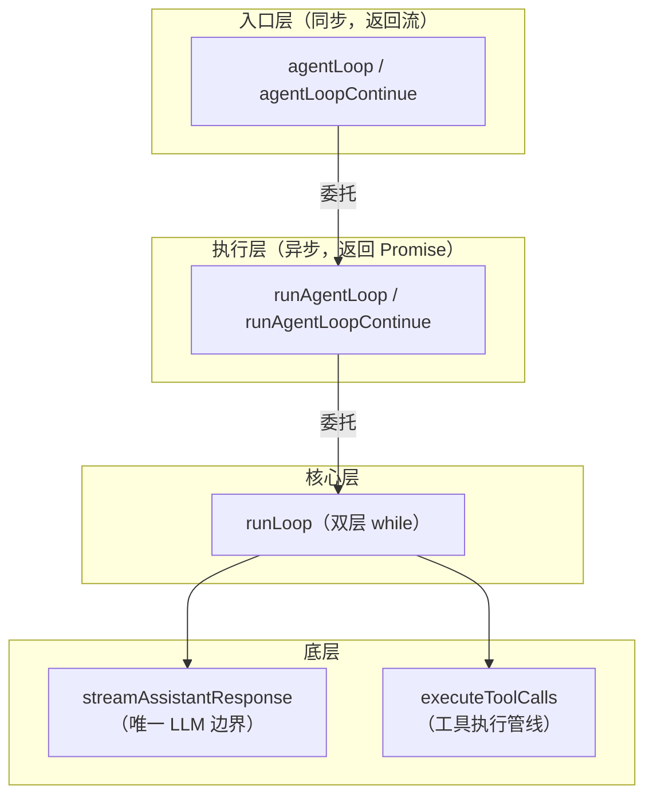
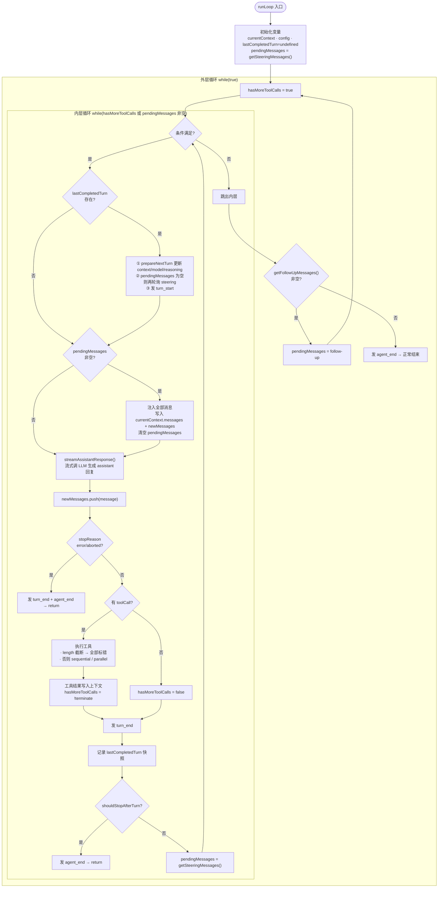

# runLoop 深度解析：双层循环、粒度与消息分类

状态：草稿（2026-09-16 对照 [agent-loop.ts](../../../packages/agent/src/agent-loop.ts) 全文，以及 [agent.ts](../../../packages/agent/src/agent.ts)、[agent-session.ts](../../../packages/coding-agent/src/core/agent-session.ts)、[interactive-mode.ts](../../../packages/coding-agent/src/modes/interactive/interactive-mode.ts)、[keybindings.ts](../../../packages/coding-agent/src/core/keybindings.ts)、[rpc-mode.ts](../../../packages/coding-agent/src/modes/rpc/rpc-mode.ts) 的队列消费侧；runLoop 流程图、粒度层次、steering/follow-up 分类来源均逐点对照源码）

本文是 [agent-loop.zh.md](agent-loop.zh.md)（四入口、事件序列、工具执行）的姊妹篇，聚焦 `runLoop` 这一核心函数的三件事：**完整流程图、一次 runLoop 的粒度、steering/follow-up 消息从哪来**。

## 事实源（链接，不复述）

- [agent-loop.ts](../../../packages/agent/src/agent-loop.ts)（804 行；`runLoop` 在 153-273 行）
- [types.ts](../../../packages/agent/src/types.ts)（`getSteeringMessages` / `getFollowUpMessages` 契约，L245-258）
- [agent.ts](../../../packages/agent/src/agent.ts)（有状态 `Agent`：`steer()` / `followUp()` / 两个队列）
- [agent-session.ts](../../../packages/coding-agent/src/core/agent-session.ts)（`streamingBehavior` 分流 + `deliverAs` 分流）
- [interactive-mode.ts](../../../packages/coding-agent/src/modes/interactive/interactive-mode.ts)（回车 = steer、快捷键 = followUp）
- [keybindings.ts](../../../packages/coding-agent/src/core/keybindings.ts)（`app.message.followUp` 默认键）
- [rpc-mode.ts](../../../packages/coding-agent/src/modes/rpc/rpc-mode.ts)（`steer` / `follow_up` 命令）

## 三层结构 + 一个核心思想

`agent-loop.ts` 是 agent 的「心脏」，驱动「模型输出 → 工具调用 → 再回模型」的循环。核心设计思想写在文件开头：

> *Agent loop that works with AgentMessage throughout. Transforms to Message[] only at the LLM call boundary.*

即**循环内部始终用 `AgentMessage`，只在真正调 LLM 那一刻才转成底层 `Message[]`**——把「agent 层领域模型」和「provider 层协议模型」解耦。

调用链分层清晰：



三个片段的职责：

| 片段 | 行号 | 职责 | 同步/异步 |
|---|---|---|---|
| `agentLoop` | 28-55 | 公开入口：同步返回 `EventStream`，异步跑循环，事件桥接到流 | 同步返回 |
| `runAgentLoop` | 96-119 | 组织上下文（`currentContext` / `newMessages`）、发启动事件、委托 `runLoop` | async |
| `runLoop` | 153-273 | 核心双层循环，产出最终 `newMessages` | async |

### 片段 1：`agentLoop`（28-55）—— 同步入口 + 流式桥接

```typescript
export function agentLoop(
	prompts: AgentMessage[],
	context: AgentContext,
	config: AgentLoopConfig,
	signal: AbortSignal | undefined,
	streamFn: StreamFn,
): EventStream<AgentEvent, AgentMessage[]> {
	const stream = createAgentStream();

	void runAgentLoop(
		prompts, context, config,
		async (event) => { stream.push(event); },
		signal, streamFn,
	).then((messages) => {
		stream.end(messages);
	});

	return stream;
}
```

四个设计点：

1. **同步返回、异步执行**：函数非 `async`，立即返回 `EventStream`，循环在后台 `void runAgentLoop(...)` 启动。调用方拿到流即可订阅，不错过任何事件。
2. **`void` 运算符**：明示「这里有 Promise，故意不 await」，完成通过 `.then()` 里 `stream.end(messages)` 衔接。
3. **事件桥接**：`emit` 支持 `Promise<void> | void`，且 `runAgentLoop` 内都是 `await emit(...)`，故事件**有序串行**流出——对 UI 按序渲染至关重要。
4. **`createAgentStream`**（146-151 行）：传入「终结事件判断」（`event.type === "agent_end"`）与「终结值提取」（`event.messages`），用**终结事件**闭合流，而非靠 Promise resolve。

### 片段 2：`runAgentLoop`（96-119）—— 准备上下文 + 发启动事件

```typescript
export async function runAgentLoop(...): Promise<AgentMessage[]> {
	const initialMessages = declareToolChanges(context, prompts);
	const newMessages: AgentMessage[] = [...initialMessages];
	const currentContext: AgentContext = {
		...context,
		messages: [...context.messages, ...initialMessages],
	};

	await emit({ type: "agent_start" });
	await emit({ type: "turn_start" });
	for (const message of initialMessages) {
		await emit({ type: "message_start", message });
		await emit({ type: "message_end", message });
	}

	await runLoop(currentContext, newMessages, config, signal, emit, streamFn ?? getDefaultStreamFn());
	return newMessages;
}
```

四个设计点：

1. **`declareToolChanges` 先行**（2026-09-19 起）：入口先调 `declareToolChanges(context, prompts)`，把「可执行工具集（`context.tools`）」与「transcript 中已声明的工具」的差异折算成 system 消息，产出 `initialMessages`——系统提示词与工具声明不再由 `context.systemPrompt`/`context.tools` 承载，而是随 transcript 的 system 消息走。
2. **两个消息集合分离**：`newMessages` 只记录**本轮新产生**的消息（最终返回值）；`currentContext.messages` 是**完整上下文**（历史 + initialMessages），喂给 LLM。前者回答「这次发生了什么」，后者回答「全部发生了什么」。
3. **不可变更新**：`{ ...context, messages: [...] }` 复制而非原地 `push`，不污染调用方传入的 `context`。
4. **事件时序**：`agent_start` → `turn_start` → 逐 initialMessages `message_start`/`message_end`。把用户消息也当消息发出事件，让 UI 能显示「用户说了什么」。
5. **`streamFn ?? getDefaultStreamFn()`**：依赖注入 + 默认值兜底，测试可注入 faux provider。

## runLoop 完整流程图（153-273）

双层循环：**内层循环**处理「模型→工具→模型」的单轮迭代与 steering 消息，**外层循环**处理 agent 停止后的 follow-up 消息。



### 初始化变量

| 变量 | 初始值 | 作用 |
|------|--------|------|
| `currentContext` | `initialContext` | 当前完整上下文，`messages` 数组不断被 push |
| `config` | `initialConfig` | 运行配置，可被 `prepareNextTurn` 替换 |
| `lastCompletedTurn` | `undefined` | 上一轮快照，供下一轮钩子使用 |
| `pendingMessages` | `getSteeringMessages()` | 启动时先查一次，捕获「用户等待期间已输入」的消息 |
| `hasMoreToolCalls` | 每轮重置 `true` | 是否还需继续工具迭代 |

### ① prepareNextTurn 块（仅 `lastCompletedTurn` 存在时）

三件事：动态重配（返回新 `context`/`model`/`reasoning`，用 `??` 只覆盖提供的字段）；补充轮询 steering（长任务期间用户又输入了，但**仅当 `pendingMessages` 为空**才查，避免 `one-at-a-time` 同轮塞两条）；发 `turn_start`（首轮由 `runAgentLoop` 发过，这里不重复）。

### ② 注入 pendingMessages

把 steering / follow-up 消息在**下一次 LLM 调用前**写入上下文，同时写 `currentContext.messages`（喂 LLM）与 `newMessages`（返回值）。2026-09-19 起注入前先经 `declareToolChanges` 折算工具负载差异（与入口同逻辑）。

### ③ 流式生成 assistant 回复

唯一「`AgentMessage[]` → `Message[]`」的边界转换点，内部处理流式增量与 `message_start`/`message_update`/`message_end`。

### ④ 错误/中止分支

`stopReason` 为 `error`/`aborted` 时立即终结（退出路径 1）。

### ⑤ 工具调用处理

- `stopReason === "length"`：输出撞 token 上限，参数可能残缺，**不执行**，全部标错让模型重发。
- 否则 `executeToolCalls` 内部按 `sequential`/`parallel` 执行。
- `hasMoreToolCalls = !terminate`：所有工具都 `terminate: true` 才停工具迭代。

### ⑥ 记录快照 + 停止判断

`turn_end` 标志一轮完成；快照供下一轮钩子；`shouldStopAfterTurn` 可主动终止（退出路径 2）；最后为下一轮预取 steering。

### ⑦ 外层 follow-up 检查

内层退出（无工具、无 steering）时，若有排队 follow-up 则塞回 `pendingMessages` 并 `continue` 重启内层；否则 `break`（退出路径 3）。

### 三条退出路径

| 路径 | 触发条件 | 位置 |
|------|---------|------|
| 1 | `stopReason` 为 `error`/`aborted` | ④ |
| 2 | `shouldStopAfterTurn` 返回 true | ⑥ |
| 3 | 无工具调用、无 steering、无 follow-up | ⑦ |

三条路径最终都统一发 `agent_end` 收尾。

## 一次 runLoop 的粒度：session / run / turn

「一次 runLoop 调用」既不是「完整 Session」，也不严格是「一次用户提问」，而是**一次 run（一次连续执行段）**。

| 概念 | 由谁管理 | 包含几次 runLoop |
|------|---------|-----------------|
| 完整 Session | `Agent` 类（`agent.ts`），持有持续的历史 `_state.messages` | 多次 |
| 一次运行（一次 runLoop） | `runAgentLoop` / `runAgentLoopContinue` | 1 次 |
| 一个 turn（模型→工具→模型…） | `runLoop` 内层 `while` | 属于某次运行 |

**「一次提问 = 一次 runLoop」只在 agent 空闲时成立**：`Agent.prompt()` 空闲时 `runPromptMessages` → 新起一次 `runLoop`。

但外层 `while(true)` 打破了这个 1:1——它专门处理「agent 本该停止时，队列里又来了新消息」：

```typescript
// Agent would stop here. Check for follow-up messages.
const followUpMessages = (await config.getFollowUpMessages?.()) || [];
if (followUpMessages.length > 0) {
	pendingMessages = followUpMessages;
	continue;
}
break;
```

在交互式场景下，agent 运行中用户再输入**不会**触发新的 `prompt()`（`agent.ts` 353 行抛「already processing」），而是入队。因此：

- **steering 消息** → 内层循环捞走，注入**同一次** runLoop；
- **follow-up 消息** → 外层循环捞走，也在**同一次** runLoop 接续处理。

一次 `runLoop` 的真实语义是：

> **一次连续的、直到「无工具调用、无 steering 消息、无 follow-up 消息」三者同时满足才结束的执行段。**

而完整 Session 由 `Agent` 实例统筹，把一次次 `runLoop` 串起来共享同一份历史。

## steering vs follow-up：消息从哪来

**核心结论：消息成为 steering 还是 follow-up，与消息内容无关，完全由「发送者选择的投递动作」显式决定。** 同一个文本，普通回车发就是 steering，专用按键发就是 follow-up。

### 语义区别

| | steering（转向） | follow-up（后续） |
|---|---|---|
| 用户意图 | 「别继续了，**现在**就改方向」 | 「先把**当前工作做完**，再处理这个」 |
| 投递时机 | 当前 turn 工具执行完后、下一次 LLM 调用前 | agent 完全没有工具调用、也没有 steering、即将停止时 |
| 对应代码位置 | `runLoop` 内层 `getSteeringMessages` | `runLoop` 外层 `getFollowUpMessages` |
| 是否打断工作 | 打断当前方向 | 不打断，等自然收尾 |

### 四条分类来源

**1. 交互式 CLI（最常见）**——按键区分（[keybindings.ts](../../../packages/coding-agent/src/core/keybindings.ts) L134-137）：

```typescript
"app.message.followUp": {
	defaultKeys: windowsKeybindings ? "ctrl+q" : "alt+enter",
	description: "Queue follow-up message",
},
```

- 普通回车（Enter）→ 默认 **steering**（`queueCompactionMessage(text, "steer")`）
- `ctrl+q`（Windows）/ `alt+enter`（其他）→ **follow-up**（`handleFollowUp` → `queueCompactionMessage(text, "followUp")`）

**2. 程序化 API（`AgentSession`）**——`streamingBehavior` 选项（[agent-session.ts](../../../packages/coding-agent/src/core/agent-session.ts) L1218-1229）：

```typescript
if (this.isStreaming) {
	if (!options?.streamingBehavior) {
		throw new Error(
			"Agent is already processing. Specify streamingBehavior ('steer' or 'followUp') to queue the message.",
		);
	}
	if (options.streamingBehavior === "followUp") {
		await this._queueFollowUp(expandedText, currentImages);
	} else {
		await this._queueSteer(expandedText, currentImages);
	}
}
```

agent 运行中未指定 `streamingBehavior` 会直接抛错——默认行为必须显式。

**3. RPC 模式**——命令名区分（[rpc-mode.ts](../../../packages/coding-agent/src/modes/rpc/rpc-mode.ts) L418-425）：

```typescript
case "steer": {
	await session.steer(command.message, command.images, { source: "rpc" });
	return success(id, "steer");
}
case "follow_up": {
	await session.followUp(command.message, command.images, { source: "rpc" });
	return success(id, "follow_up");
}
```

**4. 自定义消息（扩展 / app 消息）**——`deliverAs` 选项（[agent-session.ts](../../../packages/coding-agent/src/core/agent-session.ts) L1516-1523）：

```typescript
if (options?.deliverAs === "nextTurn") {
	this._pendingNextTurnMessages.push(appMessage);
} else if (this.isStreaming && options?.triggerTurn !== false) {
	if (options?.deliverAs === "followUp") {
		this.agent.followUp(appMessage);
	} else {
		this.agent.steer(appMessage);
	}
}
```

### 归纳

| 发送途径 | steering | follow-up |
|---|---|---|
| 交互式 CLI | 普通回车（默认） | `ctrl+q` / `alt+enter` |
| `AgentSession.prompt` | `streamingBehavior: "steer"` | `streamingBehavior: "followUp"` |
| RPC | `steer` 命令 | `follow_up` 命令 |
| 自定义消息 | `deliverAs` 缺省 | `deliverAs: "followUp"` |

两种消息最终都是 `role: "user"` + 文本内容，形态完全一致，只有落进哪个队列不同——这种设计让用户用同一种「输入消息」动作，通过不同提交方式精确控制注入时机。

## 我曾经的误解

1. 「一次 runLoop = 一次用户提问」→ 只在 agent 空闲时成立；外层 `while(true)` 的 follow-up 机制让同一次 runLoop 可吞掉多份排队输入 → 对照 `runLoop` 外层循环与 `Agent.prompt()` 的「already processing」守卫。
2. 「steering / follow-up 由消息内容决定」→ 由发送动作（按键 / 选项 / 命令）显式决定，消息对象本身相同 → 对照四处分流代码。

## 验证方式

- `read_file` 读 `agent-loop.ts` 全文（重点 153-273 行 `runLoop`）
- `search_content` 搜 `getFollowUpMessages` / `getSteeringMessages` / `steer(` / `followUp(` 全仓分布，锁定四条分类来源
- `read_file` 读 `keybindings.ts` / `agent-session.ts` / `interactive-mode.ts` / `rpc-mode.ts` 关键段，确认分类落地处

## 遗留问题

- 与 [agent-loop.zh.md](agent-loop.zh.md) 的 Q1（agent-loop 与 AgentHarness 关系）联动：`runLoop` 是无状态核心，`AgentHarness` 是否也复用它、还是另有驱动路径，留待阶段 3 第 5 步裁决。
