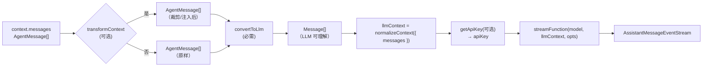
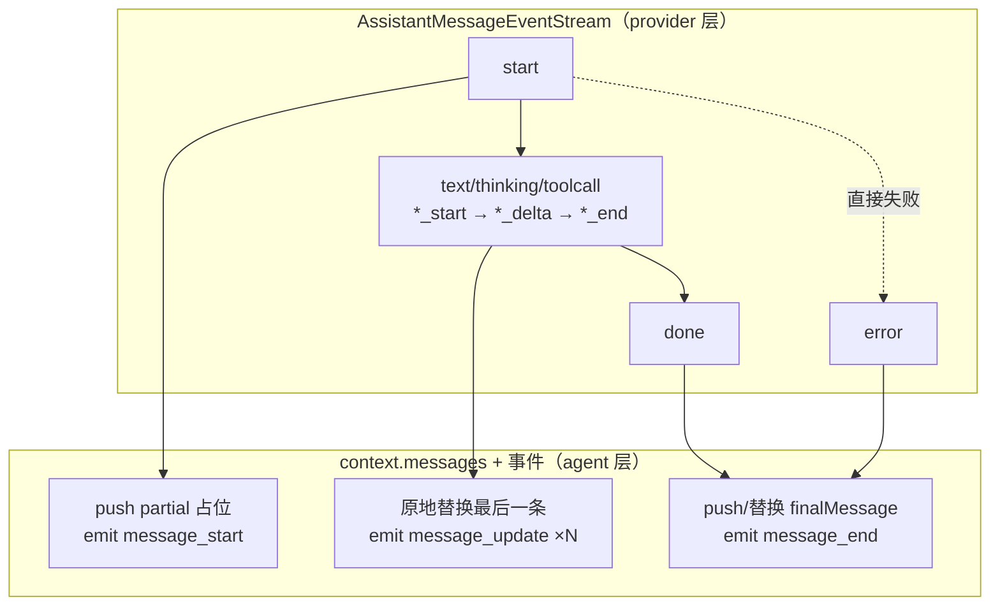

# streamAssistantResponse 深度解析：唯一 LLM 调用边界

状态：草稿（2026-09-17 对照 [agent-loop.ts](../../../packages/agent/src/agent-loop.ts) 275-370 行，以及 [event-stream.ts](../../../packages/ai/src/utils/event-stream.ts) 的 `AssistantMessageEventStream`、[types.ts](../../../packages/ai/src/types.ts) 的 `AssistantMessageEvent` 协议与 `StreamFn` 契约；五阶段、三分支、六设计点均逐点对照源码）

本文是 [agent-loop.zh.md](agent-loop.zh.md)（四入口、双层 while、事件序列概览）的姊妹篇，聚焦 `streamAssistantResponse` 这一个函数——它是 agent loop **心脏中的心脏**：全 loop 唯一调用 LLM 的地方，也是「`AgentMessage[] → Message[]` 只在 LLM 调用边界转换」的唯一发生地。

## 事实源（链接，不复述）

- [agent-loop.ts](../../../packages/agent/src/agent-loop.ts)（`streamAssistantResponse` 在 275-370 行）
- [event-stream.ts](../../../packages/ai/src/utils/event-stream.ts)（`EventStream` 泛型类、`AssistantMessageEventStream` 构造、`result()` 定义）
- [types.ts](../../../packages/ai/src/types.ts)（`AssistantMessageEvent` 协议 L546-562、`partial` 语义注释 L531-545、`StreamFn` 契约 L326-331）

## 它是什么（≤5 句）

`streamAssistantResponse` 输入 `context` + `config`，返回最终的 `AssistantMessage`，同时产生两个副作用：① 把最终消息写入 `context.messages`（原地 push 或替换最后一条）；② 发出消息生命周期事件（`message_start` / `message_update` / `message_end`）。它把 provider 的**流式协议事件**折叠成**一条 assistant 消息 + 消息生命周期事件**，是流协议与消息模型的唯一对接点。函数无 `try/catch`，完全信任 `StreamFn` 的「不抛错」契约。

## 调用前的五个准备阶段（286-310）



| 阶段 | 性质 | 作用 |
|---|---|---|
| `transformContext` | 可选 | `AgentMessage[] → AgentMessage[]`，上下文窗口裁剪 / 外部上下文注入 |
| `convertToLlm` | **必需** | `AgentMessage[] → Message[]`，**唯一**的边界转换，过滤 UI-only 消息 |
| 构建 `llmContext` | 必需 | `normalizeContext({ messages })` 归一化；系统提示词与工具声明已随 transcript 的 system 消息走 |
| `getApiKey` | 可选 | 动态解析 API key（注释明言：为**会过期的 token**，如 GitHub Copilot） |
| `streamFunction` | 必需 | 拿到 `AssistantMessageEventStream`，注入 `signal` 与解析后的 `apiKey` |

`getApiKey` 的兜底值得注意：`(await getApiKey(...)) || config.apiKey`——先尝试动态获取，拿不到再回落静态 `config.apiKey`。

## 流式事件处理的三个分支（312-369）

`AssistantMessageEvent` 协议（[types.ts](../../../packages/ai/src/types.ts) L546-562）分四类：`start`、三种块的增量（`text_*` / `thinking_*` / `toolcall_*`）、`done`、`error`。`streamAssistantResponse` 把它们映射为三个分支。

### 分支 1：`start`（317-322）—— 建立占位

```typescript
case "start":
    partialMessage = event.partial;
    context.messages.push(partialMessage);   // 在上下文末尾建立占位
    addedPartial = true;
    await emit({ type: "message_start", message: { ...partialMessage } });
    break;
```

拿到 partial（空骨架 assistant 消息），**push** 进 `context.messages`，标记 `addedPartial`，发 `message_start`。

### 分支 2：九个增量事件（324-342）—— 原地替换

```typescript
case "text_start": case "text_delta": case "text_end":
case "thinking_start": case "thinking_delta": case "thinking_end":
case "toolcall_start": case "toolcall_delta": case "toolcall_end":
    if (partialMessage) {
        partialMessage = event.partial;
        context.messages[context.messages.length - 1] = partialMessage;  // 原地替换
        await emit({ type: "message_update", assistantMessageEvent: event, message: { ...partialMessage } });
    }
    break;
```

九种增量事件**统一处理**，关键动作是 `context.messages[last] = partialMessage` 的**原地替换**——不 push 新消息，只更新上下文末尾那条 assistant 消息的内容。

### 分支 3：`done` / `error`（344-357）—— 定稿返回

```typescript
case "done":
case "error": {
    const finalMessage = await response.result();
    if (addedPartial) {
        context.messages[context.messages.length - 1] = finalMessage;  // 替换
    } else {
        context.messages.push(finalMessage);                            // push
    }
    if (!addedPartial) {
        await emit({ type: "message_start", message: { ...finalMessage } });
    }
    await emit({ type: "message_end", message: finalMessage });
    return finalMessage;
}
```

`done` 和 `error` 共用同一分支，因为两者都是终结：拿 `result()` 定稿、写入上下文、发 `message_end`、返回。

### 兜底路径（361-369）

`for await` 循环**自然耗尽**（没遇到 `done`/`error`）时，还有一段几乎相同的收尾逻辑——防御性地再调 `result()` 定稿。正常流不会走到这里（终结事件必触发 return），但作为安全网存在。

## 六个关键设计点（为什么这么写）

### 1. `partial` 是「活对象」而非「事件快照」

这是理解整段代码的钥匙。[types.ts](../../../packages/ai/src/types.ts) L539-540 的注释明说：

> *`partial` is the shared live response-so-far helper, not an event-time snapshot.*

即每个事件携带的 `partial` 字段是**同一个不断增长的响应对象**（截至当前的完整状态），不是该事件瞬间的独立快照。因此 `start` 后 push 的那个 partial，其引用本身会随后续 delta 自动增长；代码仍在每个增量事件里 `partialMessage = event.partial` 重新赋值，是为了**显式跟踪最新引用**（防御 provider 替换对象），并保证 `context.messages[last]` 始终指向最新状态。

### 2. 原地替换而非追加

流式生成过程中 `context.messages` 的**长度保持稳定**：`start` push 一次，之后所有增量只替换最后一条。这保证后续工具执行、下一轮 LLM 调用依赖的「最后一条 assistant 消息」始终最新且唯一。

### 3. `addedPartial` 标志：区分 push 还是替换

[types.ts](../../../packages/ai/src/types.ts) L533-535 给了理由：

> *A stream may terminate directly with `error` when request setup fails before generation starts.*

即「请求还没开始就失败」时流**没有 `start` 事件**，直接 `error`。此时 `addedPartial === false` → 上下文里还没有占位 → 需 **push**（而非替换）；同时之前没发过 `message_start` → 需**补发** `message_start`，保证每条消息都有完整的 `message_start → message_end` 生命周期。

### 4. `{ ...partialMessage }` 浅拷贝

emit 事件时传**副本**而非原对象，防止订阅者修改事件里的消息、进而污染 `context.messages` 中的真实对象。事件语义是「快照」，而 `context.messages` 里是「活的真相」。

### 5. 用 `result()` 而非直接读事件字段

`result()` 是 `EventStream` 的正式契约（[event-stream.ts](../../../packages/ai/src/utils/event-stream.ts) L86-88），返回 `finalResultPromise`，在 push 终结事件时 resolve，提取规则（L91-105）：

- `done` → `event.message`
- `error` → `event.error`

用它取终值，使 `done`/`error` 分支和循环后兜底**共用同一套取结果逻辑**，且 `result()` 幂等、可多次 await。

### 6. 无 try/catch：信任 `StreamFn` 的「不抛错」契约

[types.ts](../../../packages/ai/src/types.ts) L326-331 明确：失败必须编码进流（`error` 事件 + 最终 `stopReason`），不能 throw。唯一例外是「auth 缺失时 `streamSimple()` 同步 throw」（L328-329）——这个 throw 会冒泡到 `runLoop`（也无 try/catch），最终由 `Agent` 类的 `runWithLifecycle` 兜底成整场失败。

## 事件折叠全景



一句话总结：**流协议把「生成过程」拆成 start/delta/done 事件，`streamAssistantResponse` 把它们重新折叠成「一条消息」**——`start` 是消息的出生（占位），delta 是生长（原地替换），done/error 是定稿（`message_end`）。中间的 `message_update` 只是给 UI 看的流式渲染信号，最终落进上下文和会话的只有一条 `finalMessage`。

## 流式消费机制（三个易混点）

### 1. `for await` 是「等推送」不是「拉取」

`response` 是 `AssistantMessageEventStream`，底层是 `EventStream`（实现 `AsyncIterable`）。它的迭代器是「有货就 yield、没货就注册等待者挂起等 push 唤醒」的 push 模型，不是轮询。详见 [event-stream.zh.md](../mechanisms/event-stream.zh.md)。

### 2. emit 发出的粒度是「完整快照」而非「增量」

`text_delta` 等增量事件本身**没有被原样转发**，而是被折叠成 `message_update`：`message_update.message` 是 `{ ...partialMessage }` 的**完整累计快照**，真正的增量（`event.delta`）放在 `message_update.assistantMessageEvent` 里。

| 层 | 事件 | 粒度 |
|---|---|---|
| provider 层 | `text_delta` / `thinking_delta` / `toolcall_delta` | 逐 chunk/逐 token 的**增量** |
| agent 层 | `message_update` | 每次 delta 触发一次，携带**完整 partial 快照** |

订阅者默认拿 `message.message`（完整快照）直接渲染；需要 token 级增量时再读 `message.assistantMessageEvent.delta`。这是刻意的设计——`AgentMessage` 语义上永远是「完整消息」。

### 3. 接收者的两条路径

`emit` 是 `AgentEventSink` 回调，取决于入口：

- 低层 `agentLoop`：`emit` → `stream.push`（又一层 `EventStream`），外部 `for await` 观察；
- 生产 `Agent` 类：`emit` → `processEvents`，更新 `_state.streamingMessage` 并通知订阅者，最终 `AgentSession` 收到后驱动 UI 实时渲染。

## 与相邻单元的关系

- 上游：`runLoop`（每次内层迭代调用一次，注入 `currentContext` / `config` / `signal` / `emit`）
- 下游：`StreamFn` → `pi-ai`（模型层，返回 `AssistantMessageEventStream`）
- 兄弟：`executeToolCalls`（消费它返回的 `AssistantMessage` 里的 `toolCall` 块，见 [agent-loop.zh.md](agent-loop.zh.md)「工具执行三段式」）

## 验证方式

- `read_file` 读 `agent-loop.ts` 275-370 行全文
- `read_file` 读 `event-stream.ts`（`EventStream` 的 `push`/`end`/`result`/asyncIterator、`AssistantMessageEventStream` 构造）
- `read_file` 读 `types.ts` 530-562 行（`AssistantMessageEvent` 协议 + `partial` 语义注释）

## 遗留问题

- 与 [agent-loop.zh.md](agent-loop.zh.md) Q1 联动：`AgentHarness` 的驱动路径是否也复用 `streamAssistantResponse`，留待阶段 3 第 5 步裁决。
