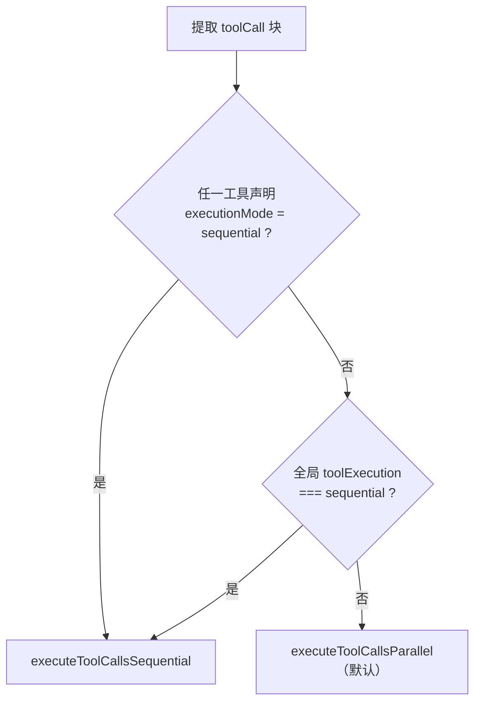
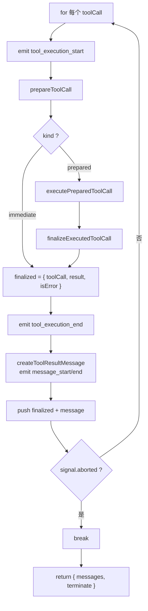
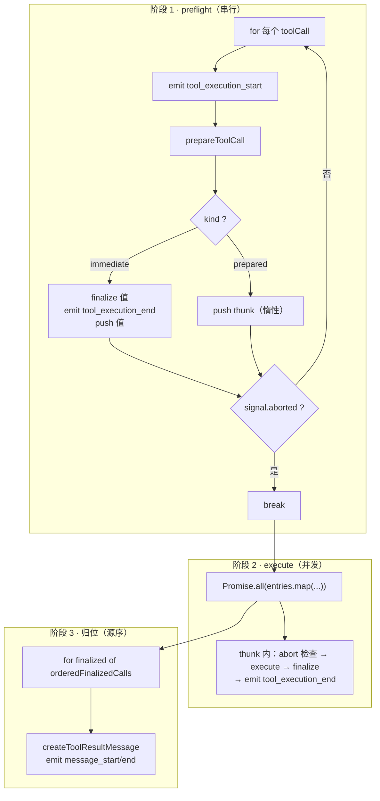

# 工具执行管线深度解析：executeToolCalls / sequential / parallel

状态：草稿（2026-09-17 对照 [agent-loop.ts](../../../packages/agent/src/agent-loop.ts) 406-591 行（入口 + 两条路径 + 类型 + `shouldTerminateToolBatch`）及 607-803 行（三段式函数），[types.ts](../../../packages/agent/src/types.ts) 的 `toolExecution` / `executionMode`；决策逻辑、两阶段编排、惰性 thunk、顺序分离均逐点对照源码）

本文是 [agent-loop.zh.md](agent-loop.zh.md)（工具执行三段式概览）的姊妹篇与深化，聚焦 `executeToolCalls` 这一条工具执行管线的**完整细节**：入口如何决策、顺序/并行两条路径如何编排、三个顺序（prepare/execute/消息）如何协调。

## 事实源（链接，不复述）

- [agent-loop.ts](../../../packages/agent/src/agent-loop.ts)（`executeToolCalls` 409-424、`executeToolCallsSequential` 431-485、`executeToolCallsParallel` 487-561、类型 563-591、`prepareToolCall` 607-675、`executePreparedToolCall` 677-718、`finalizeExecutedToolCall` 720-765、`shouldTerminateToolBatch` 589-591）
- [types.ts](../../../packages/agent/src/types.ts)（`toolExecution` 全局模式、`executionMode` 单工具覆盖）

## 它是什么（≤5 句）

工具执行管线是 `runLoop` 在拿到 assistant 消息后，把其中的 `toolCall` 块变成 `toolResult` 消息的完整过程。它分三层：**入口 `executeToolCalls`**（只决策，不执行）、**两条执行路径**（`executeToolCallsSequential` / `executeToolCallsParallel`）、**三段式**（prepare → execute → finalize，每个工具都走）。核心难点不在「执行工具」，而在「编排」——顺序 vs 并行的切换、准备与执行的解耦、完成序与消息序的刻意分离。

## 入口：executeToolCalls（调度器）

```typescript
async function executeToolCalls(...): Promise<ExecutedToolCallBatch> {
	const toolCalls = assistantMessage.content.filter((c) => c.type === "toolCall");
	const hasSequentialToolCall = toolCalls.some(
		(tc) => currentContext.tools?.find((t) => t.name === tc.name)?.executionMode === "sequential",
	);
	if (config.toolExecution === "sequential" || hasSequentialToolCall) {
		return executeToolCallsSequential(...);
	}
	return executeToolCallsParallel(...);
}
```

它不执行任何工具，只做一件事：**决定整批工具调用走顺序还是并行**。



### 四个关键设计点

1. **两层「顺序」开关**：全局 `config.toolExecution`（默认 `"parallel"`）+ 单工具 `tool.executionMode`（省略则跟随全局）。
2. **「脏批」降级**：只要一批里**任何一个**工具声明 `sequential`，**整批**降级为顺序——顺序工具的结果常被后续工具依赖，不能并发。宁慢勿险。
3. **默认并行**：多数工具调用（read/grep/find）互不依赖，并发降低延迟。
4. **`?.` 容错**：找不到同名工具时不在此入口报错，而是返回 `undefined`（不算 sequential），真正报错留到 `prepareToolCall` 的 `Tool not found`。

## 三段式：共同前提

| 阶段 | 函数 | 产物 |
|---|---|---|
| ① prepare | `prepareToolCall` | 找工具 → `prepareArguments` → `validateToolArguments` → `beforeToolCall` |
| ② execute | `executePreparedToolCall` | `try/catch` 包裹 `tool.execute`，`onUpdate` → `tool_execution_update` |
| ③ finalize | `finalizeExecutedToolCall` | `afterToolCall` 字段级合并 |

`prepareToolCall` 返回判别式联合，是两个路径共同的岔路口：

```typescript
type PreparedToolCall = { kind: "prepared"; toolCall; tool; args };        // 需要 execute
type ImmediateToolCallOutcome = { kind: "immediate"; result; isError };    // 不需要 execute（not found / blocked / aborted / 校验失败）
```

## executeToolCallsSequential：逐工具串成一条链



核心：**一个工具完整走完「prepare → execute → finalize → 发事件」才轮到下一个**，没有「先全部 prepare 再全部 execute」的分离。

要点：

1. 三段式「串成一步」，`tool_execution_end` 和 toolResult 消息紧跟，天然按**源序 = 执行序**输出。
2. `immediate` 直接定稿，跳过 execute/finalize。
3. 每个工具处理完 `if (signal?.aborted) break;`。

## executeToolCallsParallel：preflight（串行）+ execute（并发）两阶段



核心代码：

```typescript
const orderedFinalizedCalls = await Promise.all(
    finalizedCalls.map((entry) => (typeof entry === "function" ? entry() : Promise.resolve(entry))),
);
```

### 关键设计 1：`FinalizedToolCallEntry` 的「惰性 thunk」

```typescript
type FinalizedToolCallEntry = FinalizedToolCallOutcome | (() => Promise<FinalizedToolCallOutcome>);
```

- `immediate` 结果 → 存**值**（不需执行）；
- `prepared` 结果 → 存** thunk**（惰性封装「如何执行」）。

preflight 只准备不执行，`Promise.all` 里 `typeof entry === "function" ? entry() : Promise.resolve(entry)` 统一处理两类。

### 关键设计 2：两个「顺序」刻意分离

| 输出 | 顺序 | 原因 |
|---|---|---|
| `tool_execution_end` | **完成序** | thunk 内 `execute` 完立即 emit（谁先完成谁先发） |
| toolResult 消息 | **源序** | `Promise.all` 保持数组序，阶段 3 按序统一 emit |

保证喂回给 LLM 的 toolResult 消息顺序与模型发出的 toolCall 顺序一致。

### 关键设计 3：preflight 为什么要串行

`beforeToolCall` 钩子、`validateToolArguments`、`prepareArguments` 都可能读 `currentContext`（或产生顺序依赖），所以**准备阶段串行**、只有纯「执行」阶段并发。

### 关键设计 4：abort 的三种处理点

| 位置 | 行为 |
|---|---|
| sequential 每工具后 | `break` |
| parallel preflight（immediate 后 / thunk push 后） | `break` |
| parallel thunk 内（执行前） | `signal?.aborted` → 返回 `"Operation aborted"` 错误结果 |

### 关键设计 5：`terminate` 语义（`shouldTerminateToolBatch`）

```typescript
return finalizedCalls.length > 0 && finalizedCalls.every((f) => f.result.terminate === true);
```

空批不终止；混合批（有的 terminate 有的不）继续；**全 terminate 才终止**。这是易错点：个别工具 `terminate` 不生效。

## 两者对比总表

| 维度 | sequential | parallel |
|---|---|---|
| prepare 与 execute 关系 | 逐工具：prepare→execute→finalize 串成一步 | 先串行 prepare 全部，再并发 execute |
| 执行时机 | 每个 prepare 完立即 execute | `Promise.all` 并发 |
| `tool_execution_end` 顺序 | 执行序（= 源序） | **完成序** |
| toolResult 消息顺序 | 执行序（= 源序） | **源序**（阶段 3 归位） |
| immediate 处理 | 逐工具直接定稿 | preflight 阶段直接定稿（不进并发） |
| abort | 每工具后 break | preflight 断 + thunk 内检查 |
| 数据结构 | `FinalizedToolCallOutcome[]`（全值） | `FinalizedToolCallEntry[]`（值 or thunk） |

## 一句话总结

工具执行管线是「三段式」的两种编排：**sequential 是「单车道」**——逐工具串行走完 prepare→execute→finalize，顺序天然一致；**parallel 是「收费站 + 多车道」**——先串行 preflight（只准备不执行，把可执行工具封装成惰性 thunk），再 `Promise.all` 并发执行，最后按源序归位结果消息。parallel 的精髓在 `FinalizedToolCallEntry` 的「值 or thunk」联合——用惰性函数把「准备」和「执行」解耦，同时用 `Promise.all` 的保序特性维持「完成序 ≠ 消息序」的刻意分离。

## 验证方式

- `read_file` 读 `agent-loop.ts` 406-591（入口 + 两条路径 + 类型）、607-803（三段式函数）
- `read_file` 读 `types.ts` 的 `toolExecution` / `executionMode` 定义

## 遗留问题

- 三段式的细节（`prepareToolCall` 的 `beforeToolCall` 阻断、`executePreparedToolCall` 的 update 事件折叠、`finalizeExecutedToolCall` 的字段级合并）本篇只做框架性引用，未逐行展开，留待后续专项。
- `tool.result.terminate` 的具体产生者（哪些工具会置 `terminate: true`）未追踪，留待工具实现层深读。
