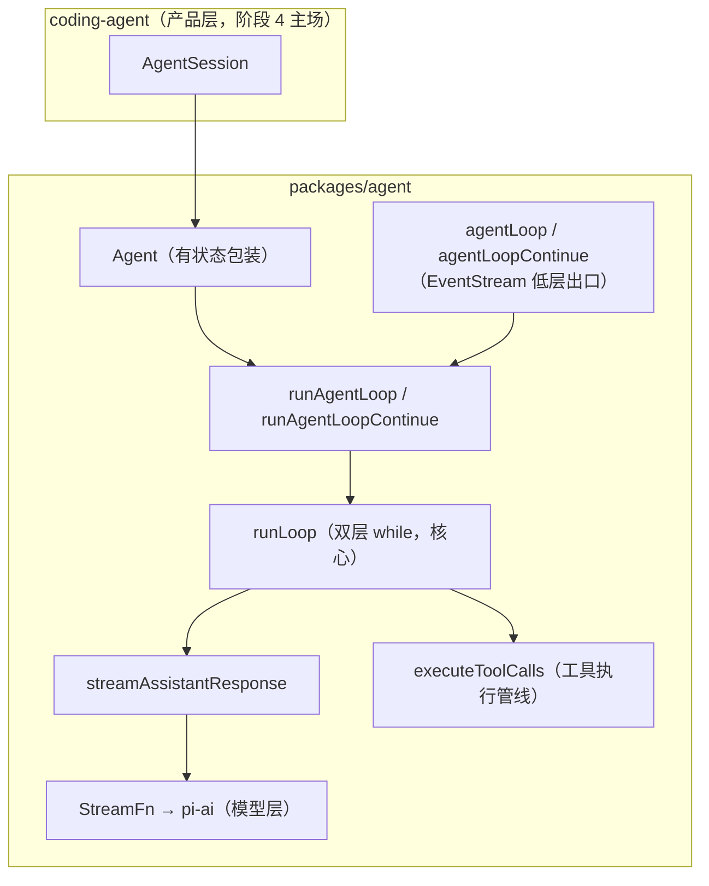
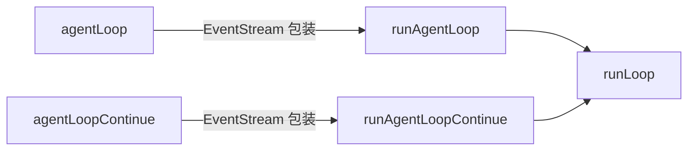
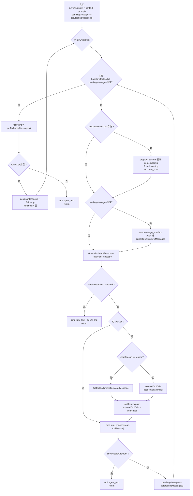
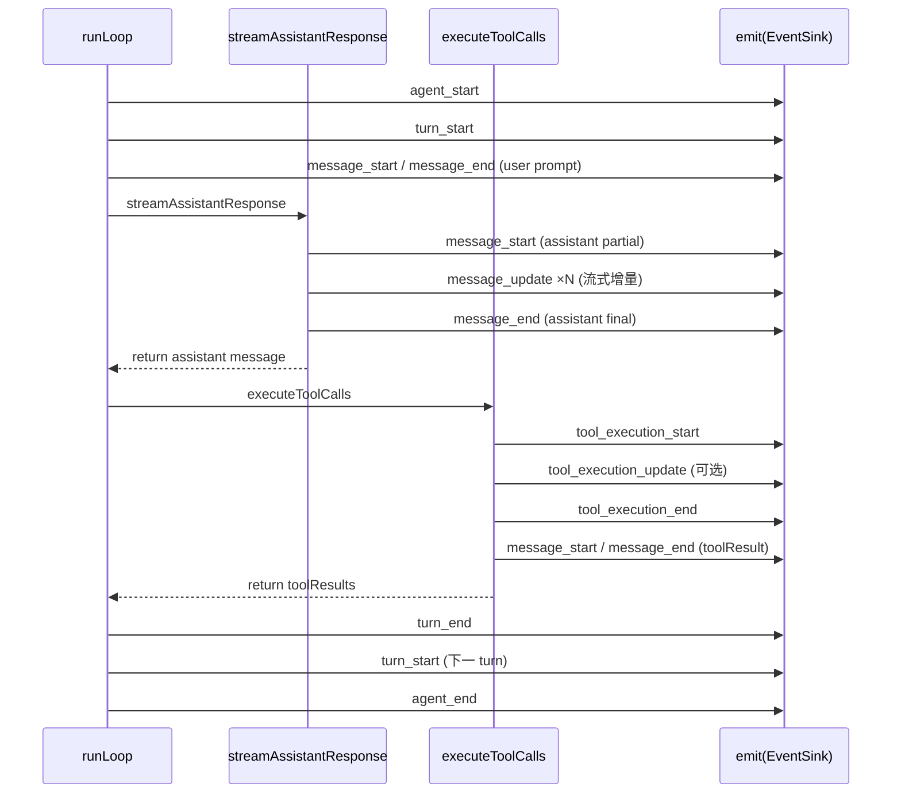
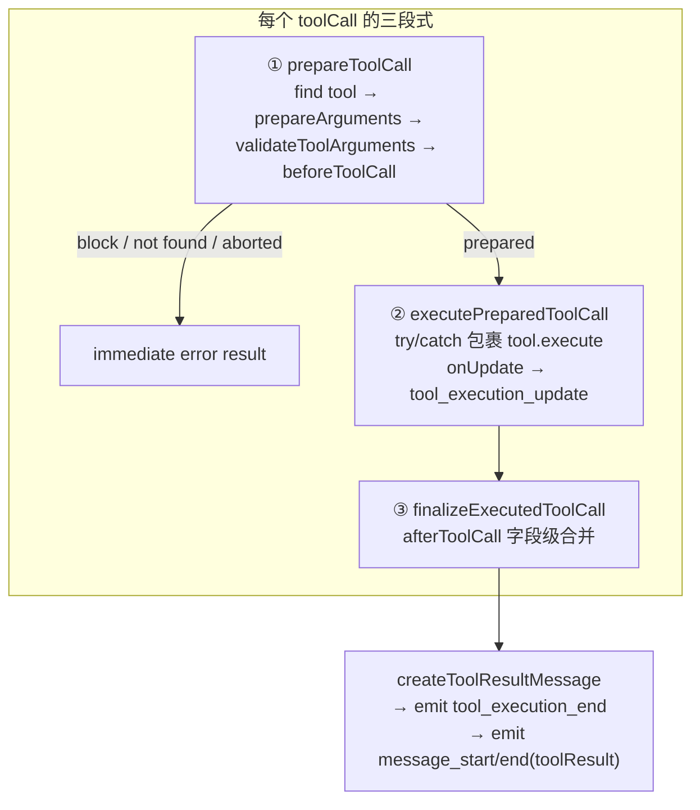

# agent-loop.ts 精读笔记

状态：已对照验证（2026-09-14 对照 [packages/agent/src/agent-loop.ts](../../../packages/agent/src/agent-loop.ts)、[types.ts](../../../packages/agent/src/types.ts)、[agent.ts](../../../packages/agent/src/agent.ts)；阶段 3 第 2/3 步）

## 事实源（链接，不复述）

- [agent-loop.ts](../../../packages/agent/src/agent-loop.ts)（804 行，回合驱动本体）
- [types.ts](../../../packages/agent/src/types.ts)（`StreamFn` / `AgentEvent` / `AgentLoopConfig` 等词汇）
- [agent.ts](../../../packages/agent/src/agent.ts)（有状态 `Agent` 类，消费 `runAgentLoop`）
- [packages/ai/src/utils/event-stream.ts](../../../packages/ai/src/utils/event-stream.ts)（`EventStream` 定义）

## 它是什么（≤5 句）

`agent-loop.ts` 是经典内存栈（生产路径）的心脏：一个无状态的回合驱动，`AgentMessage` 贯穿全程，只在 LLM 调用边界转成 `Message[]`。它提供四个入口，本质是「输出形态 × 是否带新消息」的 2×2 组合，全部收敛到同一个 `runLoop`（双层 while）。外层 while 管「agent 本应停下后还有没有 follow-up 排队」，内层 while 管「当前 turn 的工具调用与 steering 消息有没有处理完」。它不持有 transcript——那是有状态的 `Agent` 类（`agent.ts`）的职责，`Agent` 调用的是 `runAgentLoop` 系而非 `agentLoop` 系。

## 在运行时栈的位置

## 四个入口：2×2 组合（含一次纠错）

四个函数**全是无状态**的，正确矩阵是「输出形态 × 是否带新消息」：

| | 带新 prompt | 续跑现有 context |
|---|---|---|
| **EventStream 输出** | `agentLoop` | `agentLoopContinue` |
| **emit 回调 + Promise 输出** | `runAgentLoop` | `runAgentLoopContinue` |

- **输出形态**：`agentLoop` 系返回 `EventStream`（可 `for await` 观察）；`runAgentLoop` 系接收 `emit` 回调并返回 `Promise<AgentMessage[]>`。前者是后者的**薄包装**——`agentLoop` 内部调 `runAgentLoop`，把 `emit` 接到 `stream.push`、把 Promise 结算接到 `stream.end`。
- **是否带新消息**：`runAgentLoop` 的 `newMessages = [...prompts]`、`currentContext.messages` 追加 prompts；`runAgentLoopContinue` 的 `newMessages = []`、`currentContext` 原样沿用，且前置校验「末消息不能是 assistant」（否则模型无法接）。

**纠错记录**：我曾把四个入口标成「低层（无状态）/ 高层（有状态，被 Agent 调）」——错误。「有状态 vs 无状态」不是这四个入口之间的区别，而是「`Agent` 类 vs 这四个 loop 函数」之间的区别；四个 loop 函数全部无状态。

## 双层 while：两种粒度的「继续」

一句话：**内层管「当前 turn 没干完」，外层管「干完后还有没有排队的活」。**

## 事件序列（一次带工具调用的对话）

| 事件 | 由谁 emit | 关键点 |
|---|---|---|
| `agent_start` | `runAgentLoop` / `runAgentLoopContinue` | 每个 run 一次 |
| `turn_start` | `runAgentLoop`（首轮）+ `runLoop`（每轮继续前） | 后续在 `lastCompletedTurn` 分支 |
| `message_start/end`（user） | `runAgentLoop`（prompts）/ `runLoop`（pending） | prompt 与 steering 共用 |
| `message_start`（assistant） | `streamAssistantResponse` | partial 首次 push 时 |
| `message_update` | `streamAssistantResponse` | 仅 assistant，带 `assistantMessageEvent` |
| `message_end`（assistant） | `streamAssistantResponse` | `done`/`error` 时 |
| `tool_execution_start/update/end` | `executeToolCalls*` / `executePreparedToolCall` | 每个 toolCall 一次 |
| `message_start/end`（toolResult） | `emitToolResultMessage` | 工具结果转消息 |
| `turn_end` | `runLoop` | 每 turn 一次，带 message + toolResults |
| `agent_end` | `runLoop`（正常）/ `runAgentLoop`（error 早退） | 带 `messages: AgentMessage[]` |

## streamAssistantResponse：唯一 LLM 调用边界

```mermaid
flowchart LR
    A["currentContext.messages<br/>AgentMessage[]"] -->|"transformContext(可选)"| B["AgentMessage[]"]
    B -->|"convertToLlm(必需)"| C["Message[]"]
    C --> D["llmContext = systemPrompt + messages + tools"]
    D -->|"getApiKey(可选)"| E["streamFunction(model, llmContext, opts)"]
    E --> F["AssistantMessageEventStream"]
    F -->|for await 折叠| G["partialMessage<br/>emit message_start / message_update"]
    G -->|done / error| H["response.result() → finalMessage"]
    H --> I["emit message_end → return"]
```

两个关键点：① `AgentMessage[] → Message[]` 只发生在这里；② 该函数**无 try/catch**，完全信任 `StreamFn` 的「不抛错」契约。partial 是原地替换（`context.messages[last] = partialMessage`）。

## 工具执行三段式 + 两条路径

| 维度 | `sequential` | `parallel`（默认） |
|---|---|---|
| preflight | 逐工具：prepare→execute→finalize 串成一步 | 先串行 prepare 全部，再并发执行 |
| 执行 | 一个接一个 | `Promise.all` 并发 |
| `tool_execution_end` 顺序 | 执行序 | 完成序 |
| toolResult 消息顺序 | 执行序 | assistant 源序 |
| 触发 | 全局 `sequential` 或任一 tool 声明 `executionMode:"sequential"` | 其余 |

**`terminate` 语义**（易错点）：`shouldTerminateToolBatch` 要求 `length > 0 && every(terminate === true)`——批量里**所有**工具结果都 `terminate: true` 才提前停，混合批正常继续。

## 停止/继续条件全集（6 个决策点）

| # | 决策点 | 语义 |
|---|---|---|
| 1 | `stopReason === "error"/"aborted"` | 模型出错/中止 → 立即 `agent_end` |
| 2 | `hasMoreToolCalls = !terminate` | 还有工具 → 继续内层 |
| 3 | `shouldStopAfterTurn` | turn 完整结束后优雅停 |
| 4 | `getSteeringMessages` | turn 间隙注入 steering |
| 5 | `getFollowUpMessages` | 本应停后排队的工作 |
| 6 | `prepareNextTurn` | 下一 turn 前替换 context/model/thinking |

其中 4/5 差异：steering 是「turn 间隙插话」，follow-up 是「空闲后排队」。

## 截断保护：`failToolCallsFromTruncatedMessage`

`stopReason === "length"`（输出撞 token 上限）时，流式工具参数经 `parseStreamingJson` 抢救后可能「解析通过但内容不完整」。此时宁可全部标错、不执行，让模型凭错误重新发起完整调用——执行参数残缺的工具（如写文件）后果不可逆。

## 错误通道辨析：工具 throw vs StreamFn 不 throw

**不是「两条随意规则」，而是「两种调用形态决定两种错误通道」**：

| | 工具 `execute` | `StreamFn` |
|---|---|---|
| loop 怎么消费 | 直接 `await`（一次性） | `for await` 迭代（流） |
| 失败时机 | 调用当场 | 流生命周期内任意时刻 |
| throw 能否表达 | 能 | 不能（无法跨迭代边界同步传递） |
| 错误通道 | throw → loop 的 try/catch 兜底成 `isError: true` | 流内 `error` 事件 + 最终 `stopReason` |

`StreamFn` 真 throw 的后果不是崩溃，而是「绕过正常事件序列」：`Agent` 类路径被 `runWithLifecycle` 兜底成整场失败（`handleRunFailure` 补发事件）；低层 `agentLoop` 路径则 unhandled rejection。契约真正保护的是「让 loop 对每次模型调用都走统一的流事件路径」。

## runAgentLoop 系 vs agentLoop 系（搜证结论）

全 `packages/**/*.ts` 搜证结果：

| 符号 | 生产代码 | 测试 | 定义处 |
|---|---|---|---|
| `runAgentLoop` / `runAgentLoopContinue` | `agent.ts`（`Agent` 类 414/427 行） | — | `agent-loop.ts` |
| `agentLoop` / `agentLoopContinue` | 无 | `agent/test/agent-loop.test.ts`（约 20 处） | `agent-loop.ts` |

结论：**生产路径只用 `runAgentLoop` 系**（`AgentSession → Agent → runAgentLoop`）；`agentLoop` 系是「公开 API + 仓库内仅测试使用」的流式便捷出口，价值在给外部嵌入者。

**`agentLoop` 系的实际作用**：不提供新能力（与 `runAgentLoop` 共用 `runLoop`），提供更简单的**消费形态**——把状态交还调用者，只给事件流。`EventStream` 的 `push` 非阻塞（有 `for await` 等待就直接交付，否则入 FIFO 队列）。

适用场景（按真实度）：① 一次性批处理脚本；② 测试/断言事件序列（仓库内唯一真实消费者）；③ 事件转发/管道（WebSocket/SSE/日志）；④ 自定义状态管理的底层积木。

判断标准：**需不需要「有状态、可交互、可中止、可排队」的完整 Agent 语义**——需要 → `Agent`；只要「跑一次拿事件流」→ `agentLoop`。

## 我曾经的误解（原以为 → 实际是 → 修正来源）

1. 四个入口是「低层（无状态）/ 高层（有状态）」两档 → 四个全是无状态，有状态的是 `Agent` 类 → 重读 `agent-loop.ts` 与 `agent.ts` 的分工
2. `agentLoop` 系是「没人用的废代码」→ 是公开 API、仓库内仅测试用、面向外部嵌入者 → 全仓搜证
3. 工具 throw / StreamFn 不 throw 是「两条随意规则」→ 是「两种调用形态决定两种错误通道」→ 对照 `executePreparedToolCall`（有 try/catch）与 `streamAssistantResponse`（无 try/catch）

## 验证方式

- `read_file` 读 `agent-loop.ts` / `types.ts` / `agent.ts` 全文、`event-stream.ts` 关键段
- `search_content` 搜 `\bagentLoop\b` / `\bagentLoopContinue\b` / `runAgentLoop` 全仓分布
- `read_file` 读 `agent-loop.test.ts` 130-164 行，确认 `for await + stream.result()` 消费方式

## 遗留问题

- Q1 agent-loop 与 AgentHarness 关系（第 5 步源码级裁决 + 回填 questions.zh.md）
- Q2 `harness/runtime/drive/` 的 drive 概念（延后）
- Q3 chord 在 agent 的参与度（延后）
