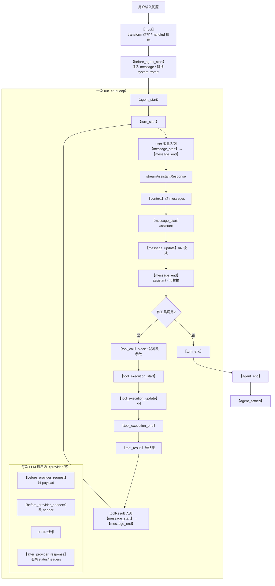

# 扩展 Hook 点梳理：一个完整会话中扩展能介入的位置

状态：草稿（2026-09-17 对照 [extensions/types.ts](../../../packages/coding-agent/src/core/extensions/types.ts) 的 `ExtensionEvent` / `ExtensionAPI.on`、[extensions/runner.ts](../../../packages/coding-agent/src/core/extensions/runner.ts) 的 `emit`/`emitXxx`、[agent-session.ts](../../../packages/coding-agent/src/core/agent-session.ts) 的接线、[sdk.ts](../../../packages/coding-agent/src/core/sdk.ts) 的装配；事件接线、能力分类均逐点对照源码）

本文回答一个问题：**用户只问一个问题、走完整个流程直到大模型输出完毕，pi 扩展（extension）能在哪些地方 hook。** 它是 [streamfn-production-path.zh.md](streamfn-production-path.zh.md)（provider 层装配）与 [agent-loop-runloop.zh.md](agent-loop-runloop.zh.md)（循环驱动）的交叉延伸——扩展的 hook 点正是缝合在这两条链路上的。

本文只展开扩展能力的「被动补丁层（hook）」；扩展系统的**完整能力全景**（5 条主动轴 + 补丁层）见姊妹篇 [extension-capabilities.zh.md](extension-capabilities.zh.md)。

## 事实源（链接，不复述）

- [extensions/types.ts](../../../packages/coding-agent/src/core/extensions/types.ts)（`ExtensionEvent` 联合 L1086-1113、`ExtensionAPI.on` 签名 L1257-1301、各事件定义）
- [extensions/runner.ts](../../../packages/coding-agent/src/core/extensions/runner.ts)（`ExtensionRunner.emit` / `emitInput` / `emitContext` / `emitToolCall` / `emitToolResult` / `emitBeforeAgentStart` / `emitBeforeProviderRequest` / `emitBeforeProviderHeaders` / `emitMessageEnd`）
- [agent-session.ts](../../../packages/coding-agent/src/core/agent-session.ts)（`input`、`before_agent_start`、`tool_call`、`tool_result` 的接线）
- [sdk.ts](../../../packages/coding-agent/src/core/sdk.ts)（`context`、`before_provider_request`、`before_provider_headers`、`after_provider_response` 的装配）

## 全景时间线（扩展可 hook 的位置）

## 分类清单（阶段 × 事件 × 能力）

| # | 阶段 | 事件 | 能力 | 接线位置 |
|---|---|---|---|---|
| 0 | 会话启动（前置） | `session_start` / `resources_discover` | 观察 / 提供资源路径 | 会话加载时 |
| 1 | 用户输入 | `input` | **transform**（改写文本/图片）、**handled**（拦截，不再交给 agent）、continue | agent-session.ts `emitInput` |
| 2 | agent 启动前 | `before_agent_start` | **注入 custom message**、**替换 systemPrompt** | agent-session.ts `emitBeforeAgentStart` |
| 3 | run 生命周期 | `agent_start` → `agent_end` → `agent_settled` | 观察（`agent_end` 带 messages，`agent_settled` 表示无重试/压缩/排队续跑） | Agent 事件订阅转发 |
| 4 | turn 生命周期 | `turn_start` / `turn_end` | 观察（`turn_end` 带 message + toolResults） | Agent 事件订阅转发 |
| 5 | **每次 LLM 调用前** | `context` | **替换 messages 数组**（`transformContext`） | sdk.ts `emitContext` |
| 6 | provider 请求前 | `before_provider_request` | **替换 payload** | sdk.ts `onPayload` |
| 7 | 请求头组装后 | `before_provider_headers` | **就地改 headers**（返回值忽略，`null` 删该头） | sdk.ts `transformHeaders` |
| 8 | provider 响应后 | `after_provider_response` | 观察 status/headers | sdk.ts `onResponse` |
| 9 | 消息生命周期 | `message_start` / `message_update` | 观察（`message_update` 带 token 级增量） | Agent 事件订阅转发 |
| 10 | 消息结束 | `message_end` | **替换最终消息**（必须同 role） | `emitMessageEnd` |
| 11 | 工具执行前 | `tool_call` | **block**（阻止执行，可带 reason/terminate）、**就地改 event.input** | agent-session.ts `beforeToolCall` → `emitToolCall` |
| 12 | 工具执行中 | `tool_execution_start` / `update` / `end` | 观察 | Agent 事件订阅转发 |
| 13 | 工具执行后 | `tool_result` | **改 content/details/isError/usage** | agent-session.ts `afterToolCall` → `emitToolResult` |

## 三类 hook 能力

### 1. 观察型（只读，不改流程）

`agent_start`、`turn_start/end`、`message_start/update`、`tool_execution_start/update/end`、`after_provider_response`、`session_start` 等——用于日志、遥测、UI 附加显示。

### 2. 可修改型（改数据，影响后续流程）

| 事件 | 改什么 | 链式语义 |
|---|---|---|
| `input` | 用户输入文本/图片 | `transform` 逐个链式改写 |
| `before_agent_start` | 注入消息、替换 systemPrompt | 多个扩展的结果**链式**（后者看到前者） |
| `context` | 完整 messages 数组 | 逐个替换（`structuredClone` 后链式） |
| `before_provider_request` | payload | 逐个替换 |
| `before_provider_headers` | headers（**就地改**） | 返回值忽略，就地生效 |
| `message_end` | 最终消息 | 逐个替换（必须同 role） |
| `tool_result` | 结果 content/details/isError/usage | 逐个覆盖字段 |

### 3. 拦截/阻断型（短路后续流程）

| 事件 | 阻断方式 |
|---|---|
| `input` | `handled` → 不交给 agent，完全由扩展处理 |
| `tool_call` | `block: true` → 工具不执行，返回错误结果给模型 |

## 两个值得注意的点

### 1. `context` 与 `before_provider_*` 的层次差异

`context` 在 **agent 层**改 `AgentMessage[]`（还没转成 LLM 消息），`before_provider_request`/`before_provider_headers` 在 **provider 层**改最终的 HTTP payload/headers。前者是「语义层」，后者是「协议层」。所以「改写对话内容」用 `context`，「改请求细节（加 header、改 payload）」用 `before_provider_*`。

### 2. `tool_call`/`tool_result` 与 `tool_execution_*` 不是一回事

`tool_call`（执行前，可 block/改参）和 `tool_result`（执行后，可改结果）是**扩展专用拦截点**，分别挂在 Agent 的 `beforeToolCall`/`afterToolCall` 钩子上；而 `tool_execution_start/update/end` 是 agent 层**通用生命周期事件**，只观察不拦截。一个负责「能不能执行、参数对不对」，一个负责「执行到哪一步了」。

## 一句话总结

一个「一问一答」的完整链路里，扩展的 hook 点覆盖了 **4 个边界层**：

- **输入层**：`input`
- **agent 层**：`before_agent_start` / `context` / 生命周期事件（`agent_*` / `turn_*` / `message_*`）
- **工具层**：`tool_call` / `tool_result` / `tool_execution_*`
- **provider 层**：`before_provider_request` / `before_provider_headers` / `after_provider_response`

从「用户敲下回车」到「HTTP 响应流回」每一步都能介入。

## 验证方式

- `read_file` 读 `extensions/types.ts` 的 `ExtensionEvent` 联合与 `ExtensionAPI.on` 全签名
- `read_file` 读 `extensions/runner.ts` 的 `emit` / `emitInput` / `emitContext` / `emitToolCall` / `emitToolResult` / `emitBeforeAgentStart` / `emitBeforeProviderRequest` / `emitBeforeProviderHeaders` / `emitMessageEnd`
- `search_content` 搜 `emitInput` / `emitBeforeAgentStart` / `emitToolCall` / `emitToolResult` 定位 agent-session.ts 接线；搜 `emitContext` / `emitBeforeProviderRequest` / `emitBeforeProviderHeaders` 定位 sdk.ts 装配

## 遗留问题

- agent 生命周期事件（`agent_start` / `turn_start` / `message_start` 等）从 `Agent` 事件订阅到 `ExtensionRunner.emit` 的**精确转发点**（`AgentSession._handleAgentEvent` 内部）尚未逐行核对，本文标注为「Agent 事件订阅转发」。
- `session_before_*` 系列（switch/fork/compact/tree，可 cancel）属于会话切换/压缩场景，不在「一问一答」链路上，本篇未展开，留待阶段 5（扩展体系）深入。
- `ui_prompt_start/end`、`model_select`、`thinking_level_select`、`user_bash` 等侧链路 hook 亦未展开，留待阶段 5。
