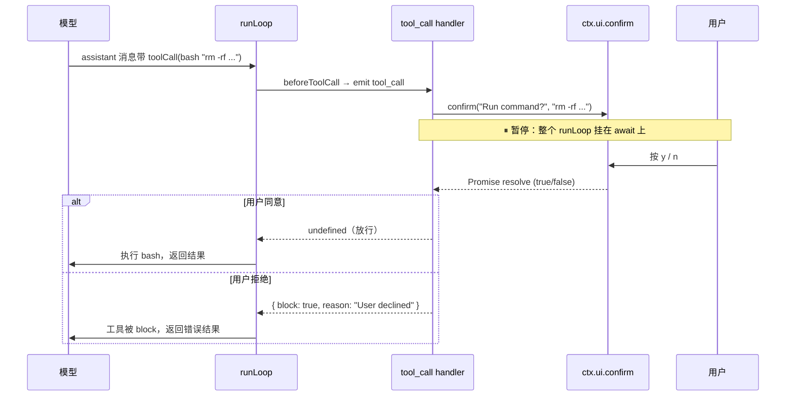

# 人工审批与暂停等待机制

状态：草稿（2026-09-18 对照 [agent-loop.ts](../../../packages/agent/src/agent-loop.ts) `prepareToolCall` 626-654 的 `await beforeToolCall`、[agent-session.ts](../../../packages/coding-agent/src/core/agent-session.ts) 482-490 的 `beforeToolCall` 接线、[extensions/runner.ts](../../../packages/coding-agent/src/core/extensions/runner.ts) `emitToolCall` 982-1003 的 `await handler`、`wrapUIPromptContext` 441-486、`noOpUIContext` 236-267、[extensions/types.ts](../../../packages/coding-agent/src/core/extensions/types.ts) `ExtensionUIDialogOptions` 97-103、[docs/usage.md](../../../packages/coding-agent/docs/usage.md) L309 官方原文、[docs/extensions.md](../../../packages/coding-agent/docs/extensions.md) `permission-gate` 示例）

本文回答：**pi 如何在 agent loop 的执行点上「暂停执行 + 等待人工审批 + 后续跟进」**。它是 [extension-hooks.zh.md](extension-hooks.zh.md)（hook 点）里 `tool_call` 能 block 但未展开「怎么暂停」那一面的深化。

## 事实源（链接，不复述）

- [agent-loop.ts](../../../packages/agent/src/agent-loop.ts)（`prepareToolCall` 626-654：`await config.beforeToolCall(...)`）
- [agent-session.ts](../../../packages/coding-agent/src/core/agent-session.ts)（482-490：`beforeToolCall` 接到 `emitToolCall`）
- [extensions/runner.ts](../../../packages/coding-agent/src/core/extensions/runner.ts)（`emitToolCall` 982-1003：`await handler`；`wrapUIPromptContext` 441-486；`noOpUIContext` 236-267）
- [extensions/types.ts](../../../packages/coding-agent/src/core/extensions/types.ts)（`ExtensionUIDialogOptions` 97-103；`ExtensionUIContext` 的 `confirm`/`select`/`input`/`custom`）
- [docs/usage.md](../../../packages/coding-agent/docs/usage.md) L309（官方「故意不内置 permission popups」原文）
- [docs/extensions.md](../../../packages/coding-agent/docs/extensions.md)（`permission-gate.ts` / `protected-paths.ts` 示例）

## 背景：pi 故意不内置审批

[docs/usage.md](../../../packages/coding-agent/docs/usage.md) L309 官方原文：

> *It intentionally does not include built-in MCP, sub-agents, **permission popups**, plan mode, to-dos, or background bash. You can build or install those workflows as extensions or packages.*

`permission popups`（工具审批弹窗）被**点名**为「故意不内置」。理由：*Pi keeps the core small and pushes workflow-specific behavior into extensions*。

pi 的替代安全模型（三层）：

| 层 | 机制 | 控制什么 |
|---|---|---|
| 1 项目信任 | `--approve`/`-na`/`/trust`/`defaultProjectTrust` | 是否加载项目本地资源 |
| 2 工具白名单 | `--tools`/`setActiveTools` | 哪些工具对模型可见 |
| 3 扩展拦截 | `on("tool_call")` + `ctx.ui.confirm` | 扩展**自己**实现审批逻辑 |

第 3 层是「有机制、无逻辑」——本文展开的就是这一层的「暂停等待」怎么实现。完整安全模型（七层 + 无内置沙箱哲学）见 [pi-security-model.zh.md](../architecture/pi-security-model.zh.md)。

## 机制本质：async handler 链 + `await ctx.ui.*`

pi **没有**显式的 `pause()/resume()` API。暂停机制是**隐式的 async/await**：

- 几乎每个扩展事件 handler 都是 async 函数，pi 用 `await handler(...)` 调用它；
- handler 内部只要 `await` 一个返回 Promise 的 UI 调用（`ctx.ui.confirm/select/input/custom`），整个调用链就自然挂在那个 await 上；
- 用户响应后 Promise resolve，handler 返回，链路继续。

最自然的审批拦截点是 `tool_call` 事件（对应 `beforeToolCall` 钩子）。

## 暂停链路（三层 await 串起来）

```
runLoop
  └─ executeToolCalls
       └─ prepareToolCall（agent-loop.ts 626）
            └─ await config.beforeToolCall(...)              ← ① await
                 └─ agent-session.ts 483: await runner.emitToolCall(...)
                      └─ runner.ts 991: await handler(event, ctx)   ← ② await
                           └─ 扩展 handler 内:
                                const ok = await ctx.ui.confirm("Run?", cmd)  ← ③ 暂停点
```

三层 `await` 一路串到 `ctx.ui.confirm` 的 Promise——**整个 agent loop 都暂停在 await 上**，直到用户在 TUI 里按 y/n。

## 时序图



## 关键代码：`prepareToolCall` 的 await + block 判定

```typescript
if (config.beforeToolCall) {
    const beforeResult = await config.beforeToolCall(
        { assistantMessage, toolCall, args: validatedArgs, context: currentContext },
        signal,
    );
    if (signal?.aborted) {
        return { kind: "immediate", result: createErrorToolResult("Operation aborted"), isError: true };
    }
    if (beforeResult?.block) {
        const result = createErrorToolResult(beforeResult.reason || "Tool execution was blocked");
        if (beforeResult.terminate === true) result.terminate = true;
        return { kind: "immediate", result, isError: true };   // ← 工具不执行，返回错误给模型
    }
}
```

`beforeResult` 拿到后才判断 block——而 `beforeResult` 来自 `await` 链，中间可以挂任意长时间。

## 四个关键设计点

### 1. 暂停范围：整个 agent loop 都挂起

`runLoop → executeToolCalls → prepareToolCall → beforeToolCall` 是一路 `await` 串起来的，handler 里 `await ui.confirm` 会让**整条链都暂停**。不是「工具暂停、loop 继续」，而是「loop 也暂停」——审批期间不该有别的 turn 推进。

### 2. 可观测：`ui_prompt_start` / `ui_prompt_end` 事件

`ctx.ui.confirm/select/input/editor/custom` 都被 `ExtensionRunner.wrapUIPromptContext` 包裹（`runner.ts` 441-486）。调用时发 `ui_prompt_start`，结束时发 `ui_prompt_end`——这是**可观测的「暂停区间」信号**，UI 据此显示「等待用户输入」状态、其他扩展也能感知。

### 3. 模式限制：只有有 UI 的模式才会真暂停

| 模式 | `hasUI` | `ui.confirm` 行为 |
|---|---|---|
| tui | true | 真暂停，等用户按键 |
| rpc | true | 真暂停，等远程客户端响应 |
| json / print | false | **立即返回**（`noOpUIContext`：confirm → false，select → undefined） |

非交互模式没法等用户，安全侧倒向**自动拒绝**——`confirm` 返回 false → handler 返回 `{ block: true }` → 工具不执行。

### 4. 审批本身可被取消：`signal` / `timeout`

`ExtensionUIDialogOptions`（`types.ts` 97-103）：

```typescript
export interface ExtensionUIDialogOptions {
    signal?: AbortSignal;   // 编程式取消对话框
    timeout?: number;       // 超时自动关闭（带倒计时）
}
```

用户 Ctrl+C 会让 `signal` abort，`prepareToolCall` 里也有 `if (signal?.aborted)` 检查返回 aborted 错误。审批能被超时/中止干净地取消，不会永久挂起。

## 「后续跟进」怎么实现

用户审批后，结果决定走向：

| 审批结果 | handler 返回 | 后续 |
|---|---|---|
| 同意 | `undefined`（不 block） | `prepareToolCall` 返回 `prepared` → 工具正常执行 → 结果回模型 |
| 拒绝 | `{ block: true, reason }` | 返回 `immediate` 错误结果 → 工具不执行 → 错误回模型 → 模型自行决定重试/换方案/放弃 |
| 拒绝且终止 | `{ block: true, terminate: true }` | 同上，但参与 `shouldTerminateToolBatch`（整批全 terminate 才提前停 runLoop） |

「后续跟进」就是模型拿到「工具被 block」的错误结果后自行决策——pi 不替模型决定下一步，只把「用户拒绝了」这个事实回传。

## 不止 `tool_call`：几乎所有 async handler 都能暂停

`await handler(...)` 模式贯穿所有扩展事件，所以这些点都能 `await ctx.ui.*` 暂停：`input` / `before_agent_start` / `context` / `message_end` / `tool_result` / `session_before_*` 等。`tool_call` 只是最自然的「人工审批」点（模型要做事前的拦截），但机制是通用的。

## 一句话总结

pi 的「暂停等待人工审批」机制是 **async handler + `await ctx.ui.confirm/select/input/custom`**——不需要专门的 pause/resume API，async/await 本身就是暂停机制。最自然的审批拦截点是 `tool_call` 事件（`beforeToolCall`），handler 内 `await ui.confirm` 让整个 agent loop 挂起，用户响应后 Promise resolve，按 block 与否决定放行或回传错误给模型。关键约束：**只有 tui/rpc 模式真暂停，json/print 自动拒绝**；审批可被 `signal`/`timeout` 取消；暂停区间有 `ui_prompt_start/end` 事件可观测。

## 验证方式

- `read_file` 读 `agent-loop.ts` `prepareToolCall` 626-654（`await beforeToolCall` + block 判定）
- `read_file` 读 `agent-session.ts` 482-490（`beforeToolCall` → `emitToolCall` 接线）
- `read_file` 读 `runner.ts` `emitToolCall` 982-1003（`await handler`）、`wrapUIPromptContext` 441-486（`ui_prompt_start/end`）、`noOpUIContext` 236-267
- `read_file` 读 `types.ts` `ExtensionUIDialogOptions` 97-103、`ExtensionUIContext` 的 dialog 方法
- `read_file` 读 `docs/usage.md` L309（官方原文）

## 遗留问题

- pi 安全模型的三层（项目信任 / 工具白名单 / 扩展拦截）本文只作为背景简述，完整展开留待阶段 5（扩展体系）或专项「pi 安全模型」笔记。
- `ui_prompt_start/end` 事件在多扩展嵌套调用 dialog 时的深度计数（`uiPromptDepth`）行为未深究，留待后续。
- rpc 模式下「远程客户端响应」的具体协议（CBOR？JSON？）未展开，留待远程会话轴深读。
