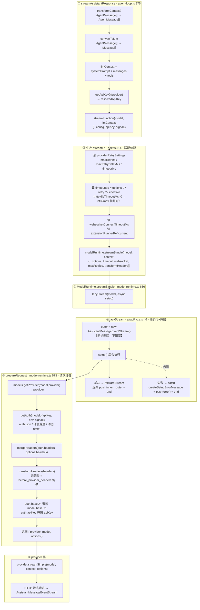
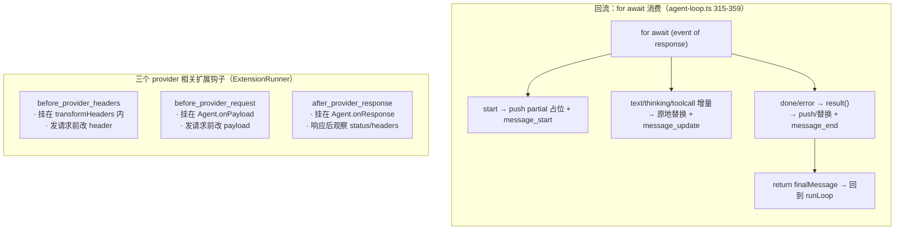

# 生产路径 streamFn 深度解析：LLM 调用装配链

状态：草稿（2026-09-17 对照 [sdk.ts](../../../packages/coding-agent/src/core/sdk.ts) 314-360 行、[model-runtime.ts](../../../packages/coding-agent/src/core/model-runtime.ts) 573-645 行、[lazy.ts](../../../packages/ai/src/api/lazy.ts) 全文、[provider-attribution.ts](../../../packages/coding-agent/src/core/provider-attribution.ts) 全文、[agent-loop.ts](../../../packages/agent/src/agent-loop.ts) 275-370 行；六层调用链、逐层职责、归因头、两级 key 解析均逐点对照源码）

本文是 [agent-loop-stream.zh.md](agent-loop-stream.zh.md)（`streamAssistantResponse` 如何**消费**流）的姊妹篇，回答另一面：`streamFunction` 在**生产路径**里到底是什么、它如何把「agent 层的一次流函数调用」翻译成「provider 层的 HTTP 流式请求」。生产 `streamFn` 的代码在 coding-agent 包，跨 agent → coding-agent → ai → provider 四层。

## 事实源（链接，不复述）

- [sdk.ts](../../../packages/coding-agent/src/core/sdk.ts)（生产 `streamFn` 314-342、`onPayload`/`onResponse` 343-360、`setDefaultStreamFn(streamSimple)` 37、`Agent` 创建 306）
- [model-runtime.ts](../../../packages/coding-agent/src/core/model-runtime.ts)（`streamSimple` 636-641、`prepareRequest` 573-608）
- [lazy.ts](../../../packages/ai/src/api/lazy.ts)（`lazyStream` 46-61、`forwardStream` 31-39）
- [provider-attribution.ts](../../../packages/coding-agent/src/core/provider-attribution.ts)（归因头，全文 98 行）
- [agent-loop.ts](../../../packages/agent/src/agent-loop.ts)（`streamAssistantResponse` 275-370，`StreamFn` 的调用方）
- [stream-fn.ts](../../../packages/agent/src/stream-fn.ts)（`setDefaultStreamFn`/`getDefaultStreamFn`，与显式 `streamFn` 的兜底关系）

## 它是什么（≤5 句）

生产 `streamFn` 是 **`StreamFn` 契约的「最后一公里」装配器**：它不直接发 HTTP，而是把「agent 层的一个流函数调用」翻译成「`ModelRuntime` 的一次懒执行请求」。在这一公里里注入三样 default 拿不到的东西——运行时超时/重试配置、provider 归因头、扩展的 header 钩子。真正的 provider 调用藏在 `lazyStream → prepareRequest → provider.streamSimple` 深处，且所有失败都通过 `error` 事件回流，从不让异常逃出 `StreamFn`。

## 完整调用链（六层）

### 图 1：正向调用链（从上下文准备一路下沉到 HTTP）



### 图 2：回流消费 + 扩展钩子旁路（图 1 没体现的两块）



## 逐层职责

### 第 1 层：生产 `streamFn`（sdk.ts 314-342）—— 适配 + 装配

```typescript
streamFn: async (model, context, options) => {
    const providerRetrySettings = settingsManager.getProviderRetrySettings();
    const httpIdleTimeoutMs = settingsManager.getHttpIdleTimeoutMs();
    const effectiveTimeoutMs = httpIdleTimeoutMs === 0 ? 2147483647 : httpIdleTimeoutMs;
    const timeoutMs = options?.timeoutMs ?? providerRetrySettings.timeoutMs ?? effectiveTimeoutMs;
    const websocketConnectTimeoutMs =
        options?.websocketConnectTimeoutMs ?? settingsManager.getWebSocketConnectTimeoutMs();
    const headerRunner = extensionRunnerRef.current;
    return modelRuntime.streamSimple(model, context, {
        ...options,
        timeoutMs,
        websocketConnectTimeoutMs,
        maxRetries: options?.maxRetries ?? providerRetrySettings.maxRetries,
        maxRetryDelayMs: options?.maxRetryDelayMs ?? providerRetrySettings.maxRetryDelayMs,
        transformHeaders: async (requestHeaders) => {
            const headers = mergeProviderAttributionHeaders(
                model, settingsManager, options?.sessionId, requestHeaders,
            );
            return headerRunner?.hasHandlers("before_provider_headers")
                ? headerRunner.emitBeforeProviderHeaders(headers ?? {})
                : (headers ?? {});
        },
    });
},
```

做三件事：① 注入超时（优先级 `options.timeoutMs` > `providerRetrySettings.timeoutMs` > `effectiveTimeoutMs`）；② 注入重试（`maxRetries` / `maxRetryDelayMs`）；③ 注入 `transformHeaders`（归因头 + 扩展钩子）。

**`timeout=0` 特殊处理**：`httpIdleTimeoutMs === 0 ? 2147483647 : ...`。SDK 把 `timeout=0` 解释为「立即超时」而非「无超时」，所以用 `int32` 最大值**有效禁用**超时。

### 第 2 层：`ModelRuntime.streamSimple`（model-runtime.ts 636-641）—— 懒执行

```typescript
streamSimple(model, context, options) {
    return lazyStream(model, async () => {
        const prepared = await this.prepareRequest(model, options);
        return prepared.provider.streamSimple(prepared.model, context, prepared.options);
    });
}
```

用 `lazyStream` 包裹，把 `prepareRequest`（auth 解析）延迟到真正消费流时才执行。

### 第 3 层：`lazyStream`（ai/api/lazy.ts 46-61）—— 同步返回 + 异步 setup + 错误兜底

```typescript
export function lazyStream(model, setup) {
    const outer = new AssistantMessageEventStream();
    setup()
        .then((inner) => forwardStream(outer, inner))
        .catch((error) => {
            const message = createSetupErrorMessage(model, error);
            outer.push({ type: "error", reason: "error", error: message });
            outer.end(message);
        });
    return outer;
}
```

三个关键点：① **同步返回流**——立即返回 `outer`，调用方的 `for await` 马上能迭代；② **异步 setup**——后台执行 `setup()`，完成后 `forwardStream` 把 inner 事件逐条 `push` 到 `outer`；③ **错误兜底**——setup 失败（如 auth 解析失败）→ `push(error)` + `end`，而非 throw。

这呼应 `StreamFn` 的「不抛错契约」：`lazyStream` 把同步/异步的 setup 失败都编码成流内 `error` 事件。

### 第 4 层：`prepareRequest`（model-runtime.ts 573-608）—— auth 解析 + headers 合并

```typescript
const provider = this.models.getProvider(model.provider);
const resolution = await this.getAuth(model, { apiKey, env, signal });
const { transformHeaders, ...rawProviderOptions } = options ?? {};
let headers = mergeHeaders(resolution.auth.headers, providerOptions.headers);
if (transformHeaders) headers = await transformHeaders(headers ?? {});
// ...
return { provider, model: resolution.auth.baseUrl ? { ...model, baseUrl: resolution.auth.baseUrl } : model,
         options: { ...providerOptions, apiKey: providerOptions.apiKey ?? resolution.auth.apiKey, headers, env } };
```

依次：找 provider → 解析 auth → 合并 auth 自带 headers → 调用 `transformHeaders`（真正发请求前最后一刻触发归因头 + 扩展钩子）→ 用 `auth.baseUrl` 覆盖 model、用 `auth.apiKey` 兜底。

### 第 5 层：`provider.streamSimple` —— 真正发 HTTP

具体 provider（OpenAI / Anthropic / …）的实现，发请求、返回流式响应。

## 归因头（provider-attribution.ts）

第 1 层注入的 `mergeProviderAttributionHeaders` 针对特定 provider 加**归因头**（仅当 install telemetry 开启）：

| Provider | 头部 |
|---|---|
| OpenRouter | `HTTP-Referer`、`X-OpenRouter-Title: pi`、`X-OpenRouter-Categories: cli-agent` |
| NVIDIA NIM | `X-BILLING-INVOKE-ORIGIN: Pi` |
| Cloudflare | `User-Agent: pi-coding-agent` |
| opencode | `x-opencode-session`（带 sessionId）、`x-opencode-client: pi` |

## 两个值得记住的设计

1. **扩展钩子延迟绑定**：`extensionRunnerRef` 是 `{ current?: ExtensionRunner }`（sdk.ts 304 行），因为扩展在 `Agent` 创建**之后**才加载。`transformHeaders` 在每次请求时读 `extensionRunnerRef.current`，让 `before_provider_headers` 能在发请求前改 header。
2. **「无超时」的 SDK 语义坑**：`timeout=0` 在不同 SDK 里语义相反，这里用 `int32` 最大值显式化解。

## 两个「隐藏接线」（易忽略）

### 1. `getApiKey`（L1）与 `getAuth`（L5）是两级 key 解析

- **L1 `getApiKey`**：agent 层提前解析（支持会过期的 token），把 `resolvedApiKey` 放进 `options.apiKey`；
- **L5 `getAuth`**：在 `prepareRequest` 里以 `options.apiKey` 作为输入之一做最终 auth 解析，产出真正的 `resolution.auth.apiKey`。

两者不是重复，而是「提前兜底」与「最终裁决」的分工。

### 2. `onPayload` / `onResponse` 不在 `streamFn` 里

它们与 `streamFn` 并列传入 `Agent`（sdk.ts 343-360），通过 `streamAssistantResponse` 的 `{...config}` → 生产 `streamFn` 的 `{...options}` 一路透传，最终在 provider 层发请求前/后触发扩展钩子。所以「扩展的三个 provider 钩子」实际挂在**三个不同装配点**：

| 扩展钩子 | 装配点 | 时机 |
|---|---|---|
| `before_provider_headers` | `transformHeaders` | 发请求前改 header |
| `before_provider_request` | `Agent.onPayload` | 发请求前改 payload |
| `after_provider_response` | `Agent.onResponse` | 响应后观察 status/headers |

## 一句话总结

生产 `streamFn` 是 **`StreamFn` 契约的「最后一公里」装配器**：不直接发 HTTP，而是把「agent 层的一次流函数调用」翻译成「`ModelRuntime` 的一次懒执行请求」，并注入 default 拿不到的**运行时超时/重试配置、provider 归因头、扩展 header 钩子**；真正的 provider 调用藏在 `lazyStream → prepareRequest → provider.streamSimple` 深处，所有失败经 `error` 事件回流，从不让异常逃出 `StreamFn`。

## 验证方式

- `read_file` 读 `sdk.ts` 306-360（`Agent` 创建 + `streamFn` + `onPayload`/`onResponse`）
- `read_file` 读 `model-runtime.ts` 573-645（`prepareRequest` + `streamSimple`）
- `read_file` 读 `lazy.ts` 全文（`lazyStream` + `forwardStream`）
- `read_file` 读 `provider-attribution.ts` 全文（归因头逻辑）
- `search_content` 搜 `lazyStream` 定位其 ai 包定义

## 遗留问题

- `getAuth` 内部（auth.json / 环境变量 / 动态 token 的优先级与来源）尚未展开，留待阶段 4（coding-agent 产品层）深入。
- `lazyStream` 的 `hasResult` / `createSetupErrorMessage` 细节（`lazy.ts` 前半部分）未在本篇展开。
