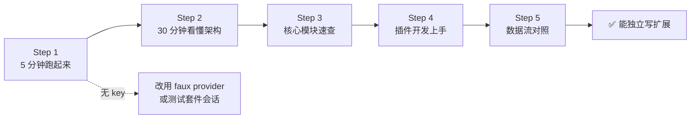

# pi 快速学习通道

本目录是 pi 的**快速上手通道**，面向"先跑起来、再懂原理、最后写扩展"的实践型学习者。与父目录 [learning/](../) 的七阶段深度方案平行存在，两者互不干扰：深度方案追求"能复述一次 turn 的完整生命周期"，本通道追求"两小时内能在 `.pi/extensions/` 写出可生效的扩展"。

## 与深度方案的区别

| 维度 | 深度方案（../learning-path.zh.md） | 快速通道（本目录） |
|---|---|---|
| 目标 | 源码级理解，能复述生命周期 | 快速跑起来 + 写出扩展 |
| 范围 | 11 包全量 + 双运行时栈 | 6 个桌面端包，忽略 server/client/protocol |
| 节奏 | 七阶段，按序串行 | 五步，可跳跃 |
| 产出 | 笔记/journal/questions 三层载体 | 可跑的扩展 + skill + prompt template |
| 预计耗时 | 数周 | 2-4 小时 |
| 适合 | 想深度参与 pi 开发 | 想基于 pi 做二次开发/插件 |

## 快速通道地图

## 文件索引

| 文件 | 回答什么 | 预计耗时 |
|---|---|---|
| [fast-track.zh.md](fast-track.zh.md) | 五步怎么走、每步过关标志 | 5 分钟（读图） |
| [architecture.zh.md](architecture.zh.md) | pi 整体架构一图一表 | 30 分钟 |
| [modules.zh.md](modules.zh.md) | 6 个桌面端核心包速查 | 15 分钟 |
| [extension-quickstart.zh.md](extension-quickstart.zh.md) | 怎么写 extension/skill/prompt | 45 分钟 |
| [commands.zh.md](commands.zh.md) | Windows 下快速命令速查 | 按需查 |

## 三条前提

1. **Windows 环境**：本通道面向 Windows 11，命令以 PowerShell / `pi-test.ps1` 为主。
2. **聚焦桌面端**：忽略 `packages/server`、`packages/client`、`packages/protocol`、`packages/evals`、`packages/session-backends/sqlite-node`。这些是远程会话轴/评测/持久化后端，桌面端开发用不到。
3. **无需 key 也能学**：无 provider API key 时，Step 1 的真实交互可改用测试套件的 faux provider 会话对照；但有一把 key（任意 provider）体验最佳。

## 何时转向深度方案

当出现以下信号，说明快速通道已不够用，建议回到 [../learning-path.zh.md](../learning-path.zh.md)：

- 想改 `packages/agent/src/agent-loop.ts` 的运行时行为 → 阶段 3
- 想理解 `harness/` 双栈语义 → 阶段 3 + [../notes/mechanisms/dual-runtime-semantics.zh.md](../notes/mechanisms/dual-runtime-semantics.zh.md)
- 想贡献代码到 pi 主仓 → [../../CONTRIBUTING.md](../../CONTRIBUTING.md) + 阶段 1

## 基准

初始落笔于 pi-coding-agent 0.85.1（commit 9767ba275，2026-09-07）；2026-09-14 核对到 commit 71dca871b，版本号仍 0.85.1，核心结构（6 个桌面端包、8 个内置工具、扩展三件套、`pi-test.ps1` 运行方式）均未变；上游仓库已从 `earendil-works/pi-mono` 更名为 `earendil-works/pi`。pi 迭代快，所有命令与文件路径以你本机当前版本为准；发现不一致时修本目录对应行。
