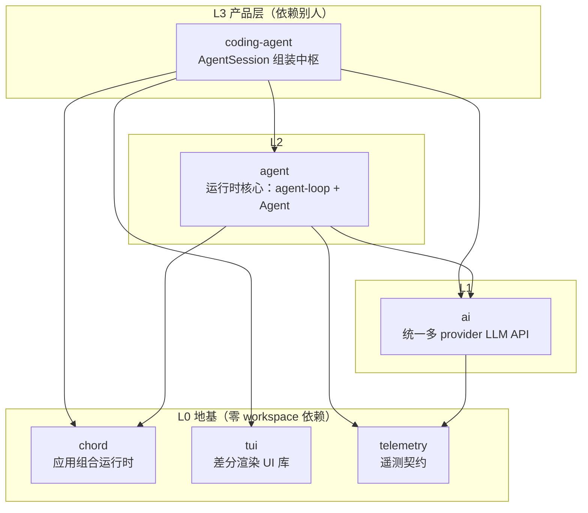
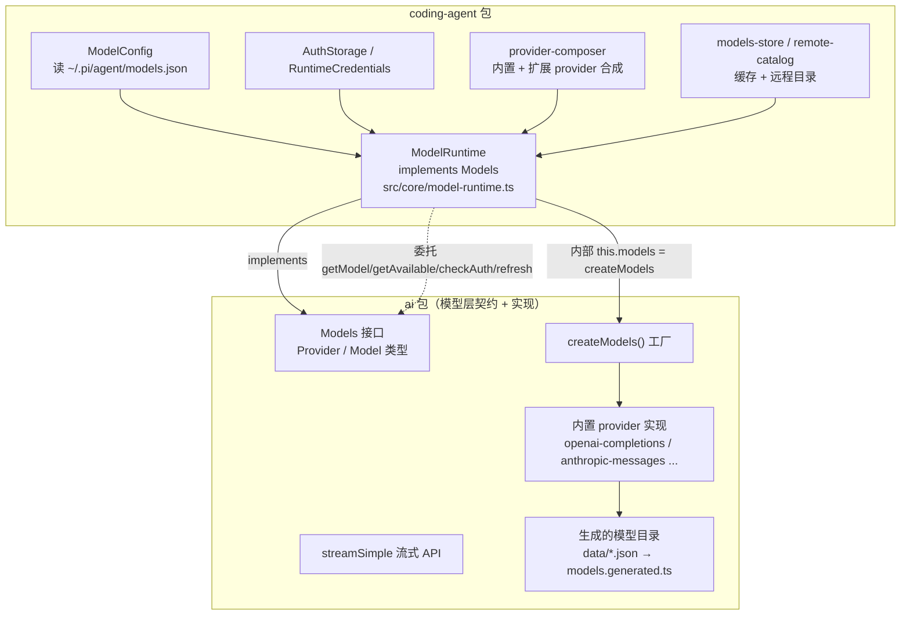
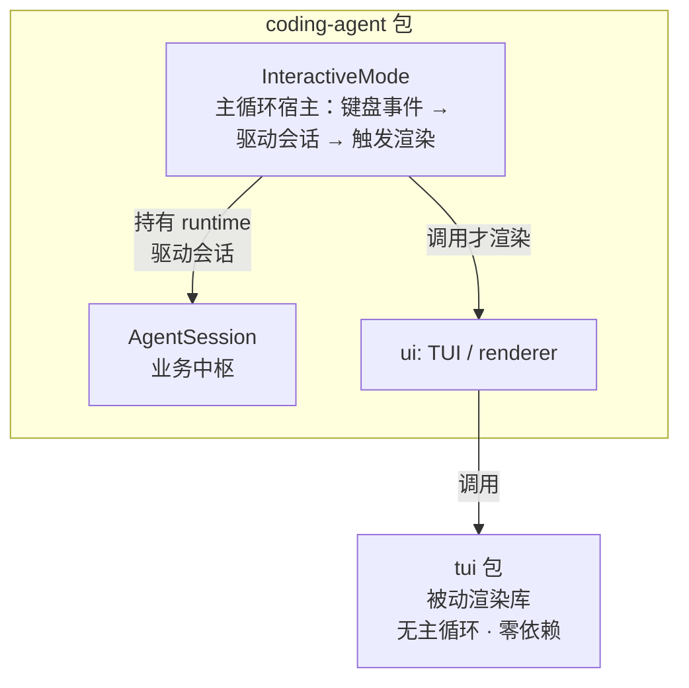
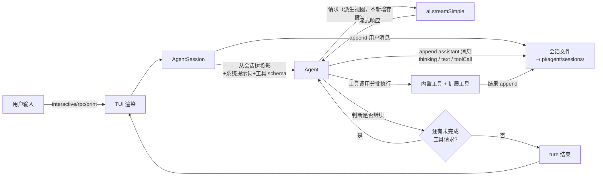

# pi 架构速懂（30 分钟）

**目标**：读完本文，能不看资料画出 pi 桌面端的分层图、组装图、数据流图。范围只覆盖桌面端 6 个包，忽略远程会话轴。

## 1. pi 是什么（一句话）

pi = **AgentSession**（coding-agent 包，组装中枢）把 **Agent 运行时**（agent 包）+ **统一 LLM API**（ai 包）+ **终端 UI**（tui 包）装配成编码 agent CLI；核心理念是「最小核心 + 通过扩展长大」——核心只保留 runtime 与少量内置工具，一切增值能力（工具、命令、事件钩子、技能、提示词、主题）通过 TypeScript extension / skill / prompt template 外挂。

## 2. 五条设计信条

| 信条 | 含义 | 对扩展开发的影响 |
|---|---|---|
| 最小核心 | runtime + 内置工具，其余外挂 | 你的能力挂在扩展点上，不改核心 |
| 自扩展 | pi 能用 pi 开发 pi | `.pi/` 目录就是 dogfooding 实例 |
| 事实源唯一 | 工程事实只在一个 home | 改模型目录走生成脚本，不手改 |
| append-only 会话 | 会话 JSONL 只增不改，分支靠 parentId | resume/compaction/导出都是树操作 |
| jiti 运行时加载 | TS 扩展无需编译 | 改 `.pi/extensions/*.ts` 后 `/reload` 即生效 |

## 3. 分层图：6 个桌面端包

**读法**：箭头 = 依赖方向，`A --> B` 读作「**A 依赖 B**」；图上**上方 = 产品层（靠近用户），下方 = 地基层（更基础）**，箭头自上而下表示上层依赖下层。



**一句话分层**：

| 层 | 包 | 一句话定位 |
|---|---|---|
| L0 地基 | chord | 应用组合运行时（services、复制状态、RPC、plugins） |
| L0 地基 | tui | 差分渲染终端 UI 库，只被 interactive 模式消费 |
| L0 地基 | telemetry | 厂商中立遥测契约 |
| L1 | ai | 把 OpenAI/Anthropic/Google 等多 provider 抹平成一个 API |
| L2 | agent | 通用 agent runtime：agent-loop 回合驱动 + Agent 有状态包装 |
| L3 产品 | coding-agent | 面向终端用户的编码 agent CLI，AgentSession 是组装中枢 |

**依赖方向说明（易反直觉）**：`coding-agent --> tui` 读作「coding-agent 依赖 tui」，即 interactive 模式用 tui 渲染——这与一般实现一致（应用依赖 UI 库，UI 库不自知应用）。`tui` 的 `package.json` **没有任何 dependencies 字段**，是零依赖的纯库，绝不反向依赖 coding-agent。同理 `agent --> ai` 是 agent 使用 ai 的模型能力，而非相反。方向记法：**箭头从"使用者"指向"被使用者"**。

**忽略的包**（本通道不覆盖）：protocol（CBOR 传输）、client、server（远程会话轴，实验性）、session-backends/sqlite-node（持久化后端）、evals（评测）。

## 4. 组装图：AgentSession 是中枢

箭头 = 创建/持有/调用（静态关系）：

```mermaid
flowchart TB
    subgraph CA["coding-agent 包"]
        MODES["modes 入口<br/>interactive / rpc / print<br/>（main.ts 依参数与 TTY 选择）"]
        AS["AgentSession<br/>组装中枢<br/>agent-session.ts"]
        MODES -->|创建 runtime<br/>并驱动会话| AS
        AS --> TOOLS["工具注册表<br/>内置 x8 + 扩展注册"]
        AS --> SM["SessionManager<br/>会话 JSONL"]
        AS --> ER["ExtensionRunner<br/>扩展加载"]
        AS --> MR["ModelRuntime<br/>ai.Models 的配置化实现<br/>model-runtime.ts"]
        AS --> SET["SettingsManager<br/>设置/信任"]
    end
    AS -->|创建并持有| AGENT
    subgraph AGENT["agent 包"]
        A["Agent<br/>有状态包装 agent.ts"]
        A -->|每次 turn 调用| LOOP["agentLoop<br/>无状态循环原语<br/>agent-loop.ts"]
    end
    AGENT -->|经 streamFn| AI
    MR -.->|implements Models<br/>内部 createModels()| AI
    subgraph AI["ai 包"]
        SS["streamSimple<br/>统一流式 API"]
        SS --> PROV["provider<br/>OpenAI/Anthropic/Google/..."]
    end
    MODES -.interactive 经.-> TUI["tui 包<br/>差分渲染"]
    ER <.-. 扩展来源 .-> DOTPI[".pi/ 目录<br/>extensions / skills / prompts"]
```

**读法**：**modes（interactive / rpc / print）是入口/宿主层**，由 `main.ts` 的 `resolveAppMode()` 依 `--mode` 参数与 stdin/stdout 是否 TTY 选择，它**创建 runtime（含 AgentSession）并驱动它**——所以箭头 `MODES --> AS` 读作"modes 使用 AgentSession"，**不是 AgentSession 组装 modes**。AgentSession 是组装中枢，创建并持有 Agent 与五个服务；Agent 调用 agentLoop；每次 LLM 调用经 ai 的 streamSimple 到 provider。会话 JSONL 与扩展是两个外部落点：前者由 SessionManager 追加，后者经 ExtensionRunner 注入。

**ModelRuntime 与 ai 包的关系（易混淆点）**：`ModelRuntime` 定义在 **coding-agent 包内**（`src/core/model-runtime.ts`），不是 ai 包。它 `implements Models`——`Models` 是 **ai 包导出的接口**；构造时调用 ai 包的 `createModels()` 得到一个内部 `MutableModels`，把 `getModel` / `getModels` / `getAvailable` / `checkAuth` / `refresh` 等**委托**给它，再叠加 coding-agent 专属装配：`ModelConfig`（读 `~/.pi/agent/models.json` 自定义模型）、`AuthStorage`（凭据）、`provider-composer`（把内置 provider 与扩展注册的 provider 合成）、远程目录与可用性缓存。

结构如下（实线 = 依赖/持有，虚线 = 实现与委托）：



分工一句话：**ai 包提供模型层的契约与实现**（`Models`/`Provider`/`Model` 类型、`createModels` 工厂、`streamSimple` 流式 API、内置 provider 实现、生成的模型目录）；**ModelRuntime 把这个契约实例化成"本进程可用的模型集合"**（含认证、用户自定义模型、扩展 provider、缓存与刷新）。因此 coding-agent **直接依赖 ai 包**（`package.json` dependencies 里的 `@earendil-works/pi-ai`），不是只经 agent 包间接使用。

**控制权归属：谁拥有主循环（易反直觉）**：直觉的"一般实现"是 UI 引擎主导——UI 框架拥有主循环、业务注册进去被它回调（React、游戏引擎如此）。pi 相反，是**应用主导、UI 库被动**：拥有主循环的是 `InteractiveMode`（`modes/interactive/`），它**同时持有两个下游**——`runtimeHost: AgentSessionRuntime`（业务）与 `ui: TUI` / `renderer`（tui 包，渲染）。tui 与 AgentSession **互不相识、平级**；§3 的 `coding-agent --> tui` 是包级依赖，包内真正的使用者只有 InteractiveMode。tui 保持零依赖、可独立发布（`@earendil-works/pi-tui` 是独立 npm 包）——被动渲染是库的边界纪律：只提供画布与组件，不拥有控制流。



**modes 三个运行入口、四种模式**（`resolveAppMode()` 依 `--mode` 参数与 stdin/stdout 是否 TTY 选择）：

| 运行入口 | appMode | 持有业务（runtime） | 持有渲染（tui） | 输出去向 |
|---|---|---|---|---|
| `InteractiveMode` | `interactive` | ✅ | ✅ **唯一** | tui 差分渲染到终端 |
| `runRpcMode` | `rpc` | ✅ | ❌ | stdin/stdout JSONL 协议（进程集成） |
| `runPrintMode` | `print` / `json` | ✅ | ❌ | 一次性写 stdout（text 或 JSON 事件流） |

**不是所有 mode 都同时持有业务和渲染**：三个入口都持有 runtime（业务），但**只有 InteractiveMode import tui**——`modes/rpc/` 与 `print-mode.ts` 的 import 里完全没有 `@earendil-works/pi-tui`，输出直接写 stdout。这也是 §3 分层表中"tui 只被 interactive 模式消费"的确切含义。

## 5. 数据流图：一次消息怎么穿层



**穿层步骤**：

| 步 | 发生什么 | 落在哪 | 是否落盘 |
|---|---|---|---|
| 1 | 用户经 interactive（TUI）或 rpc/print 输入消息 | coding-agent 的 modes 入口 | — |
| 2 | AgentSession 接收，**用户消息** append 进会话 JSONL | `~/.pi/agent/sessions/` 下的 `.jsonl` | ✅ user entry |
| 3 | 从会话树投影出消息历史，连同系统提示词与工具 schema 组装成请求，经 ai 调 provider | agent-loop.ts + ai streamSimple | ❌ 派生视图 |
| 4 | 模型流式响应回来，**assistant 消息**（thinking / text / toolCall 块）append 进会话 | agent-loop.ts + session-manager | ✅ assistant entry |
| 5 | 工具调用分批执行（内置或扩展注册），结果 append 进会话 | tools/ + ExtensionRunner | ✅ toolResult entry |
| 6 | 若仍有未完成工具请求则进下一 step，否则 turn 结束 | agent-loop.ts 停止条件 | — |

**关键不变量**：会话 JSONL 是事实源（append-only + parentId 分支成树），内存 transcript 是运行时真相，二者并行。

**为什么"发给模型的请求"不落盘**：请求 payload 是**派生视图**——消息数组由会话树沿路径投影（`buildSessionContext()`），系统提示词与工具 schema 每次运行时重新组装。三者都不含新事实（源头数据已在 JSONL），再存一份既冗余，又会因系统提示词/工具 schema 随版本与扩展变化而失真。**JSONL 只存不可推导的事实，可推导的不存**：用户消息、assistant 消息、toolResult 是输入/输出本身，故落盘；消息数组与请求是它们的投影，故不落盘。完整 entry 类型见 [session-format.md](../../packages/coding-agent/docs/session-format.md)。

### 数据落盘总表

**表 A：会落盘的数据**（写入会话 JSONL，均为 entry）

| 数据 | entry 形态 | 落盘时机 | 为什么必须落盘 | 进 LLM 上下文 |
|---|---|---|---|---|
| 会话元数据 | `session`（首行 header） | 创建会话时 | 版本 / cwd / session-id 无法从其他数据推导 | 否 |
| 用户消息 | `message` role=`user` | 用户提交后 | 输入事实，只此一份 | 是 |
| 模型回复 | `message` role=`assistant`（thinking / text / toolCall 块） | 流式响应结束 | 输出事实，含 usage / stopReason，无法重建 | 是 |
| 工具结果 | `message` role=`toolResult` | 工具执行完成 | 端侧产生的事实；靠 `toolCallId` 与调用配对 | 是 |
| 用户 shell 命令 | `message` role=`bashExecution` | `!` / `!!` 命令执行后 | 命令 + 输出 + exitCode 是事实 | `!` 是；`!!` 否 |
| 扩展状态 | `custom` | 扩展调用 `appendEntry()` | 跨重启恢复扩展状态 | 否 |
| 扩展注入上下文 | `custom_message` | 扩展注入后 | 需参与模型上下文的额外事实 | 是 |
| 压缩检查点 | `compaction` | 自动压缩 / `/compact` | 摘要 + 保留尾是路径局部检查点，事后无法重建 | 是 |
| 分支摘要 | `branch_summary` | `/tree` 切换分支 | 保留被放弃分支的上下文 | 是 |
| 模型切换 | `model_change` | 启动选定 / `/model` 切换 | 请求时从树的路径提取最新值 | 否 |
| 思考等级切换 | `thinking_level_change` | `/thinking` 切换 | 同上 | 否 |
| 会话名 | `session_info` | `/name` | 显示名 | 否 |
| 书签 | `label` | 给 entry 打标 | 树导航标记 | 否 |

**表 B：不落盘的数据**（运行时派生，重启时从 JSONL 重建）

| 数据 | 为什么不需要落盘 |
|---|---|
| 请求 payload（消息数组） | 由会话树沿路径投影（`buildSessionContext()`）；源头 entry 已落盘 |
| 系统提示词 | 每次运行时从 AGENTS.md + 模板 + 扩展重建；随版本 / 扩展变化 |
| 工具 schema | 从工具注册表重建；随扩展增删变化 |
| 内存 transcript（`_state.messages`） | 运行时真相，与 JSONL 并行；重启时从 JSONL 重建 |
| run / turn 结构 | 可从树推导：新 run 起点是 `role: user` entry，turn 边界看 `stopReason` |
| 事件流（`agent_start` / `turn_start` / `message_update` / `tool_execution_*` …） | 运行时观察接口，不是持久事实 |
| 流式中间态（partial assistant） | 只在流式期间存在，被最终 assistant 消息取代 |
| UI 状态（footer / widget / 光标） | 纯展示，重启不恢复 |
| **slash 命令执行**（如扩展 `registerCommand` 的 `/hello`） | 端侧 handler 直接执行、不发往模型，不产生 message；要留痕须 handler 显式调 `pi.appendEntry()` |
| **扩展与工具的注册定义** | 每次启动从扩展 / 内置工具重建；定义本身不是事实，只有调用结果（toolResult）落盘 |

**一句话总结**：JSONL 存"不可推导的事实"（输入 / 输出 / 元数据）；请求、提示词、schema、run/turn、事件、UI 都是这些事实的投影或运行时派生，一律不落盘。注意**落盘 ≠ 进上下文**——两者独立：`custom` / `model_change` / `label` 落盘但不进上下文，`!!` 命令落盘但排除出上下文。

**slash 命令不落盘（易踩坑）**：输入 `/hello` 这类命令时，它由端侧 handler 直接执行（`ctx.ui.notify` 等），**不发给模型、不产生 message、不写 JSONL**，所以"命令执行过"在会话文件里查不到。对照铁证：若扩展尚未加载，`/hello` 会被当作**普通文本**发给模型（于是落盘成 `user` entry）；扩展生效后走命令通道，就再无 entry。内置命令只有产生元数据的那几个（`/model` → `model_change`、`/thinking` → `thinking_level_change`、`/name` → `session_info`、`/compact` → `compaction`、`/tree` 分支 → `branch_summary`）会在 JSONL 留痕，其余（`/help`、`/reload`）纯 UI 不落盘。

**额外技巧**：会话内 `PI_SESSION_FILE` 环境变量就是当前会话文件路径（`echo $env:PI_SESSION_FILE`），不必手工按 cwd 转义规则推算目录。

## 6. 扩展挂载点全集（写扩展必看）

扩展是默认导出的 TS 工厂函数，接收 `ExtensionAPI`，可在任意挂载点注册：

| 挂载点 | API | 触发时机 | 典型用途 |
|---|---|---|---|
| `pi.on(event, handler)` | 事件订阅 | 生命周期各阶段 | 拦截工具调用、注入上下文、自定义压缩 |
| `pi.registerTool(opts)` | 注册工具 | 启动时 | 让 LLM 能调用你的自定义工具 |
| `pi.registerCommand(name, opts)` | 注册命令 | 启动时 | 添加 `/mycommand` slash 命令 |
| `pi.registerShortcut(key, opts)` | 注册快捷键 | 启动时 | 绑定 ctrl+x 等 |
| `pi.registerFlag(name, opts)` | 注册 flag | 启动时 | 添加 CLI flag |
| `pi.registerProvider(opts)` | 注册 provider | 启动前 flush | 自定义 LLM provider |

**核心事件速查**（完整表见 [../../packages/coding-agent/docs/extensions.md](../../packages/coding-agent/docs/extensions.md)）：

| 事件 | 触发时机 | 能干什么 |
|---|---|---|
| `session_start` | 会话启动 | 初始化状态、通知用户 |
| `tool_call` | 工具调用前 | 拦截/阻止/修改工具调用 |
| `tool_result` | 工具返回后 | 改写结果、追加上下文 |
| `agent_start` / `agent_end` | 一个 agent 回合起止 | 统计 token、计时 |
| `model_response` | 模型流式响应 | 实时处理流式块 |

## 7. 与深度方案的差异

本文是 [../notes/architecture/classic-stack-overview.zh.md](../notes/architecture/classic-stack-overview.zh.md) 的精简重组，省略了：

- **双栈语义**（经典内存栈 vs durable 持久化栈）：桌面端开发用不到 durable 栈，见 [../notes/mechanisms/dual-runtime-semantics.zh.md](../notes/mechanisms/dual-runtime-semantics.zh.md)。
- **harness/ 子系统详解**：阶段 3 深入，本通道只记住 `agent-loop.ts` 是循环原语即可。
- **edit 工具的安全设计**：用到时查 [../../packages/coding-agent/docs/](../../packages/coding-agent/docs/)。

## 8. 自检清单

读完本文，能不看资料回答：

- [ ] pi 的核心理念是什么？（最小核心 + 自扩展）
- [ ] 6 个桌面端包的分层与依赖关系？
- [ ] AgentSession 组装了哪几个服务？
- [ ] 一次消息穿过 5 层的路径？
- [ ] 扩展有哪些挂载点？至少说出 3 个。
